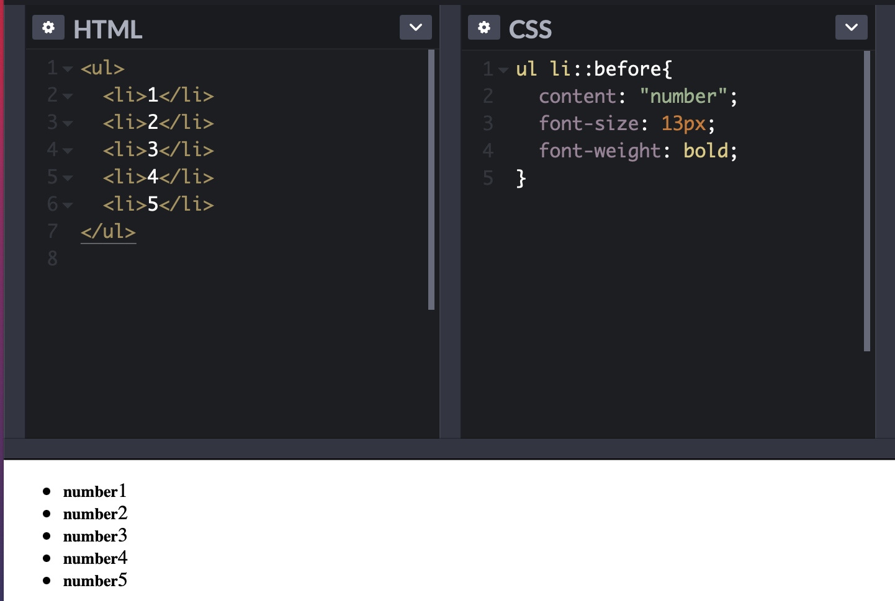
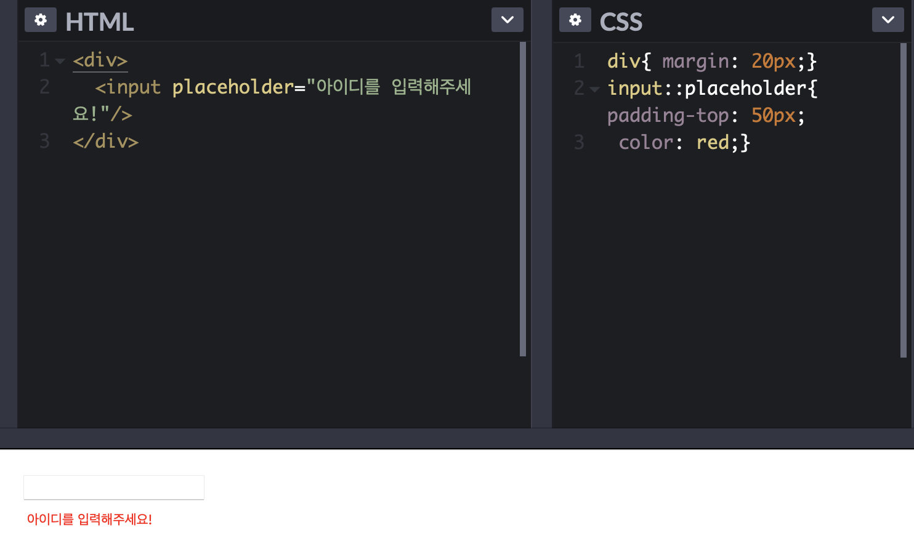

# 선택자 

- 선택자(selector)란? 
- 가상 선택자란? 

    `Pseudo-Classes Selectors(가상 클래스)` VS `Pseudo Element(가상 요소 선택자)`

<br>

---
> Selector(선택자)

    CSS에서 선택자란 HTML과 CSS를 연결해주는 개념으로 사용된다.   
    쉽게 얘기하자면 '스타일링 하려는 대상이 무엇인지?'를 의미하는 것이 셀렉터라고 할 수 있겠다.  
    선택자의 종류는 다양한데 오늘은 기본적으로 꼭 학습해야 하는 기본 선택자들을 정리해보는 시간을 갖고, 
    가상 클래스 선택자와 가상 요소 선택자에 대해서 알아보는 시간을 갖고자 한다. 
<!-- CSS에서는 스타일을 적용할 대상을 선택하기 위해서 선택자(selector)를 사용한다. 지금까지 살펴본 대표적인 선택자는 아래와 같다. --> 

<br>

>> Basic Selectors(기본 선택자)

1. Universal Selectors(전체 선택자)
    - (HTML 내부의) `모든 요소`를 전체 선택
    - Asterisk로 표현

    ```css
    * {
        color: blue;   /* 모든 요소의 색을 파란색으로 만든다 */
    }
    ```

2. Type Selectors(태그 선택자/타입 선택자/(HTML)요소 선택자)
    - `태그`를 선택
    - HTML 요소(Element)를 선택자로 놓고 속성과 속성값을 지정한다 
    
    ```css
    div {
        backgroundcolor: pink;   /* HTML 문서 안에 있는 모든 div 요소의 색을 분홍색으로 만든다 */
        width: 100px;            /* HTML 문서 안에 있는 모든 div 요소의 width를 100px로 만든다 */
    }
    ```

3. Attribute Selectors(속성 선택자)
    - 속성 선택자를 사용하면 특정 속성이나 특정 속성값을 가지고 있는 HTML 요소를 선택할 수 있다. 
    - 기본적으로:
        - [속성이름]
        - [속성이름="속성값"]
    의 형태로 속성 선택자를 사용한다. 
    ```css
    a[target="_blank"] { color: red; }
    /* a태그에 target="_blank"라는 속성을 가진 요소를 셀렉트/선택한다. 
    해당 요소의 color를 red로 바꿔주는 스타일링을 적용시켜준다! */
    ```
    
4. Class Selectors(클래스 선택자)
    - HTML의 `class`를 선택
    - .클래스명{ 속성: 속성값; }으로 표현. 이때, 클래스 명 앞에 `.` 붙이는 것 유의!
    
    ```html
    <div class="div_1"> DIV - 1 </div>
    ```

    ```css
    .div_1{                       /* 선택자로 들어온 클래스에 border와 border-radius라는 CSS 속성들을 적용 시킨다 */
        border: 1px solid lightgray;  
        border-radius: 3px;
    }
    ```

5.  ID Selectors(아이디 선택자)
    - HTML의`id`를 선택 
    - #아이디명{ 속성: 속성값; }으로 표현. 이때, 아이디명 앞에 `#` 붙이는 것 유의!

    ```html
    
    ```

    ```css
    .first-image{                       /* 선택자로 들어온 아이디에 width와 height를 각각 100px, 200px로 지정한다 */
        width: 100px;
        height: 200px;
    }
    ```
<br>

6. Group Selectors(그룹 선택자)
    - 그룹 선택자는 위에서 언급한 여러 선택자를 같이 사용하고자 할 때 사용한다.  
    그룹 선택자는 여러 선택자를 쉼표(,)로 구분하여 연결한다.  
    이러한 그룹 선택자는 코드를 중복해서 작성하지 않도록 하여 코드를 간결하게 만들어주는 효과가 있다.  

    ```html
    <style>
        h2 { color: navy; }
        h2, h3 { text-align: center; }
        h2, h3, p { background-color: lightgray; }
    </style>
    ```

<br>

7. Combinators(복합 선택자/결합 선택자/결합자) 
    - CSS 선택자는 하나 이상의 선택자를 포함할 수 있다.  
    복합 선택자는 두 개 이상의 선택자 요소가 모인 선택자다.   
    (이는 꼭 태그 선택자 간의 결합이 아니어도 된다.) 
    <!-- - 결합 선택자(Combinators):
        - 손자 결합자/자손 선택자(Descendant Selector) 
        - 자녀 결합자/자식 선택자(Child Selector) 
        - 형제 결합자/동위 선택자(Sibling Selector):
            - 인접 형제 결합자/인접 동위 선택자(Adjacent Sibling Selector) 
            - 일반 형제 결합자/일반 동위 선택자(General Sibling Selector) -->
<div style = "margin-left:55px; padding: 2px; border: 1px dashed lightgray;">
    <ul>
        <li>결합 선택자(Combinators):
            <ul style="list-style-type: none;">
                <li><details><summary>손자 결합자/자손 선택자(Descendant Selector)</summary>
                    <ul>
                        <li>자손 선택자는 해당 요소의 하위 요소 중에서 특정 타입의 요소를 모두 선택한다.</li> 
                        <li>아래의 예제는 모든 div 태그의 하위 요소 중에서 p 태그를 모두 선택하는 예제다;   <br>
                            <ul style="list-style-type: none;">
                                <li>e.g. div p { 스타일; }</li>
                            </ul>
                        </li>       
                    </ul>
                </details></li>
                <li><details><summary>자녀 결합자/자식 선택자(Child Selector)</summary>
                <ul>
                    <li>자식 선택자는 해당 요소의 바로 밑에 존재하는 하위 요소 중에서 특정 타입의 요소를 모두 선택한다.</li>
                    <li>아래의 예제는 모든 div 태그의 바로 밑에 존재하는 하위 요소 중에서 p 태그를 모두 선택하는 예제다; <br> 
                        <ul style="list-style-type: none;">
                            <li>e.g. div > p { 스타일; }</li>
                        </ul>
                    </li>
                </ul>
                </details></li>
                <li><details><summary>형제 결합자/동위 선택자(Sibling Selector):</summary>
                <ul>
                    <li>동위 선택자는 동위 관계(sibling relation)에 있는 요소 중에서 해당 요소보다 뒤에 존재하는 특정 타입의 요소를 모두 선택한다. <br> 
                    <del>여기서 동위 관계란 HTML 요소의 계층 구조에서 같은 부모(parent) 요소를 가지고 있는 요소들을 의미하고, 이런 (동위) 관계에 있는 요소들을 '형제 요소'라고 한다.</del></li>
                    <li>동위 선택자는 2 가지로 나눌 수 있는데, 하나는 '인접 동위 선택자/인접 형제 결합자'이고 또 하나는 '일반 동위 선택자/일반 형제 결합자'이다. <br> 
                    </li>
                </ul>
                </details>
                    <ul style="list-style-type: none;">
                        <li><details><summary>인접 형제 결합자/인접 동위 선택자(Adjacent Sibling Selector)</summary>
                            <ul>
                                <li>영어로 adjacent는 인접한, 가까운 이란 의미다. 인접 동위 선택자는 해당 요소와 동위(sibling) 관계에 있으며, 해당 요소의 바로 뒤에 존재하는 특정 타입의 요소를 모두 선택한다. <br> 
                                <del>말이 어려워서 그렇지 그냥 같은 부모를 가지는 형제 관계에 있는 요소 바로 뒤에 오는 요소에게만 스타일링을 적용하겠다는 의미이다. </del></li>
                                <li>아래의 예제는 모든 div 태그와 동위 관계에 있는 요소 중에서 div 태그의 바로 뒤에 존재하는 p 태그를 모두 선택하는 예제다; <br> 
                                    <ul style="list-style-type: none;">
                                        <li>e.g. div + p { 스타일; }</li>
                                    </ul>
                                </li>
                            </ul>
                        </details></li>
                        <li><details><summary>일반 형제 결합자/일반 동위 선택자(General Sibling Selector)</summary>
                            <ul>
                                <li>일반 동위 선택자는 해당 요소와 동위 관계에 있으며, 해당 요소보다 뒤에 존재하는 특정 타입의 요소를 모두 선택한다.
                                <br> 일반 동위 선택자는 위에서 살펴본 인접 동위 선택자와 달리 '인접'해 있을 필요가 없다. 즉, 같은 부모를 갖는 형제 관계에 있는 두 요소 뒤에 오는 어떠한 요소이기만 하면 되지 바로 뒤에 올 필요는 없다는 얘기다. 
                                </li>
                                <li>아래의 예제는 모든 div 태그와 동위 관계에 있는 요소 중에서 div 태그보다 뒤에 존재하는 p 태그를 모두 선택하는 예제다; <br> 
                                    <ul style="list-style-type: none;">
                                        <li>e.g. div ~ p { 스타일; }</li>
                                    </ul>
                                </li>
                            </ul>
                        </details></li>
                    </ul>
                </li>
            </ul>
        </li>
    </ul>
</div>
    

---
---

> 가상 선택자 

    CSS의 가상 선택자에는 크게 가상 클래스 선택자와 가상 요소 선택자가 있다.
    HTML에 이미 존재하는 요소를 선택하면 `가상 클래스 선택자`이고, 
    HTML에 존재하지는 않지만 가상의 요소를 생성하여 선택하고자 할 때 사용하는 것은 `가상 요소 선택자`이다. 
    (cf. 가상 클래스가 가상 요소보다 구체성이 높다!)

<br>
<br>

>> 가상 클래스 (📍tip: 콜론이 하나! `의사 클래스`라고도 한다.)
- CSS에서 가상 클래서(pseudo-class)는 선택하고자 하는 HTML 요소의 특별한 '상태(status)'를 명시할 떄 사용한다.
- 가상 클래스를 사용하려면 기본적으로는 아래와 같은 문법을 준수하면 된다;  
```css 
        선택자: 의사 클래스 이름 {
            속성: 속성값; }
```
- 클래스(class)나 아이디(id)에도 가상 클래스를 사용할 수 있다.   
이때는 위의 가상 클래스 기본 문법에서 선택자 자리에 클래스 이름 또는 아이디 이름을 넣어주면 된다.  
```css 
        선택자.클래스이름: 의사 클래스 이름 {
            속성: 속성값; }

        선택자#아이디이름: 의사 클래스 이름 {
            속성: 속성값; }
```

<br>
<br>

<div style="border: 1px dashed lightgray; padding: 15px; margin-left : 10px;">
 
<b>[동적 의사 클래스(Dynamic Pseudo-Classes)]</b>

- `E:hover`  

    :point_right: 
    요소 위로 마우스(포인터)를 가져가서 마우스가 요소 위에 있을 동안에만 요소를 선택 

- `E:active`

    :point_right: 
    요소를 마우스로 클릭하는 동안에만 요소를 선택 

- `E:focus`

    :point_right: 
    요소가 포커스된 동안에만 요소를 선택

    :point_right: 
    여기서 포거스가 됐다는 것은 사용자가 요소를 클릭하거나 탭키를 사용하여 해당 부분이 선택되어 졌다는 것을 의미 

    :point_right: 
    포커스 가상 클래스 선택자는 대화형 콘텐츠 --input, img, tabindex와 같은-- 에서 사용 되는 셀렉터이다 

- `E:link`

    :point_right: 
    사용자가 아직 한 번도 해당 링크를 통해서 연결된 페이지를 방문하지 않은 상태를 모두 선택함.

- `E:visited`

    :point_right: 
    사용자가 한 번이라도 해당 링크를 통해서 연결된 페이지를 방문한 상태를 모두 선택함. 


<b>[상태 의사 클래스(UI Element States Pseudo-Classes)]</b>

- `E:checked`

    :point_right:
    체크된(checked) 상태의 input 요소를 모두 선택함.

- `E:enabled`

    :point_right:
    사용할 수 있는 input 요소를 모두 선택함.

- `E:disabled`

    :point_right:
    사용할 수 없는 input 요소를 모두 선택함.


<b>[구조 의사 클래스(Structural Pseudo-Classes)]</b>

- `E:first-child`

    :point_right:
    모든 자식(child) 요소 중에서 첫 번째에 위치하는 자식 요소를 모두 선택함.

- `E:nth-child`

    :point_right:
    모든 자식 요소 중에서 앞에서부터 n번째에 위치하는 자식 요소를 모두 선택함.

- `E:first-of-type`

    :point_right:
    모든 자식 요소 중에서 첫 번째로 등장하는 특정 요소를 모두 선택함.

- `E:nth-of-type`

    :point_right:
    모든 자식 요소 중에서 n번째로 등장하는 특정 요소를 모두 선택함.


- 이 외에도 기타 다양한 가상 클래스 선택자들이 있다. 
    
    - cf. 

        [링크1]: https://bearjin90.tistory.com/4 "참고 링크1로 이동합니다!"
        [링크2]: https://homzzang.com/b/css-284 "참고 링크2로 이동합니다!"
        [링크3]: http://www.tcpschool.com/css/css_selector_pseudoClass "참고 링크3로 이동합니다!"
        📍 [링크1], [링크2], [링크3] 참고!! 
</div>

<br>
<br>


>> 가상 요소 (📍tip: 콜론이 두개! `의사 요소`라고도 한다.)

- 가상 요소 선택자라는 것은 가상 클래스 선택자와는 다르게 CSS를 통해서 HTML에 가상의 요소를 생성해서 제공을 할 수 있다. 
- '의사 요소'라고도 불리는 가상 요소는 해당 HTML 요소의 특정 부분만을 선택할 때 사용한다. 
- 가상 요소를 사용하려면 기본적으로는 아래와 같은 문법을 준수하면 된다;  
```css 
        선택자:: 의사 요소 이름 {
            속성: 속성값; }
```
- <del>이때, CSS1과 CSS2에서는 의사 클래스와 의사 요소를 나타낼 때 하나의 콜론(:)으로 함께 표기했지만, CSS3에서는 의사 클래스의 표현과 의사 요소의 표현을 구분하기로 하여, CSS3에서는 의사 클래스는 하나의 콜론(:)을, 의사 요소에는 두 개의 콜론(::)을 사용하고 있다.</del>
- 이제 대표적인 가상 요소 선택자들을 알아보자. 

<br>
<br>

<div style="border: 1px dashed lightgray; padding: 15px; margin-left : 10px;">

<b>[대표적인 CSS 가상 요소/의사 요소]</b>

- `E::before:`

    :point_right: 
    특정한 요소의, 내부의, **앞**쪽에다가 가상으로 존재하지 않는 요소를 존재하는 것처럼 부여하여 문서에 내용(content)을 삽입하는 것을 가능케한다 

    :point_right: 
    가상 요소 선택자인 `:before`에 `content: "";` 라는 속성과 속성값을 넣어주는 것은 아주 중요하다. 왜냐면 이 content: ""; 라는 속성을 넣어주지 않으면 해당 가상 요소 선택자에 어떠한 CSS 속성을 적용시킨다 한들 결과가 나오지 않기 때문이다. 
    ""안에는 아무 값도 넣지 않아 null 값을 만드는 것도 가능하지만, 안에 내용(content)를 삽입하는 것도 가능하다. 

    
    <!--  -->
    
    <br>
    
    
    <!--  -->

    <br>
    <br>

- `E::after`  
    
    :point_right: 
    특정한 요소의, 내부의, **뒤**쪽에다가 가상으로 존재하지 않는 요소를 존재하는 것처럼 부여하여 문서의 특정 부분 선택 및 내용 삽입을 가능케한다  

    
    <!--  -->

    <br>
    <br>
    
- `E::first-letter` 

    :point_right: 
    요소의 첫번째 글자를 감싸고 있는 요소가 없지만, 있는 것과 같이 가상의 요소를 만들어서 제어하는 것이 가능해진다 
    ```html
    <ul>
        <li>오늘 점심메뉴는?</li>
        <li>고기!!</li>
    </ul>
    ```

    ```css
    ul li::first-letter{font-size: 30px; color: red;}
    ```

    
    <!--  -->

    <br>
    <br>
    
- `E::placeholder` 

    :point_right: 
    input 필드에 힌트 텍스트에 스타일을 적용한다     
    ```html 
    <input placeholder="아이디를 입력해주세요!"/>
    ```
            
    ```css 
    input::placeholder{ padding-top: 50px; color: red;}
    ```
    
    
    <!--  -->
</div>

---
---

<details>
<summary> CLICK ME</summary>

- cf. 
    - https://www.codingfactory.net/10792  
    - https://bearjin90.tistory.com/4  
    - http://blog.hivelab.co.kr/공유before와after-그들의-정체는/
    - https://wallel.com/css-속성-선택자-정리-css-attribute-selector/
    - https://www.nextree.co.kr/p8468/
    - https://aboooks.tistory.com/270
    - http://www.tcpschool.com/css/css_selector_sibling
    - http://www.tcpschool.com/css/css_selector_pseudoElement

</details>