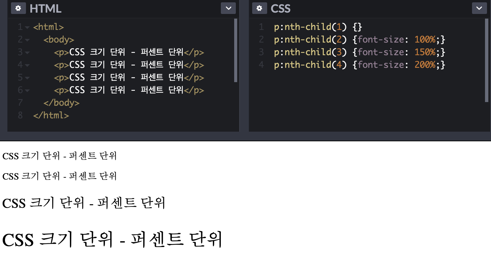
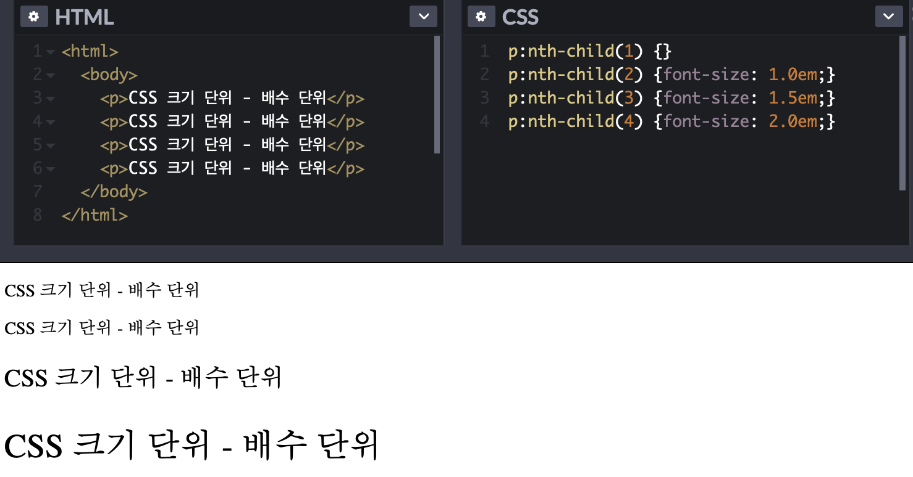
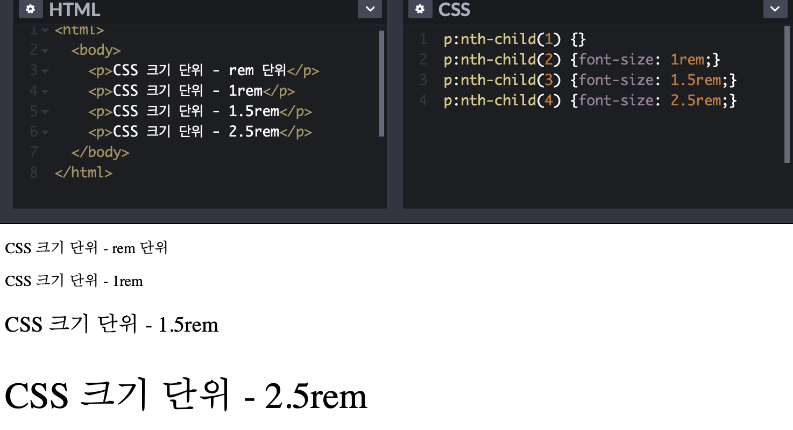
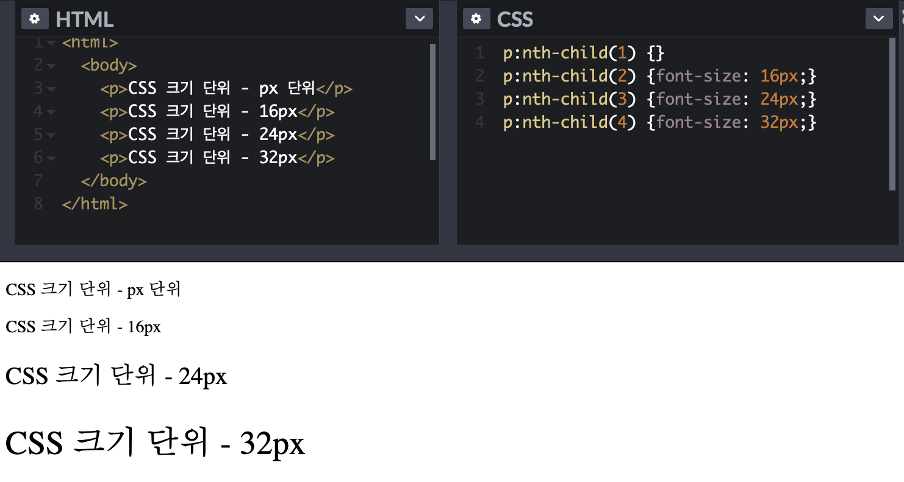

# CSS 크기 단위 

cm, mm, inch 등의 단위도 있지만, CSS에서 사용하는 대표적인 크기 단위는 크게 %, em, px이다. 
이때, px는 절대값이고 em, %는 상대값이다. 

- %
- em, rem 
- px
- vh, vw, vmin, vmax

---

> 퍼센트 단위 

 

첫 번째로 살펴볼 크기 단위는 퍼센트 단위이다. %는 백분률 단위의 상대 단위로써, 요소에 지정된 사이즈(상속을 받은 사이즈나 default 값으로 설정된 사이즈)에 대한 상대적인 크기를 갖는다. 초기에 설정된 크기는 100%이다. 

    e.g.    

---

> em 단위 

 

em 단위는 배수를 나타내는 상대 단위이다. *1배 = 1em = 100%*이며, *1.5배 = 1.5em = 150%*이다. 
폰트 사이즈 설정이나 콘텐츠를 포함하는 컨테이너의 크기 설정에 사용하면 상대적인 설정이 가능하여 편리하다.
하지만 중첩된 자식 요소에 em을 지정하면 모든 자식 요소의 사이즈에 영향을 미치기 떄문에 의도치 않게 em의 기준이 상속과 같은 영향으로 바뀔수 있는 상황에 주의하여야 한다.  
    e.g.    

---

> rem 단위

 

위에서 살펴본 em 단위의 기준은 상속의 영향으로 바뀔수 있기도 했었다. em과는 다르게 rem은 최상위 요소인 html의 사이즈를 기준으로 삼는다. (cf. rem에서 'r'은 root의 'r'이다.)
그렇기 때문에 예를 들어, 1.5em은 상황에 따라 다른 값을 가질 수 있지만, 1.5rem은 항상 같은 크기를 갖는다. 
html를 기준으로 삼는다는 점 때문에 폰트 사이즈 뿐만 아니라 요소의 내용의 크기에 따라 반응하고 가변적으로 대응해야 하는 wrapper 요소 등에도 적합한 크기 단위이다. 
    e.g.    

---

> px 단위

 

위에서 살펴본 % 단위와 em 단위는 모두 상대적인 크기를 갖지만, 이와는 다르게 절대적으로 크기를 지정하고 싶을 때 사용하는 단위가 px이다. 일반적으로 대부분의 브라우저의 font-size 기본 속성값은 16px로 설정 되어있다. 

    e.g.    

---

> vh, vw, vmin, vmax

 

    반응형 웹사이트는 모바일, 태블릿, 데스크탑 등으로 다양하게 웹사이트가 렌더링 되는 화면의 크기(뷰포트 크기)에 동적으로 대응하야 한다. 이때 사용되는 크기 단위가 바로 viewport 단위이다.   
    Viewport 단위는 상대적인 단위로 viewport를 기준으로 한 상대적인 사이즈를 의미한다.

| 단위 | |
|:---:|:---:|
|vw| viewport 너비의 1/100 |
|vh| viewport 높이의 1/100 |
|vmin| viewport 너비 또는 높이 중 작은 쪽의 1/100 |
|vmax| viewport 너비 또는 높이 중 큰 쪽의 1/100 |

 

    e.g. viewport 너비가 1000px이고 높이가 600px인 경우라고 가정하면...

- 1vw : viewport 너비 1000px의 1%인 10px
- 1vh : viewport 높이 600px의 1%인 6px
- vmin : viewport 높이 600px의 1%인 6px
- vmax : viewport 너비 1000px의 1%인 10px

---
