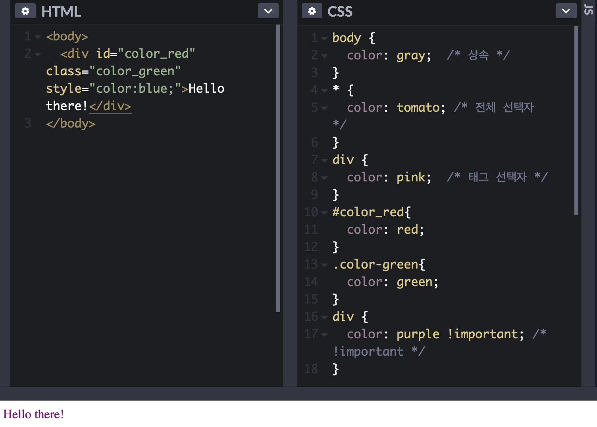

# CSS 우선순위와 구체성

- CSS에서 우선순위란?
- 구체성이란?
- 어떤 요소에 어떤 속성이 먼저 적용될지 계산하는 방법은?

<br>

---

> 학습 동기와 목적

     최근 CSS에서 속성과 속성값을 넣어주었음에도 불구하고 적용이 안된 적이 몇번 있었다.
    처음에는 오타가 났거나 해당 요소에 적용할 수 없는 속성을 넣었나 확인해 보았지만 코드 자체만 보면 외관상 문제는 없었다.
    왜 그런지 이유를 찾지 못하다가 강사님께서 그런 이슈는 `CSS의 구체성`과 관련이 있는거라고 하셨다.
    그래서 오늘은 CSS에서 style을 선언해도 적용되지 않는 대참사(?)를 방지하고자 CSS에서 속성이 적용되는 우선순위에 대해 알아보고,
    그 우선순위에 영향을 미치는 구체성을 표로 정리하여 어떤 속성이 어떤 규칙에 의해 먼저 적용되는 것인지를 이해하는 시간을 가져보도록 하겠다.

<br>

---

> 우선순위 결정

<br>

같은 요소가 여러 선언의 대상이 되었을 때, 선언된 CSS 속성(property) 중 어떤 속성이 우선적으로 적용되는지를 결정한다. 이런 우선순위의 결정 방법은 크게 3가지로, 아래와 같다:

<br>

1. <u>선택자를 얼마나 명시적으로 선언했느냐에 대해 수치화 했을 때, 점수가 높은 선언이 우선</u> (**명시도**)

    | 센택자 | 점수  |
    | :----: | :---: |
    | !important | 가장 중요 |
    | 인라인 선언 방식 (HTML style 속성을 사용, CSS를 직접 명시)| 1000점 |
    |   아이디 선택자   | 100점 |
    | 클래스 선택자  | 10점  |
    |  태그 선택자   |  1점  |
    | 전체 선택자 | 0점|
    

<br> 

2. <u>점수가 같은 경우, 가장 늦게, 코드상 뒤에서 작성된 선언일수록 우선</u> (**선언순서**)

<br>

3. <u>명시도는 '상속'규칙보다 우선</u> (**중요도**)

<br>

4. <u>`!important`가 적용된 선언 방식이 다른 모든 방식보다 우선</u> (**중요도**)

<br>
    
        e.g. 아래와 같이 하나의 요소를 가르키는 7개의 색상이 있다고 해보자. Hello, there! 이라는 문자는 어떤 색상이 될까? 

```html
        <body>
            <div id="color_red" class="color_green" style="color:blue;">
                Hello there!
            </div>
        </body>
```

```css
        body {
            color: gray;  /* 상속 */
        }
        * { 
            color: tomato; /* 전체 선택자 */
        }
        div {
            color: pink;  /* 태그 선택자 */
        }
        #color_red{
            color: red;   /* 아이디 선택자 */
        } 
        .color-green{
            color: green;   /* 클래스 선택자 */
        }
        div {
            color: purple !important; /* !important */
        }
```

<br>

위와 같이 코드를 짜고 결과를 보면 아래와 같다: 



위의 예시에서는 `!important`가 적용된 선언 방식이 다른 모든 방식보다 우선시 돼서 `Hello there!`에 `{color: purple; }`이 먼저 적용된 것을 확인할 수 있다. 

<hr>

> 퀴즈 

<br>

    마지막으로 글을 줄이기 전에 퀴즈 타임! 알아맞춰보자! 

```css
.list li.item {color: red;}
.list li:hover {color: red;}
.box::before {content: "Nice"; color: red;}
#submit span {color: red;}
header .menu li:nth-child(2) {color: red;}
h1 {color: red;}
:not(.box) {color: red;}
:not(span) {color: red;}  
```

    답을 보려면 스크롤을 쭉 내리세요! 

---

cf.

https://sapjil.net/css-priorities/
https://m.blog.naver.com/jm3ds/221612412063
https://www.w3schools.com/cssref/css_selectors.asp

<br>

--- 

>> 퀴즈 답
 
<br>

```
21점
21점
11점
101점
22점
1점
10점
1점
```

---
date: 2021-03-05-금