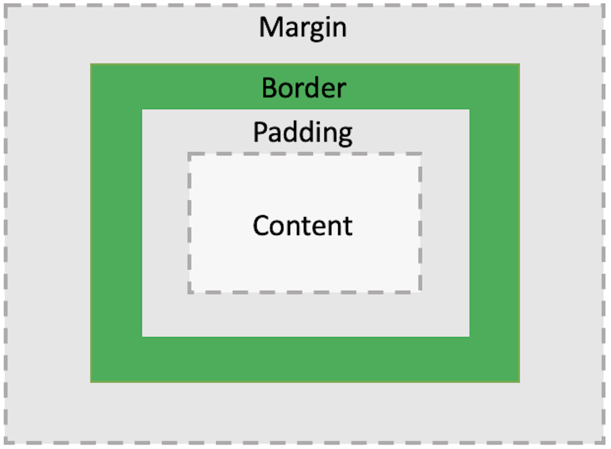
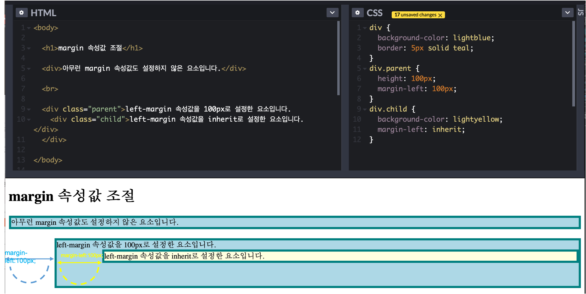
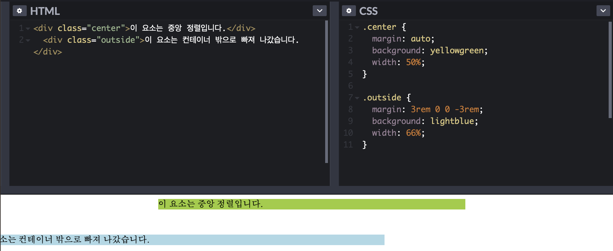
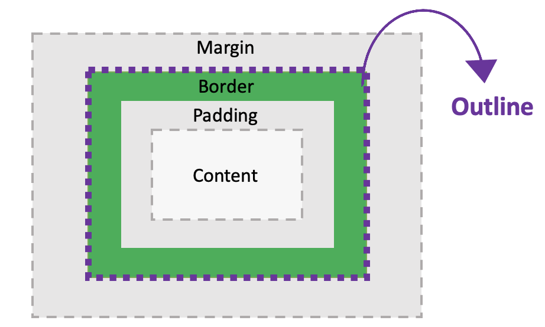

# CSS 박스 모델 

- CSS 에서 `박스 모델(Box Model)`이라는 용어는 디자인과 레이아웃을 말할 때 주로 사용된다. 
- 기본적으로 모든 HTML 요소는 박스(상자) 모양으로 구성되며, 이것을 CSS 박스 모델이라고 부른다.
이 '상자'는 HTML 요소를 여백/마진(margin), 테두리(border), 패딩(padding), 및 실제 내용이 담긴 콘텐츠/내용(content)로 구분한다.
	- `Margin`: 테두리와 이웃하는 요소 사이의 간격이다. 마진은 눈에 보이지 않는다. 
	- `Border`: 내용과 패딩 주변을 감싸는 테두리다. 
	- `Padding`: 내용과 테두리 사이의 간격이다. 패딩은 눈에 보이지 않는다. 
	- `Content`: 텍스트나 이미지가 들어있는 박스의 실징적인 내용 부분이다.
말로 하면 이해가 안되니 아래의 예시를 보자;
<div style="padding-left: 80px;">
	
</div>

- 기본적으로 HTML 요소를 하나의 상자라고 보았을 때, 아래와 같이 각 박스 모델의 영역들에 스타일을 적용시킬 수 있다;
```html
	<style>
		div {
				background-color: red;
				padding: 50px;
				border: 20px solid maroon;
				margin: 50px;
		}
	</style>
```
- 위와 같이 마진, 테두리, 패딩, 그리고 내용 부분에 스타일링을 적용 시키려면 CSS 속성들을 알아야 한다.  
이제 CSS 속성들에 대해 알아보는 시간을 가져보자! 

---
> 패딩(Padding)

- padding은 내용(content)과 테두리(border) 사이의 공간을 의미한다. 
- padding의 속성을 사용하면 패딩 영역의 ㅣ크기를 방향별로 따로 설정하는 것이 가능해진다. padding 속성은 아래와 같다; 
	|속성|설명|
	|:---:|:---:|
	|padding-top|상단 여백|
	|padding-right|오른쪽 여백|
	|padding-bottom|아래 여백|
	|padding-left|왼쪽 여백|

	<!-- - padding-top (상단 여백)
	- padding-right (오른쪽 여백)
	- padding-bottom (아래 여백)
	- padding-left (왼쪽 여백) -->
	
- 사용 예시;
```css
p {
	padding-top: 5px;
	padding-right: 5px;
	padding-bottom: 5px;
	padding-left: 5px;
}
```
- 패딩 축약 표현(padding shorthand);
```css
p {
	/* 축약 표현을 사용할 때는 top, right, bottom, left 순으로 값을 적어주면 된다. 
	단, 만약 4면의 값이 전부 똑같을 경우 그냥 한번만 값을 적어주면 된다.  */
	padding: 5px;
	/* 만약 top, bottom의 값이 같고, right, left에 적용시킬 값이 같다면 아래와 같이 작성할 수 있다. 
	top, bottom에는 5px씩 패딩이 적용되고, right, left에는 10px씩 패딩이 적용된다는 의미다. */
	padding: 5px 10px;
}
```

<br>

---

> 테두리(Border)
- border는 테두리를 만드는 속성이다.  
border에 적용할 수 있는 속성과 속성값들은 아래와 같다;
	|속성|설명|속성값|
	|:---:|:---:|:---:|
	|border-width|선의 두께을 지정. 기본값은 medium이다.|px, em, cm 등과 같은 CSS 크기 단위를 이용하여 두께를 설정할 수 있다. 또는 미리 설정해 놓은 예약어인 thin, medium, thick을 사용하여 설정하는 것도 가능하다.|
	|border-style|선의 모양을 지정. 기본값은 none이다.|dotted, dashed, solid, double, groove, ridge, inset, outset, none, hidden|
	|border-color|선의 색을 지정. 기본값은 꾸미려는 요소의 색(color)이다.|기본적인 color 속성값들 뿐만 아니라 투명한 선을 나타내는 transparent 속성값도 설정 가능하다. rgb와 16진수 코드로 색을 설정할 수도 있다. 만약 border-color 속성값이 설정되지 않으면 해당 요소의 color 속성값을 그대로 물려받게 된다.|
	|initial|기본값으로 설정한다.||
	|inherit|부모 요소의 속성값을 상속받는다.||
	
<br>

- 사용 예시; 
```html
<!-- border-style 속성 -->
<style>
	.dotted {border-style: dotted;}
	.dashed {border-style: dashed;}
	.solid {border-style: solid;}
	.double {border-style: double;}
	.groove {border-style: groove;}
	.ridge {border-style: ridge;}
	.inset {border-style: inset;}
	.outset {border-style: outset;}
	.none {border-style: none;}
	.hidden {border-style: hidden;}
	.mix {border-style: solid dashed dotted double;}
	/* cf. http://tcpschool.com/examples/tryit/tryhtml.php?filename=css_boxmodel_borders_01 */
</style>


<!-- border-width 속성 -->
<style>
	.dottedA { border-style: dotted; border-width: 2px; }
	.dottedB { border-style: dotted; border-width: 5px; }
	.dashedA { border-style: dashed; border-width: thin; }
	.dashedB { border-style: dashed; border-width: thick; }
	.doubleA { border-style: double; border-width: 5px; }
	.doubleB { border-style: double; border-width: thick; }
	.mix { border-style: solid; border-width: 1px 2px 10px thick; }
</style>


<!-- border-color 속성 -->
<style>
	.red { border-color: red; }
	.green { border-color: rgb(0,255,0); }
	.blue { border-color: #0000FF; }
	.mix { border-color: red green blue maroon; }
	.color { color: teal; }
</style>
```

<br>

- 테두리(border)는 위에서 살펴본 padding과 마찬가지로 위쪽, 오른쪽, 아래쪽, 왼쪽 부분에 대하여 개별적으로 스타일을 적용시키는 것이 가능하다; 
```html
<style>
	.mixA {
			border-top-style: dotted;
			border-right-style: double;
			border-bottom-style: dotted;
			border-left-style: double;
	}
	.mixB { border-style: dotted double; }
</style>
```

<br>

- border도 축약 표현(border shorthand)이 가능하다;
```html
<style>
	.good { border: 3px solid teal; }
	.wrong { border: 5px teal; }

	/* 4면이 모두 다른 값을 갖을 땐 top, right, left, bottom순으로 각각의 값을 적어 넣고, 만약 4면 전부 똑같은 값을 사용할 때는 값을 한 번만 적는다.*/
	div{
		border-style-top: dotted;
		border-style-right: dashed;
		border-style-bottom: solid;
		border-style-left: double;
	}
	div{
		border-style: dotted;
	}
	/* 만약 top, bottom이 같은 값을 갖고, right와 left가 같은 값을 갖는다면 아래와 같이 설정한다. */
	div{
		border-style: dotted dashed;
	}
</style>
```

<br>

---

> 마진(Margin)

- margin 속성은 테두리(border)와 이웃하는 요소 사이의 간격인 마진 영역의 크기를 설정한다.  
CSS를 사용하면 마진 영역의 크기를 방향별로 따로 설정할 수 있다.  
- margin 속성; 
	- margin-top
	- margin-right
	- margin-bottom
	- margin-left
- 사용 예시; 
```html
<style>
	div.mar {
		margin-top: 50px;
		margin-right: 10px;
		margin-bottom: 30px;
		margin-left: 100px;
	}
</style>
```
<br>

- margin 속성값을 음수로 설정하여 해당 요소를 다른 요소의 위에 겹치게 할 수도 있다.
```html
<style>
	div.mar {
		margin-top: -25px;
		margin-right: 10px;
		margin-bottom: 30px;
		margin-left: 100px;
	}
</style>
```
<br>

- margin 속성값을 inherit로 설정하면, 부모(parent) 요소의 margin 속성값을 그대로 물려받는다.
```html
<style>
	div.parent { height: 100px; margin-left: 100px; }
	div.child { background-color: #FFF8DC; margin-left: inherit; }
</style>
```
<div style="padding-left: 45px;">
	
</div>

<br>

- 마진 축약 표현(margin shorthand);   	  
모든 margin 속성을 이용한 스타일을 한 줄에 설정할 수 있다.
```html 
<style>
	/* 4개의 margin 속성값을 가질 때는 top, right, bottom,left 순으로 설정한다. */
	div.four { margin: 20px 50px 30px 50px; }

	/* 아래 예제에 나와있는 3개의 margin 속성값은 
		margin-top: 10px; 
		margin-right: 20px; 
		margin-bottom: 30px; 
		margin-left: 20px;     와 같은 의미다! */
	div.three { margin: 10px 20px 30px; }
	
	/* 2개의 margin 속성값을 가질 때는 top, bottom은 같은 속성값을 갖고, 
	right와 left는 같은 값을 갖는다. */
	div.two{ maring: 10px 20px; }
</style>
```
<br>

- margin 속성값에 있는 auto 속성값:
	- [auto 속성]은 브라우저가 적절한 여백 크기를 선택한다.    
		예를 들어 중앙 정렬하고 싶을 때 사용할 수 있다.
	- e.g. { margin: 0 auto; } 
		- 위는 대표적인 중앙 정렬 속성이다. 
		- margin 값으로 top, bottom에 0을 주겠다는 것은, 위 아래에 여백을 주지 않겠다는 의미이다.   
		~~브라우저를 개발자 도구를 켜고 검사를 해보면 여백이 없다고 나올 것이다.~~
		- margin 속성값을 auto로 설정하면, 웹 브라우저는 수평 방향 마진(margin) 값을 자동으로 설정하게 되는데, 해당 HTML 요소의 왼쪽과 오른쪽 마진을 자동으로 균등 배분하기 떄문에, 그 결과 해당 요소는 그 요소를 포함하고 있는 부모 요소의 정중앙 위치하게 되는 것이다. 
```html
<div class="center">이 요소는 중앙 정렬입니다.</div>
<div class="outside">이 요소는 컨테이너 밖으로 빠져 나갔습니다.</div>
```
```css
.center {
	margin: auto;
	background: yellowgreen;
	width: 50%;
}	

.outside {
	margin: 3rem 0 0 -3rem;
	background: lightblue;
	width: 66%;
}
```
<div style="padding-left: 45px;">
	
</div>

[auto 속성]: https://developer.mozilla.org/ko/docs/Web/CSS/margin

<br>

---

> 아웃라인(Outline)

- outline 속성은 HTML 요소의 가장 바깥 부분을 둘러싸고 있는 아웃라인 부분의 스타일을 설정한다. 
- outline 속성은 border 속성과 마찬가지로 style, width, color 속성을 갖는다.  
📍 단, border의 속성과는 다르게 HTML 요소의 전체 크기에는 포함되지 않는다.   
 	다시, HTML 요소의 높이나 너비는 outline의 두께에 전혀 영향을 받지 않는다. 
<div style="padding-left: 45px;"> 
	
</div>
<br>

- outline의 속성과 속성값들은 아래와 같다;
	|속성|설명|속성값|
	|:---:|:---:|:---:|
	|outline-style|outline-style 속성을 이용하면 아웃라인을 다양한 모양으로 설정하는 것이 가능하다.|dotted, dashed, solid, groove, ridge, inset, outset, none, hidden|
	|outline-width|outline-width 속성은 아웃라인의 두께/너비/width를 설정한다.|px, em, cm 등과 같은 CSS 크기 단위를 이용하여 두께를 직접 설정할 수도 있고, 또한, 미리 설정해 놓은 예약어인 thin, medium, thick을 사용하여 설정할 수도 있다.|
	|outline-color|outline-color 속성은 아웃라인의 색상을 설정한다.|기본적인 color 속성값 뿐만이 아니다 색반전을 나타내는 invert 속성값을 사용할 수 있다. 또한, invert 속성값은 배경색과 관계없이 아웃라인을 보여주기 위한 색반전을 설정한다.|
	|outline-offset|테두리(border)와 아웃라인(outline) 사이의 여백/간격을 설정한다.|기본값은 0이다. length, inherit이 설정값으로 올 수 있다.|  
	||||
		
	📍 _이때, outline 속성을 설정하기 위해서는 반드시 outline-style 속성이 먼저 설정되어 있어야 한다._  
	📍 _또한, 익스플로러 8과 그 이전 버전에서는 HTML 문서에 \<!DOCTYPE html> 태그가 삽입되어 있어야만 outline(외곽선) 속성이 제대로 표현된다._ 

<br>

- 사용 예시; 
```html
<!-- outline-style 속성 -->
<style>
	p.dotted {outline-style: dotted;}
	p.dashed {outline-style: dashed;}
	p.solid {outline-style: solid;}
	p.double {outline-style: double;}
	p.groove {outline-style: groove;}
	p.ridge {outline-style: ridge;}
	p.inset {outline-style: inset;}
	p.outset {outline-style: outset;}
	p.none {outline-style: none;}
	p.hidden {outline-style: hidden;}
	/* cf. http://tcpschool.com/css/css_boxmodel_outline */
</style>


<!-- outline-width 속성 -->
<style>
	p.solidA { outline-style: solid; outline-color: violet; outline-width: 2px; }
	p.solidB { outline-style: solid; outline-color: coral; outline-width: 7px; }
	p.dashedA { outline-style: dashed; outline-color: violet; outline-width: thin; }
	p.dashedB { outline-style: dashed; outline-color: coral; outline-width: thick; }
</style>

<!-- outline-color 속성 -->
<style>
	p { border: 1px solid black; outline-style: dashed; }
	p.red { outline-color: red; }
	p.green { outline-color: rgb(0,255,0); }
	p.blue { outline-color: #0000FF; }
	p.invert { outline-color: invert; }
</style>
```

<br>

- outline도 축약 표현(outline shorthand)이 가능하다; 
```html
<style>
	p { border: 1px solid black; }
	p.none { border-style: none; }
	p.good { outline: 3px solid teal; }
	p.wrong { outline: 5px teal; }
</style>
```

<br>

---

<details>
<summary>CLICK ME!</summary>

- cf. 
	- https://www.w3schools.com/css/css_boxmodel.asp
	- https://developer.mozilla.org/ko/docs/Web/CSS/CSS_Box_Model/Introduction_to_the_CSS_box_model
	- https://developer.mozilla.org/ko/docs/Learn/CSS/Building_blocks/The_box_model
	- http://tcpschool.com/css/css_boxmodel_boxmodel
	- https://aboooks.tistory.com/81
	- http://tcpschool.com/css/css_boxmodel_margins
	- https://developer.mozilla.org/ko/docs/Web/CSS/margin
	- http://tcpschool.com/examples/tryit/tryhtml.php?filename=css_boxmodel_margins_02
	- https://hansolcha.tistory.com/4    
	(cf. margin: 0 auto; 를 해줘야 하는 이유 - 정중앙 배치)
	- https://coderap.tistory.com/247

</details> 

---

📍 다음 시간에는 CSS 속성 중 display 속성/ 가시 속성에 대해서 알아보도록 해요! 😊   

---
