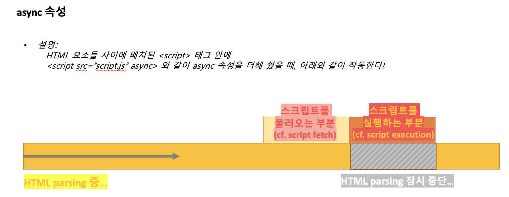
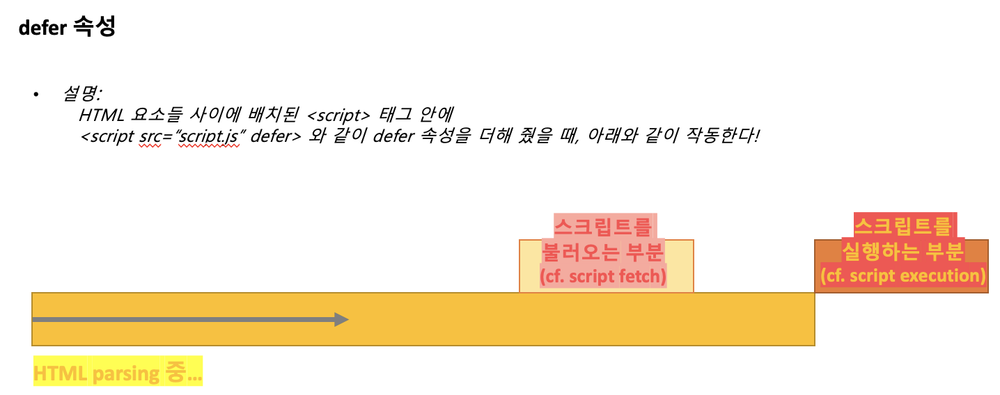

# \<head>\</head> 안에서 사용하는 태그들


> `<head></head>` 안에서 사용하는 태그들

<div style="padding-left: 45px;">
	<h3>목록</h3>
	<ol type="1"> 
		<li>title (웹 페이지의 제목)</li>
		<li>meta (웹 페이지의 정보)</li>
		<li>link (CSS 불러오기/CSS 파일 연결하기)</li>
		<li>style (CSS 작성하기)</li>
		<li>script (JS 불러오거나 작성하기)</li>
		<li><del>base</del></li>
		<li><del>noscript</del></li>
	</ol>
</div>

<!-- - 목록 
	1. title (웹 페이지의 제목)
	2. meta (웹 페이지의 정보)
	3. link (CSS 불러오기/CSS 파일 연결하기)
	4. style (CSS 작성하기)
	5. script (JS 불러오거나 작성하기)  
~~6. base~~  
~~7. noscript~~ -->

<br>

>> `1. title tag`

- `<title> 태그`는 HTML 문서의 제목(title)을 정의하며, 아래와 같은 용도로 사용된다:
	- 웹 브라우저의 툴바(toolbar)에 표시된다 
	- 웹 브라우저의 즐겨찾기(favorites)에 추가할 때 즐겨찾기의 제목이 된다
	- 검색 엔진의 결과 페이지에 제목으로 표시된다 (cf. 페이지 제목은 SEO에 큰 영향을 준다.)
- 다시, HTML \<title> 요소는 브라우저의 제목 표시줄이나 페이지 탭에 보이는 문서 제목을 정의하는 용도로 사용된다. 
- HTML의 \<title> 요소는 텍스트만 포함할 수 있으며 태그를 포함하더라도 무시한다.
- HTML의 \<title> 요소는 여는 태그와 닫는 태그 모두 필수다. <br> ~~만약 여는 태그만 넣고 닫는 태그 \<title>이 없으면 브라우저가 페이지의 나머지 내용을 무시한다.~~
- \<title> 요소는 페이지의 \<head> 안에서 사용해야 합니다. <br>
	~~(cf. 가능한 부모 요소; <head>)~~
- 기본 문법:
	```html

	<title>엄청 흥미로운 제목</title>

		<!-- <title> 태그에서 고려해봐야 하는 부분들...
			1. 엄청 흥미로운 제목은 검색 결과에서 잠재적 독자의 주목을 끌 수 있는 최초의 '훅(hook)'과 같은 역할을 한다
			2. <title>에는 페이지의 목적을 설명하는 title을 제공하는 것이 중요한데, 스크린리더와 같은 보조 기술 사용자는 검색을 할 때, 일일이 탐색을 해 콘텐츠를 찾는 것보다는 페이지의 제목만을 우선적으로 읽고 어떤 내용인지 유추하기 때문이다. 그렇기 때문에 '접근성'을 고려하여 페이지의 title 값에 중요한 정보를 반영하도록 노력해야한다.
		 -->
	```

<br>

>> `2. meta tag`

- `<meta> 태그`는 웹 문서의 정보 ~~(cf. 여기서 해당 웹 문서, 즉 HTML 문서의 대한 정보를 '메타 데이터'라고 한다)~~ 를 설정하는 태그이다. 
- 다시, \<meta> 요소는 브라우저가 화면을 구성하는데 필요한 정보를 설정하거나 개발자가 임의로 정한 정보를 기록하는데 사용된다. 
- 이러한 <meta> 요소는 언제나 <head> 요소 내부에 위치해야 한다.
<!-- - \<meta> 요소는 항상 \<head> 태그 안에 들어가는데, \<base>, \<link>, \<script>, \<style>, \<title>과 같은 메타 관련 요소들을 지정하여 일반적으로 어떤 문자로 HTML 문서를 인코딩할지, 페이지에 대한 설명, 키워드, 문서 작성자, 뷰포트의 설정 등의 '화면에는 렌더링 되지는 않지만 브라우저나 검색 엔진 등이 분석하여 웹 페이지를 렌더링 할 때 사용되는 다양한 메타데이터'를 지정하는데 사용된다.  -->
<!-- - \<meta> 태그로 표현된 메타 데이터는 페이지에 표시되지 않아 사용자가 보지는 못하지만 컴퓨터가 이를 분석한다.   -->
<!-- - HTML 문서에서 \<meta> 태그는 \<base>, \<link>, \<script>, \<style>, \<title>과 같은 다른 메타관련 요소로 화면에 렌더링 되지는 않지만 컴퓨터는 해석할 수 있는 메타데이터를 나타낸다. -->
- \<meta>는 빈 요소(empty tag)이다. 
- \<meta> 태그는 아래와 같은 속성(attributes)들을 갖을 수 있다:

	| **속성(attribute)** | **값(value)** | **설명(description)** | **문법** |
	|:---:|:---:|:---:|:---:|
	|<u>charset</u>|_character_set_|\<meta> 태그의 charset 속성은 해당 HTML 문서의 문자 인코딩 방식을 명시한다. <br> 다시, 웹 브라우저가 읽어들일 HTML 문서의 문자열을 처리할 때 사용하는 방식을 명시하는 속성으로, `UTF-8`로 설정하면 현존하는 전 세계의 모둔 언어를 표현할 수 있다. |`<meta charset="문자셋" />` <br> ~~(cf. 유니코드(Unicode)를 위한 문자셋인 UTF-8이 가장 많이 사용됨.)~~ |
	|<u>content</u>|_text_|\<meta> 태그의 content 속성은 name 속성이나 http-equiv 속성과 관련된 값(value)을 명시한다|`<meta content="텍스트" />`|
	|<u>http-equiv</u>|_content-security-policy content-type default-style refresh_|서버/사용자 에이전트의 작동방식 변경에 대한 지시(HTTP 응답 헤더 제공)|`<meta http-equiv="content-type|default-style|refresh" />`|
	|<u>name</u>|_application-name author description generator keywords viewport_|<meta> 태그의 name 속성은 메타데이터를 위한 이름을 명시한다|`<meta name="애플리케이션 이름|author|description|generator|keywords|viewport" />`|

<br>

- 메타 태그의 필요성 / 메타 태그와 SEO의 관계성
	-  메타 태그는 검색엔진최적화(SEO)를 위한 첫 걸음이라고도 할 수 있다. 왜냐면 메타 태그를 사용하여 웹페이지에 대한 묘사/요약을 할 수 있기 때문이다. <br>
	~~최근들어 검색엔진마케팅(SEO, Search Engine Marketing)이 인터넷 비지니스 아이템으로 각광받을 만큼 그 중요성이 나날이 상승되고 있는데, 이러한 시점에서 웹페이지나 블로그 스킨의 올바른 메타대그 적용은 더욱 더 고려해야될 부분이라고 생각한다!~~  
	<div style="padding-left: 70px;">
	<ul style="list-style: square;">
	<li> cf. 메타 태그를 활용한 검색엔진최적화(SEO) 가이드 영상:  <br>
			https://www.youtube.com/watch?v=EzRiGZNThb8 </li> 
	<br>
	<li> cf. SEO를 위한 메타 태그 작성 도구 (Meta Tag Generator) <br>
				https://www.seomarketing.kr/meta-tag-generator/</li>
	</ul>
	</div>

<br>

- 메타 태그의 속성과 사용 예시
	- e.g.
	```html
	<!-- charset: 웹 브라우저가 웹 문서의 문자열을 처리할 때 사용하는 방식이다. UTF-8로 설정하면 전 세계 언어 표현이 가능하다. -->
		<meta charset="UTF-8" />

		<!-- viewport: 눈에 보이는 영역의 크기를 설정하는 meta 태그. PC용 브라우저가 아닌 모바일 브라우저를 위해 사용한다. -->
		<meta name="viewport" content="width=device-width, initial-scale=1.0, maximum-scale=1.0, minimun-scale=1.0, user-scalable=no, target-densitydpi=medium-dpi"/>
		<!-- 해석: 뷰포트는 눈에 보이는 화면이라고 생각하면 되는데, 'width=device-width' 라고 하면 눈에 보이는 화면의 가로 길이를 화면의 길이만큼 최적화 하겠다는 의미리고, 'initial-scale=1.0'이라고 하면 최초의 확대 비율이 원본 크기여야 한다고 설정하는 것이다. 그리고 'user-scalable=no' 은 사용자에 의해 확대 축소가 가능하지 않게 설정을 하는 것인데, 이 부분이 안먹히면 'maximum-scale=1.0, minimun-scale=1.0'를 적용하여 같은 효과를 기대할 수 있게 하려고 사용한 것이다. 그리고 마지막으로 'target-densitydpi=medium-dpi'는 보편적으로 많이 사용하는 해상도에 맞춰서 화면이 나오게 하겠다고 설정해 놓는 아이이다! -->

		<!-- X-UA-Compatible: HTML5 이후로 사용되고 있으며 인터넷 익스플로러에서 화면이 깨지는 걸 사전에 방지하기 위해 사용한다 -->
		<meta http-equiv="X-UA-Compatible" content="IE=edge" />
	``` 
	- 메타 태그에 관련된 내용은 이 밖에도 괸장히 많고, 브라우저의 종류, OS 종류, 디바이스의 종류에 따라 맞춰야만 하는 요구사항이 굉장히 많기 때문에 메타 태그의 수가 많을 수도 있다. 

	- 📍 이 외의 기타 메타 태그 속성 사용 방법을 익히려면:      
		- https://m.blog.naver.com/PostView.nhn?blogId=shinekjm&logNo=221261775607&proxyReferer=https:%2F%2Fwww.google.com%2F  
		- https://blog.munilive.com/posts/meta-tag-property-and-use-method.html  
		- http://tcpschool.com/html-tag-attrs/meta-name  

<br>


>> `3. link tag`
- \<link> 태그는 외부의 문서를 연결해주는 역할을 한다. <br>
~~(cf. 주로 CSS 파일이나 JS 파일과 같은 파일을 연결하거나 웹 폰트를 사용할 때 폰트가 있는 주소로 연결시킬 수도 있다.)~~
- \<link> 태그는 \<head> 태그 안에 위치시킨다. 
- \<link> 태그는 여러개 삽입할 수 있다. 
- \<link> 태그는 빈 태그다. 
	```html
	<link rel="stylesheet" type="text/css" href="style.css" />
	```
- 위의 예시에서 사용된 속성들은 아래와 같다:
	- `rel 속성`
		- 해당 속성은 문서와 외부에서 불러올 연결 관계를 설정하는 속성이다. 
		- \<link rel="stylesheet">가 가장 기본적인데 해석하면 스타일 시트로써 이 문서를 불러오겠단 말이다.
		이 밖에도 다양한 속성이 있다:

			 태그의 속성 중 rel의 속성들 설명" width="500px" height="auto" />


	- `type 속성`
		- type은 연결 문서의 유형을 나타낸다
		- e.g.
		```html
			<!-- css 파일일 경우  -->
			<link type="text/css" />

			<!-- js 파일일 경우  -->
			<link type="text/javascript" />
			
			<!-- xml 파일일 경우  -->
			<link type="application/txml" />
		```  

			📍 주로 이렇게 3가지 속성이 많이 사용된다. 더 알고 싶다면:
			 	  cf. https://www.sitepoint.com/mime-types-complete-list/

	- `href 속성`
		- 연결될 문서를 설정해주는 속성이다. <br>
		이때 경로 설정에는 상대경로와 절대경로가 있다:
			1. <u>**상대경로**</u>의 경우에는 현재 머물고 있는 페이지부터 시작해서 경로를 설정하는 방법이고, 
			2. <u>**절대경로**</u>의 경우에는 이 페이지를 가지고 있는 최상위 경로부터 시작해 설정하는 방법이다.
		- e.g.
		```html
			<!-- 1. 상대 경로 -->
			같은 폴더의 다른 페이지 이동하기
			<link href ="./ex04.htm" /> 
			같은 폴더의 다른 페이지 이동하기
			<link href ="ex04.htm" />
			자식 폴더의 다른 페이지 이동하기 
			<link href ="./Member/list.htm" />
			자식 폴더의 다른 페이지 이동하기 
			<link href ="Member/list.htm" />
			자식 폴더의 다른 페이지 이동하기 
			<link href ="./Member/private/private.htm" />
			자식 폴더의 다른 페이지 이동하기 
			<link href ="Member/private/private.htm" />
			프로젝트 루트 폴더의 자원으로 이동
			<link href ="../필기.txt" />
				
			<!-- 2. 절대 경로 -->
			절대경로
			<link href ="/WebClientTest/ex01.htm" />
			절대경로
			<link href ="/WebClientTest/Member/list.htm" />
			절대경로
			<link href ="/WebClientTest/Member/private/private.htm" />
			부모폴더의 다른 페이지 이동하기
			<link href ="/WebClientTest/Member/list.htm" />

			<!-- cf. 
			https://sas-study.tistory.com/127 
			https://soharu.tistory.com/11 
			-->
		```

<br>

>> `4. style tag`
- CSS를 HTML 문서에 적용하는 방법은 3 가지이다:
	1. 인라인 스타일
	2. 내부 스타일 시트
	3. 외부 스타일 시트	
- 1. 인라인 스타일
	- 인라인 스타일은 HTML 요소 내부에 style 이란 속성을 사용하여 해당 요소에만 스타일을 적용할 수 있는 방법이다. 
		- e.g. 
		```html
		<body>
			<h2 style="color: yellow; text-decoration: underline">
				Heading 2
			</h2>
		</body>
		```
- 2. 내부 스타일 시트
	- 내부 스타일 시트는 HTML 문서 내의 \<head> 태그 사이에 \<style> 태그를 사용해 CSS 스타일을 해당 HTML 문서에 적용시키는 방법이다. 
		- e.g. 
		```html
		<style>
			body{
				background-color: lightyellow;
			}
			h2{
				color: red;
				text-decoration: underline;
			}
		</style>
		```
- 3. 외부 스타일 시트
	- 외부 스타일 시트는 웹사이트 전체의 스타일을 /.css 확장자를 사용해 저장한 파일 하나에서 변경할 수 있는 방법을 의미한다. \<head> 태그 사이에 \<link> 태그를 사용해 외부에서 스타일시트를 연결 시켜서 불러온다고 하여 붙여진 이름이다.  
		- e.g. 
		```html
		<head>
			<link rel="stylesheet" href="./style.css" />
		</head>
		
		<body>
			<h2>
				Heading 2
			</h2>
		</body>
		```
- `<style> 태그`는 내부 스타일시트 방법을 사용하여 해당 HTML 문서에 CSS를 적용시킬 때 사용하는 태그이다. 

<br>


>> `5. script tag` 
- \<script> 태그는 HTML 문서 내에서 JavaScript 코드를 적용/사용하기 위해 필요한 태그이다. 
- \<script> 태그를 사용하여 HTML 문서에 연결 시키는 방법은 2가지:
	1. HTML 문서에 직접 삽입
	2. 스크립트 파일을 만든 후 불러오기   
	- e.g.
	```html
	<html>
		<head>
			<!-- 1. HTML 문서 안에 <script> 태그를 만들고, 그 안에 코드를 넣는 반법이다.
				이 방법은 JavaScript 코드가 짧은 경우에 유용하다. -->
			<script>
				document.getElementById("#paragraph").innerHTML = "Nice to meet you!"
			</script>
		</head>

		<body>
			<h1>EXAMPLE</h1>
			<p id="paragraph">Hello there : ) </p>

			<!-- 2. JavaScript 코드를 담은 파일을 만든 후 HTML 문서에 연결시키는 방법이다. 자바스크립트 코드를 담은 파일의 확장자는 .js이며, src라는 속성을 사용하여 해당 HTML 문서와 연결시킨다. 이 방법은 많은 HTML 문서에 같은 자바스크립트 코드를 적용시키거나, 자바스크립트 코드가 긴 경우 유용한 방법이다.
			cf. HTML 문서에서 script의 위치는 매우 중요하다. 스크립트가 로딩되고 실행되어야 하는 시점을 잘 파악하여 적절한 위치에 사용해야하는데, 이는 뒤에서 좀 더 살펴볼 예정... 
			지금은 <script> 태그가 위에서 처럼 <head> 안에 있을 수도 있지만 이렇게 위치할 수도 있다는 것을 보여주기 위해 이렇게 적은 것! -->
			<script src="EXAMPLE.js"></script>
		</body>	
	</html>
	``` 

- `<script> 태그의 속성`들은 아래와 같다:
	| **속성(attribute)** | **값(value)** | **설명(description)** | **문법** |
	|:---:|:---:|:---:|:---:|
	|<u>async</u>|_Boolean(true/false)_|async가 있는 경우에는 스크립트가 페이지의 나머지 부분과 비동기적으로(순차적이지 않게) 실행된다. 즉, 페이지가 구문 분석을 계속 하는 동안 스크립트가 실행된다는 의미이다. <br> ~~만약 async가 존재하지 않는 (그리고 아래의 'defer'도 존재하지 않는) 경우 브라우저는 페이지 구문 분석을 계속하기 전에 스크립트를 가져와서 즉시 실행시킨다.~~ <br> async 속성은 불리언 속성으로 명시하지 않으면 자동으로 false 값을 갖게되고, 명시하면 true 값으로 설정된다. |`<script src="example_script_async.js" async></script>` <br> 이때, async 속성은 \<script> 요소가 외부 스크립트를 참조하는 경우에만 사용할 수 있으므로, `src=" "` 라는 속성이 명시된 경우에만 사용할 수 있다.|  
	|<u>defer</u>|_Boolean(true/false)_|\<script> 태그의 defer 속성은 페이지가 모두 로드된 후에 해당 외부 스크립트가 실행됨을 명시한다. <br> defer의 속성으로 불리언을 명시하지 않으면 자동으로 false 값을 갖게되고, 명시하면 true로 그 값이 바뀐다. <br> 이 속성은 \<script> 요소가 외부 스크립트를 참조하는 경우에만 사용할 수 있기 때문에, src 속성을 명시해야만 한다. <br>  |`<script defer>`|
	|<u>src</u>|_URL_|참조할 외부 스크립트의 URL(/주소/경로) |`<script src="URL">` <br> 'URL' 자리에 스크립트 파일의 주소를 절대주소 또는 상대 주소로 알려주면 된다.|
	|<u>type</u>|_미디어 타입_|\<script> 태그의 type 속성은 \<script></script> 태그 사이에 위치하는 스크립트의 (인터넷) 미디어 타입을 명시한다. |`<script type="스크립트의 미디어 타입">` <br> ~~(cf. MIME type이 와야함! e.g. text/javascript 또는 application/javascript)~~ |
	<!-- |<u>integrity</u>|__|설정값과 변동사항이 있다면 로드되지 않느다. 기존 값과 다른 경우에도 로드를 차단하낟. 이 속성을 활용하면 특정 버전의 파일이 변경되거나 변조된 경우 로드되는 것을 막을 수 있고, 이를 이용하여 악의적인 스크립트 변조를 막을 수 있다는 장점이 있다. |`<script integrity="filehash">` <br> 속성값으로는 'filehash'가 오는데, 해석: ???  |  -->
	<!-- |<u>crossorigin</u>|__||``|
	|<u>nomodule</u>|__||``|
	|<u>referrerpolicy</u>|__||``| -->

<br>
<br>

## \<script> 태그는 어디에 위치해야 할까? 
- 기본적으로 \<script> 태그는 문서의 어느 곳이든 배치에 제한을 두지는 않는다.  
	하지만 보통 \<head> 태그 안에 배치하거나, \<body> 태그 최하단에 위치시키곤 하는데  
	이 두 방법 중 어디에 위치시키는 것이 좋은지를 판단하려면 '브라우저의 동작 방식'을 이해할 필요가 있다. 
- 브라우저의 동작 방식을 간단히 나타내면 아래와 같다:  
	<div style="padding-left: 15px;">
		<ul>
			<li><strong>step 1.</strong> 브라우저는 불러온 HTML을 읽기 시작한다</li>
			<li><strong>step 2.</strong> 브라우저는 HTML 문서를 파싱(parsing)한다</li>			
			<li><strong>step 3.</strong> DOM 트리를 생성한다</li>			
			<li><strong>step 4.</strong> Render 트리 (DOM tree + CSS의 CSSOM 트리 결합)가 생성되고</li>			
			<li><strong>step 5. </strong> Dispaly에 표시한다 </li>			
		</ul>  
	</div>
- 이때, 중요한 부분이 step 1, 2, 3 부분인데, 브라우저가 불러운 HTML 문서를 읽기 시작하고, 파싱을 하는 도중 \<script> 태그를 만나면 파싱을 중단하고 JavaScript 파일을 로드한 후 자바스크립트 코드를 파싱하기 시작한다. 자바스크립트의 파싱이 완료되면, 이후 HTML 파싱을 계속하기 때문에 어디에 \<script> 태그를 삽입하냐에 따하 스크립트 실행 순서와 브라우저 렌더링에 영향을 미칠 수 있다는 것을 의미한다. 
- 결론적으로는 \<body> 태그의 최하단에 \<script> 태그를 위치 시키는 것이 <u>가장 좋은 방법</u>이다.   
	만약에 \<script> 태그를 HTML 태그들 사이에 배치하면 아래와 2 가지 문제점들이 발생한다:   
	- **문제점 1:** 
		- HTML을 읽는 과정에 스크립트를 만나면 중단 시점이 생기고 그만큼 Display에 표시되는 것이 지연된다. 
	- **문제점 2:**  
		- DOM 트리가 생성되기전에 자바스크립트가 생성되지도 않은 DOM의 조작을 시도할 수 있다.

	📍 따라서 위와 같은 상황을 막기 위해 script 태그는 body 태그 최하단에 위치하는 게 가장 좋다! 
- 하지만 항상  \<script> 태그를 \<body> 태그 최하단에 놓을 수 있는 상황이 아닐 수도 있다.  \<script> 태그가 HTML 요소들 사이에 위치할 때,  \<script> 태그의 속성을 활용해서 로딩 순서를 제어할 수가 있다. <br> 
이럴 때 사용할 수 있는  \<script> 태그의 속성은 2 가지:
	- `async 속성`  
  
		- 위의 그림에서 처럼 async 속성이 더해진 script 태그가 HTML 태그 사이에 있는 경우, <u>브라우저가 script 태그를 만나도 HTML parsing이 중단되지 않는다.</u> 
		- script 로드와 HTML parsing이 함께 이뤄지다가 script 로드가 끝나면 script가 실행되는 시점에 HTML parsing이 잠시 중단되고 실행이 끝나면 HTML parsing이 재개된다. <br> <br> 
		 
	- `defer 속성`  

		- 위의 그림에서 처럼 defer 속성이 더해진 script 태그가 HTML 태그 사이에 있는 경우, <u>브라우저가 script 태그를 만나도 script 로드의 시작부터 끝까지 HTML parsing이 중단되지 않으며ㅡ HTML parsing이 끝나고 난 뒤에야 script가 실행된다. </u> 
- ~~주가적으로 script 내부에서 로딩 순서를 제어할 수도 있는데, 이때 사용되는 아이들은 아래와 같다:~~
	- ~~`DOMContentLoaded`~~ 
	- ~~`onload`~~  
~~이에 관련해서는 JS를 배울 때 더 다뤄보도록 합시다!~~   
~~cf. https://velog.io/@takeknowledge/script-%ED%83%9C%EA%B7%B8%EB%8A%94-%EC%96%B4%EB%94%94%EC%97%90-%EC%9C%84%EC%B9%98%ED%95%B4%EC%95%BC-%ED%95%A0%EA%B9%8C%EC%9A%94~~


	
<br>


<!-- >> `6. base tag`
- \<base> 태그는 HTML 문서 내에서 ...

< 미완 >

- 

<br>

>> `7. noscript tag`
- \<noscript> 태그는 HTML 문서 내에서 ...

< 미완 >

- cf. 
https://developer.mozilla.org/ko/docs/Web/HTML/Element/noscript

<br> -->

---

<details>
<summary>CLICK ME</summary>

- cf.
	- https://developer.mozilla.org/ko/docs/Learn/HTML/Introduction_to_HTML/The_head_metadata_in_HTML
	- https://www.w3schools.com/html/html_head.asp
	- https://www.geeksforgeeks.org/elements-that-are-used-in-head-section-of-html-page/
	- https://www.w3schools.com/tags/tag_meta.asp
	- https://m.blog.naver.com/hobak486/221694104143
	-	https://webdir.tistory.com/38
	- https://www.youtube.com/watch?v=gDuoMCP64ZA
	- https://aboooks.tistory.com/352
	- http://chongmoa.com/mobile/3240
	- http://tcpschool.com/html-tag-attrs/meta-http-equiv
	- https://www.w3schools.com/tags/tag_meta.asp
	- https://developer.mozilla.org/ko/docs/Web/HTML/Element/meta
	- http://www.tcpschool.com/html-tags/meta
	- https://blog.munilive.com/posts/meta-tag-property-and-use-method.html
	- https://m.blog.naver.com/PostView.nhn?blogId=shinekjm&logNo=221261775607&proxyReferer=https:%2F%2Fwww.google.com%2F
	- https://hyoseung930.tistory.com/67
	- http://www.tcpschool.com/html-tags/link
	- https://aboooks.tistory.com/147
	- https://www.codingfactory.net/10397
	- https://kimlog.me/js/2019-10-05-script/
	- https://hi098123.tistory.com/273
	- https://kimlog.me/js/2019-10-05-script/	
	- http://tcpschool.com/html-tag-attrs/script-async
	- https://www.w3schools.com/tags/tag_script.asp
	- https://www.w3schools.com/tags/att_script_async.asp
	- https://pshcode.tistory.com/43
	- https://velog.io/@takeknowledge/script-%ED%83%9C%EA%B7%B8%EB%8A%94-%EC%96%B4%EB%94%94%EC%97%90-%EC%9C%84%EC%B9%98%ED%95%B4%EC%95%BC-%ED%95%A0%EA%B9%8C%EC%9A%94

</details>

---