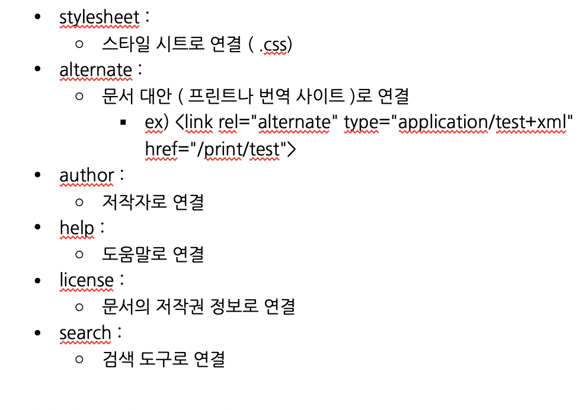

# \<head>\</head> 안에서 사용하는 태그들


> `<head></head>` 안에서 사용하는 태그들

<div style="padding-left: 30px;">
	<h3>목록</h3>
	<ol type="1"> 
		<li>title (웹 페이지의 제목)</li>
		<li>meta (웹 페이지의 정보)</li>
		<li>link (CSS 불러오기/CSS 파일 연결하기)</li>
		<li>style (CSS 작성하기)</li>
		<li>script (JS 불러오거나 작성하기)</li>
		<li><del>base</del></li>
		<li><del>noscript</del></li>
	</ol>
</div>

<!-- - 목록 
	1. title (웹 페이지의 제목)
	2. meta (웹 페이지의 정보)
	3. link (CSS 불러오기/CSS 파일 연결하기)
	4. style (CSS 작성하기)
	5. script (JS 불러오거나 작성하기)  
~~6. base~~  
~~7. noscript~~ -->

<br>

>> `1. title tag`

- `<title> 태그`는 HTML 문서의 제목(title)을 정의하며, 아래와 같은 용도로 사용된다:
	- 웹 브라우저의 툴바(toolbar)에 표시된다 
	- 웹 브라우저의 즐겨찾기(favorites)에 추가할 때 즐겨찾기의 제목이 된다
	- 검색 엔진의 결과 페이지에 제목으로 표시된다 (cf. 페이지 제목은 SEO에 큰 영향을 준다.)
- 다시, HTML \<title> 요소는 브라우저의 제목 표시줄이나 페이지 탭에 보이는 문서 제목을 정의하는 용도로 사용된다. 
- HTML의 \<title> 요소는 텍스트만 포함할 수 있으며 태그를 포함하더라도 무시한다.
- HTML의 \<title> 요소는 여는 태그와 닫는 태그 모두 필수다. <br> ~~만약 여는 태그만 넣고 닫는 태그 \<title>이 없으면 브라우저가 페이지의 나머지 내용을 무시한다.~~
- \<title> 요소는 페이지의 \<head> 안에서 사용해야 합니다. <br>
	~~(cf. 가능한 부모 요소; <head>)~~
- 기본 문법:
	```html

	<title>엄청 흥미로운 제목</title>

		<!-- <title> 태그에서 고려해봐야 하는 부분들...
			1. 엄청 흥미로운 제목은 검색 결과에서 잠재적 독자의 주목을 끌 수 있는 최초의 '훅(hook)'과 같은 역할을 한다
			2. <title>에는 페이지의 목적을 설명하는 title을 제공하는 것이 중요한데, 스크린리더와 같은 보조 기술 사용자는 검색을 할 때, 일일이 탐색을 해 콘텐츠를 찾는 것보다는 페이지의 제목만을 우선적으로 읽고 어떤 내용인지 유추하기 때문이다. 그렇기 때문에 '접근성'을 고려하여 페이지의 title 값에 중요한 정보를 반영하도록 노력해야한다.
		 -->
	```

<br>

>> `2. meta tag`

- `<meta> 태그`는 해당 HTML 문서의 대한 정보를 의미하는 `메타 데이터`를 정의하는 태그이다.
- 다시, \<meta> 요소는 \<base>, \<link>, \<script>, \<style>, \<title> 요소와 같은 다른 메타데이터 관련 요소들이 나타낼 수 없는 다양한 종류의 메타데이터를 제공할 때 사용되며, 이렇게 제공된 정보는 브라우저나 검색 엔진, 다른 웹 서비스에서 사용하게 된다.
- 이러한 <meta> 요소는 언제나 <head> 요소 내부에 위치해야 한다.
<!-- - \<meta> 요소는 항상 \<head> 태그 안에 들어가는데, \<base>, \<link>, \<script>, \<style>, \<title>과 같은 메타 관련 요소들을 지정하여 일반적으로 어떤 문자로 HTML 문서를 인코딩할지, 페이지에 대한 설명, 키워드, 문서 작성자, 뷰포트의 설정 등의 '화면에는 렌더링 되지는 않지만 브라우저나 검색 엔진 등이 분석하여 웹 페이지를 렌더링 할 때 사용되는 다양한 메타데이터'를 지정하는데 사용된다.  -->
<!-- - \<meta> 태그로 표현된 메타 데이터는 페이지에 표시되지 않아 사용자가 보지는 못하지만 컴퓨터가 이를 분석한다.   -->
<!-- - HTML 문서에서 \<meta> 태그는 \<base>, \<link>, \<script>, \<style>, \<title>과 같은 다른 메타관련 요소로 화면에 렌더링 되지는 않지만 컴퓨터는 해석할 수 있는 메타데이터를 나타낸다. -->
- \<meta>는 빈 요소(empty tag)이다. 
- \<meta> 태그 속성(attributes)

	| **속성(attribute)** | **값(value)** | **설명(description)** | **문법** |
	|:---:|:---:|:---:|:---:|
	|<u>charset</u>|_character_set_|\<meta> 태그의 charset 속성은 해당 HTML 문서의 문자 인코딩 방식을 명시한다|`<meta charset="문자셋" />` <br> ~~(cf. 유니코드(Unicode)를 위한 문자셋인 UTF-8이 가장 많이 사용됨.)~~ |
	|<u>content</u>|_text_|\<meta> 태그의 content 속성은 name 속성이나 http-equiv 속성과 관련된 값(value)을 명시한다|`<meta content="텍스트" />`|
	|<u>http-equiv</u>|_content-security-policy content-type default-style refresh_|서버/사용자 에이전트의 작동방식 변경에 대한 지시(HTTP 응답 헤더 제공)|`<meta http-equiv="content-type|default-style|refresh" />`|
	|<u>name</u>|_application-name author description generator keywords viewport_|<meta> 태그의 name 속성은 메타데이터를 위한 이름을 명시한다|`<meta name="애플리케이션 이름|author|description|generator|keywords|viewport" />`|

- 메타 태그의 속성과 사용 방법 예시
	-  메타 태그는 검색엔진최적화(SEO)를 위한 첫 걸음이라고도 할 수 있다. 왜냐면 메타 태그를 사용하여 웹페이지에 대한 묘사/요약을 할 수 있기 때문이다. <br>
	~~최근들어 검색엔진마케팅(SEO, Search Engine Marketing)이 인터넷 비지니스 아이템으로 각광받을 만큼 그 중요성이 나날이 상승되고 있는데, 이러한 시점에서 웹페이지나 블로그 스킨의 올바른 메타대그 적용은 더욱 더 고려해야될 부분이라고 생각한다!~~
	- 📍 이 외의 기타 메타 태그 속성 사용 방법을 익히려면:
		- cf. 
		- https://m.blog.naver.com/PostView.nhn?blogId=shinekjm&logNo=221261775607&proxyReferer=https:%2F%2Fwww.google.com%2F
		- https://blog.munilive.com/posts/meta-tag-property-and-use-method.html
		- http://tcpschool.com/html-tag-attrs/meta-name
		- 

< 완전 미완 >

http://tcpschool.com/html-tag-attrs/meta-http-equiv
https://www.w3schools.com/tags/tag_meta.asp
https://developer.mozilla.org/ko/docs/Web/HTML/Element/meta
http://www.tcpschool.com/html-tags/meta
https://blog.munilive.com/posts/meta-tag-property-and-use-method.html
https://m.blog.naver.com/PostView.nhn?blogId=shinekjm&logNo=221261775607&proxyReferer=https:%2F%2Fwww.google.com%2F

<br>


>> `3. link tag`
- \<link> 태그는 외부의 문서를 연결해주는 역할을 한다. <br>
~~(cf. 주로 CSS 파일이나 JS 파일과 같은 파일을 연결하거나 웹 폰트를 사용할 때 폰트가 있는 주소로 연결시킬 수도 있다.)~~
- \<link> 태그는 \<head> 태그 안에 위치시킨다. 
- \<link> 태그는 여러개 삽입할 수 있다. 
- \<link> 태그는 빈 태그다. 
	```html
	<link rel="stylesheet" type="text/css" href="style.css" />
	```
- 위의 예시에서 사용된 속성들은 아래와 같다:
	- `rel 속성`
		- 해당 속성은 문서와 외부에서 불러올 연결 관계를 설정하는 속성이다. 
		- \<link rel="stylesheet">가 가장 기본적인데 해석하면 스타일 시트로써 이 문서를 불러오겠단 말이다.
		이 밖에도 다양한 속성이 있다:

			

	- `type 속성`
		- type은 연결 문서의 유형을 나타낸다
		- e.g.
		```html
			<!-- css 파일일 경우  -->
			<link type="text/css" />

			<!-- js 파일일 경우  -->
			<link type="text/javascript" />
			
			<!-- xml 파일일 경우  -->
			<link type="application/txml" />
		```
			주로 이렇게 3가지 속성이 많은 사용되며, 더 알고 싶다면...
			  cf. https://www.sitepoint.com/mime-types-complete-list/

	- `href 속성`
		- 연결될 문서를 설정해주는 속성이다. <br>
		이때 경로 설정에는 상대경로와 절대경로가 있다:
			1. 상대경로의 경우에는 현재 머물고 있는 페이지부터 시작해서 경로를 설정하는 방법이고, 
			2. 절대경로의 경우에는 이 페이지를 가지고 있는 최상위 경로부터 시작해 설정하는 방법이다.


< 약간 미완 >

https://hyoseung930.tistory.com/67
http://www.tcpschool.com/html-tags/link
https://aboooks.tistory.com/147

<br>

>> `4. style tag`
- CSS를 HTML 문서에 적용하는 방법은 3 가지이다:
	1. 인라인 스타일
	2. 내부 스타일 시트
	3. 외부 스타일 시트	
- 1. 인라인 스타일
	- 인라인 스타일은 HTML 요소 내부에 style 이란 속성을 사용하여 해당 요소에만 스타일을 적용할 수 있는 방법이다. 
		- e.g. 
		```html
			<body>
				<h2 style="color: yellow; text-decoration: underline">
					Heading 2
				</h2>
			</body>
		```
- 2. 내부 스타일 시트
	- 내부 스타일 시트는 HTML 문서 내의 \<head> 태그 사이에 \<style> 태그를 사용해 CSS 스타일을 해당 HTML 문서에 적용시키는 방법이다. 
		- e.g. 
		```html
			<style>
				body{
					background-color: lightyellow;
				}
				h2{
					color: red;
					text-decoration: underline;
				}
			</style>
		```
- 3. 외부 스타일 시트
	- 외부 스타일 시트는 웹사이트 전체의 스타일을 /.css 확장자를 사용해 저장한 파일 하나에서 변경할 수 있는 방법을 의미한다. \<head> 태그 사이에 \<link> 태그를 사용해 외부에서 스타일시트를 연결 시켜서 불러온다고 하여 붙여진 이름이다.  
		- e.g. 
		```html
			<head>
				<link rel="stylesheet" href="./style.css" />
			</head>
			
			<body>
				<h2>
					Heading 2
				</h2>
			</body>
		```
- `<style> 태그`는 내부 스타일시트 방법을 사용하여 해당 HTML 문서에 CSS를 적용시킬 때 사용하는 태그이다. 

<완료>

<br>


>> `5. script tag`
- \<script> 태그는 HTML 문서 내에서 JavaScript 코드를 적용/사용하기 위해 필요한 태그이다. 

< 미완 >

- \<script> 태그는 어디에 위치해야 할까? 
	- https://velog.io/@takeknowledge/script-%ED%83%9C%EA%B7%B8%EB%8A%94-%EC%96%B4%EB%94%94%EC%97%90-%EC%9C%84%EC%B9%98%ED%95%B4%EC%95%BC-%ED%95%A0%EA%B9%8C%EC%9A%94
<br>


<!-- >> `6. base tag`
- \<base> 태그는 HTML 문서 내에서 ...

< 미완 >

- 

<br>

>> `7. noscript tag`
- \<noscript> 태그는 HTML 문서 내에서 ...

< 미완 >

- cf. 
https://developer.mozilla.org/ko/docs/Web/HTML/Element/noscript

<br> -->

---

<details>
<summary>CLICK ME</summary>

- cf.
	- https://developer.mozilla.org/ko/docs/Learn/HTML/Introduction_to_HTML/The_head_metadata_in_HTML
	- https://www.w3schools.com/html/html_head.asp
	- https://www.geeksforgeeks.org/elements-that-are-used-in-head-section-of-html-page/
	- https://www.w3schools.com/tags/tag_meta.asp
	- https://m.blog.naver.com/hobak486/221694104143

</details>

---