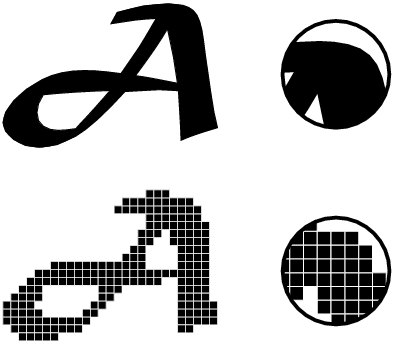

# HTML - 시작하기에 앞서 ...

## 이미지에 대한 이해 
- 웹에서 사용하는 이미지(graphic)은 크게:
	- <u>1. 비트맵과</u> 
	- <u>2. 벡터 이미지</u> 로 나뉜다. 

- 이 2가지 방식은 각각 서로 다른 형식으로 이미지를 저장하고 표현하는 방법을 사용한다. 이에 대해 알아보자! 

 

> 비트맵 이미지 VS 벡터 이미지 

<u>1. 비트맵(Bitmap) 이미지</u>:

- 우리가 일반적으로 접할 수 있는 대부분의 이미지가 비트맵 이미지이다.  비트맵 이미지의 형식은 정말 다양한데, 
*e.g.  JPG, PNG, GIF, WEBP, 등*이 모두 비트맵 확장자들이다. 
- 각 픽셀 ~~(cf. 화소(Pixel) = picture와 element의 합성어로, 우리말로는 화소라고 한다. 픽셀은 이미지를 구성하는 최소단위의 점으로, 수많은 정사각형 모양의 점들이 모여모여 어떠한 shape를 만들어 내는 것이다.)~~ 이 모여 만들어진 정보의 집합으로 픽셀들이 주욱 나열된 한 줄의 집합을 레스터(Raster)라고 부르기 때문에 비트맵 이미지를 레스터 이미지라고 부르기도 한다.

- 단점:
	- 픽셀이 모여서 만들어진 정보이기 때문에 픽셀을 단위로 하여 화면에 렌더링 ~~(cf. 렌더링 = 컴퓨터가 화면에 그림을 그리고, 그 그림을 사용자가 볼 수 있게 한다)~~ 한다. 비트맵 이미지를 원래 이미지의 크기보다 확대해 보면 이미지를 구성하고 있는 픽셀들을 확인할 수 있는데, 면적 당 보다 많은 픽셀들로 이루어지지 않은 낮은 해상도의 이미지는 각 픽셀의 점들이 그대로 커지면서 경계선 부분(특히 곡면 표현시)이 오돌도돌하게 보이는 '계단 현상(/깨짐현상)'이 나타난다는 단점이 있다. 
- 장점: 
	- 하지만 이러한 단점에도 불구하고 비트맵 이미지는 현재 널리 사용되고 있는 범용성이 뛰어난 포맷이기 때문에 비트맵 이미지의 호환성은 큰 장점으로 작용하고 있다. 
	- 또한 아래의 그림과 같이 벡터 이미지에 비해 비트맵 이미지가 '사실적 표현'에 좀 더 잘해낼 수 있다는 장점이 있다.

		
		

<u>2. 벡터(Vector) 이미지</u>:
- 벡터 이미지는 비트맵 이미지와는 대조적으로 고정된 픽셀로 이루어진 이미지가 아니다. 
- 벡터는 원래 물리학이나 기하학에서 사용되는 용어로, 크기와 방향을 동시에 나타내는 물리량을 의미한다. 즉, 벡터 이미지는 비트맵 이미지처럼 고정된 픽셀들로 이루어진 것이 아니라 '얼마 만큼 어느 방향으로' 라는 식의 좌표와 방향성을  띈 수학적 공식들로 이루어진 이미지다. 어렵게 들리지만, 심플하게 웹에서 벡터 이미지를 읽어들이면 그때마다 점, 선, 혹은 면 등의 정보를 읽어들여 사용자에게 렌더링해주는 - E.g. SVG는 대표적인 벡터 이미지 형식이다.

- 장점: 
	- 그때마다 이미지의 정보를 해석하여 그 상황에 맞게 정보를 해석하여 렌더링해주기 때문에 이미지의 확대 및 축소가 자유로우며 자유로운 수정이 가능하다. 또한 그렇기 때문에, 벡터 이미지는 해상도에 영향을 받지 않는데 이러한 점 때문에 비트맵 이미지에 비해 상당히 깔끔하고 선명한 이미지 구현이 가능해진다. 
- 단점: 
	- 다만, 컴퓨터가 벡터 이미지를 사용자에게 표현해주기 위해서는 복잡한 계산 과정이 돌아가야하고, 만약 여러개의 벡터 이미지를 한꺼번에 화면에 그려내야 할 경우, 컴퓨터는 이런 복잡한 계산 프로세스를 거쳐야만 하기 때문에 컴퓨터에게 부담을 줄 수도 있다는 단점이 있다. 

|이미지 종류|장점|단점|
|:---:|:---:|:---:|
|비트맵|정교하고 다양한 색상을 자연스럽게 표현|확대/축소시 계단현상 및 깨짐현상, 품질 저하|
|벡터|확대/축소에서 자유롭고, 용량 변화가 없다|정교한 이미지(인물, 풍경 사진 같은)를 표현하기에 부적절|

 

 

> 이미지 파일 형식(포맷)과 확장자 

- 공부 계기 
	- 프론트엔드 개발자라면 디자이너 분들과 협업할 때 말이 잘 통해야한다는 생각을 했다. 그리고 오늘 살펴볼 이미지 파일 형식(포맷)과 확장자는 디자이너분들이 디자인을 저장하고 이미지로 만들면서 절대로 뗄래야 뗄 수 없는 개념이기 때문에 나또한 조금이라도 배경지식으로 기초적인 것은 알고 넘어가면 좋겠다고 생각했다. 
	- 특히 개인적으로는 이미지 파일을 저장할 때 확장자를 1초의 고민없이 무조건 png 로 했었는데 사실 그렇게 했던 이유는 바로 확장자들끼리의 차이점을 모르고 있었기 때문이었다.  
	~~오늘부터는 그러지 않기를 바라며...~~ 😭 이제 공부를 시작해보자!
 

- 먼저, **"확장자"** 란? 확장자의 중요성! 
	- 확장자는 파일 형식이나 종류를 구분하기 위해 파일명 뒤에 붙는 마침표(.)와 알파벳 문자열을 의미한다. 
	- 이미지 파일 확장자에는 정말 많은 그래픽 파일 포맷이 있으며 각 파일 형식마다 파일의 크기나 화질, 색상 표현, 압축 방식, 호환성 등 각기 다른 특성들을 갖고있다. 
	- 특히 우리가 웹 사이트에 쓰일 이미지를 저장할 때는 이 이미지 형식을 이해하고 알맞은 포맷으로 이미지를 저장할 필요가 있다. 왜냐면 이미지가 큰 용량의 파일 형식으로 이루어지게 되면, 사이트 속도가 느려지기 때문이다. 그렇기 때문에 PNG, JPEG, GIF 와 같은 저용량 파일 형식으로 압축된 이미지를 사용해야한다.  

 

>> JPG(JPEG) - 제이피지(, 제이펙)

 

- JPEG는 Joint Picture Experts Group의 약자로 이미지 압축 기술자 모임인 JPEG 위원회에서 개발한 이미지 파일 형식이다. JPEG 파일은 Full-color와 Gray-scale의 압축을 위해 만들어졌으며 압축률이 훌륭해 사진이나 예술 분야, 웹상에서 널리 사용되고 있는 포맷이다. 
- 장점: 
	- 손실압축방식을 사용한다. ~~이게 단점이라고도 느껴질 수 있지만~~ 이미지를 만드는 사람이 이미지의 품질과 파일의 크기(용량)를 손실압축방식을 통해 조정할 수 있다는 장점으로 작용한다
	- 표현 색상도가 뛰어나 ~~(cf. 약 24비트. 우리가 눈으로 볼 수 있는 약 1600만개의 색상을 표현할 수 있다)~~ 고해상도 표시장치에 적합하다
	- 가장 널리 쓰이는 이미지 포맷이다
			
- 단점:
	- 투명 이미지를 지원하지 않는다 
	- 압축이 가능하여 용량은 적으나 압축율을 높일 수록 이미지의 질이 손상된다. 그래서 JPEG은 여러 번에 거쳐서 압축 파일로 저장하는 것을 유의해야 한다 ~~(계속 원본 이미지를 압축파일로 저장하면 할 수록 그만큼 품질도 손실이 되니까)~~ .

 

>> PNG - 핑, 피엔지

 

- PNG는 Portable Network Graphics의 약자로 철자 그대로 '피엔지'라고 읽기도 하지만, 공식적으로는 '핑'이라고 읽는다. PNG는 GIF의 대체 포맷으로 개발된 이미지 포맷으로, GIF와 JPEG의 장점을 합친 파일 포맷이다. 

- 장점: 
	- 비손실 압축방식으로 원본에 손상 없이 파일의 크기를 줄일 수 있다
	- PNG는 8비트(256색상) 컬러와 24비트(약 1600만개의 색상)의 색상을 동시에 지원한다. 그래서 저장하는 거에 따라서 지원하는 비트를 정할 수 있다. 
	- Alpha channel, 즉 투명 이미지를 지원한다. 
	- 문자 혹은 날카로운 경계가 있는 이미지인 경우 JPEG보다 PNG가 효과적이고, W3C ~~(cf. 웹표준을 지정하는 표준화 단체/기구)~~ 에서 권장하는 이미지 포맷이다. ~~(cf. 무슨 이미지 확장자를 사용할지 모르겠으면 무난하게 이걸 선택하는 것도 방법!)~~

- 단점:
	- GIF처럼 애니메이션을 만들 수 ㅇ벗다
	- JPG와 GIF보다는 용량이 크다  
	 ~~(cf. 비손실 압축방식이기 때문에 획기적으로 용량을 줄이는데에는 한계가 있다)~~

 

>> GIF - 지프, 기프

 

- GIF는 Graphics Interchange Format의 약자로 이미지 파일 내에 이미지 및 문자열 같은 정보들을 저장할 수 있다.

- 장점:
	- 비손실 압축
	- 하나의 파일에 여러 비트맵을 저장할 수 있고, 이를 통하여 다중 프레임 애니메이션을 구현할 수 있다  
	~~(cf. 움짤, 애니메이션 가능)~~
	- 생성된 애니메이션은 특별한 플러그인 없이 여러 환경에서 쉽게 적용이 가능하다
	- 투명 이미지 지원

- 단점:
8비트(256색) 컬러만 지원하기 때문에 다양한 색상을 표현하는 작업에는 부적절하다

 

>> WEBP - 웹피 

 

- JPG, PNG, GIF를 모두 대체할 수 있는 구글이 개발한 아주 좋은 이미지 포맷이다. 
- 웹 사이트의 페이지를 보다 빠르게 읽을 수 있도록 웹 고속화를 위해 개발된 새로운 이미지 압축 포맷이라 생각하면 된다. 
- 장점: 
	- 완벽한 손실/비손실 압축 지원한다. 선택해서 사용하면 된다
	- GIF 같은 애니메이션 지원 
	- Alpha channel 지원 ~~(cf. 손실, 비손실 모두)~~
- 단점: 
	- WEBP를 지원하는 브라우저가 아직은 협소. 아직 대중적으로 알려지고 활용되려면 머나먼 길이 남아있다  
	[Can I use WEBP?](url:https://caniuse.com/webp)

 

>> SVG

 

- SVG는 Scalable Vector Graphics의 약자로 마크업 언어(HTML/XML) 기반의 벡터 그래픽을 표현하는 포맷이다. 
- 장점: 
	- 해상도의 영향에서 자유롭다
	- CSS로 styling이 가능하다 
	- JavaScript로 Event Handling이 가능하다 
	- 코드 혹은 파일로 SVG를 확인할 수 있고, 이를 사용할 수 있다 
- 단점: 
	- 벡터 이미지에 익숙하지 않다면 다루기 조금 까다로울 수 있다

 

- cf.  
	- https://m.blog.naver.com/PostView.nhn?blogId=phominator&logNo=110174722227&proxyReferer=https:%2F%2Fwww.google.com%2F
	- http://blog.naver.com/PostView.nhn?blogId=hyuni_yun_&logNo=220631334274&redirect=Dlog&widgetTypeCall=true&directAccess=false
	https://heropy.blog/2019/04/24/html-css-starter/
	- https://blank2.tistory.com/16
	- https://post.naver.com/viewer/postView.nhn?volumeNo=9688816&memberNo=1834

