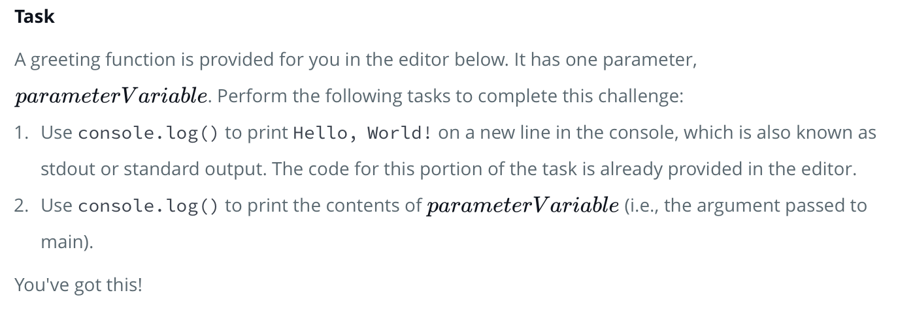
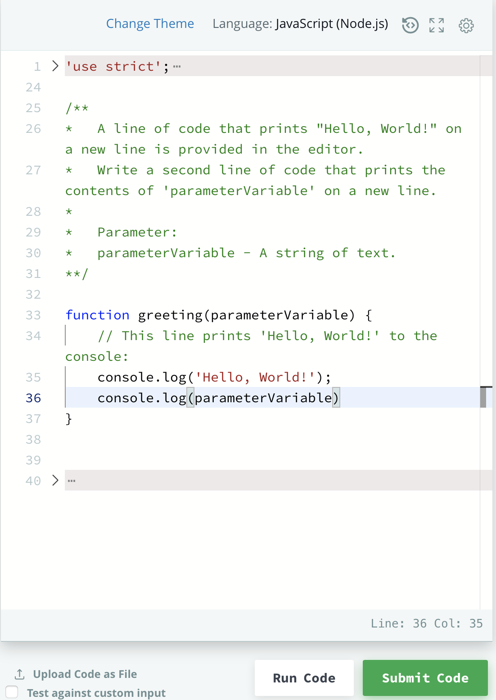

# 10 Days of JavaScript 

> Day 0: Hello, World! 

<br>

- Task

	

	- 해석: 아래의 editor에서는 인사말 기능이 제공 될 것이고, `greeting`이란 이름의 함수는 `parameterVariable`라는 하나의 매개변수를 받을 것이다. 다음과 같이 수행하여 이 task를 완수하라;
		- `console.log()`를 사용하여 `Hello, World!`를 인쇄한다. <br>
		(cf. 하지만 이 부분에 대한 코드는 이미 아래의 editor에 제공되어 있을 것이기 때문에 따로 코드를 짤 필요는 없다.)
		- 그렇다면 이제 `console.log()`를 이용하여 `parameterVariable`라고 출력해라.

- Input Format

	| Data Type | Parameter | Description |
	| :---: | :---: | :---: |
	| string | *parameterVariable* | 공백으로 구분된 하나 이상의 단어를 포함하는 텍스트 행이다 |

<br>

- Output Format
	- 다음과 같이 두 줄을 출력해라;
		- 첫 번째 줄에는: `Hello, World!`
		- 두 번째 줄에는: `Welcome to 10 Days of JavaScript!`


<br>

- Sample Input

```javascript
		Welcome to 10 Days of JavaScript!
```

<br>

- Sample Output 

```javascript
		Hello, World!
		Welcome to 10 Days of JavaScript!
```

<br>
<hr>

>> Solution 

<br>



<hr>