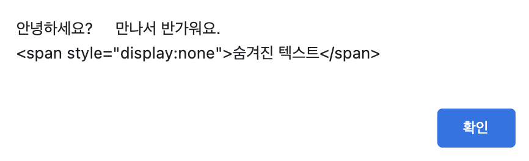
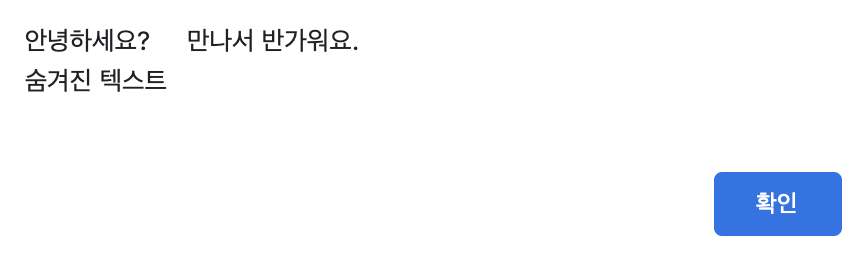

# 문서 객체 모델(DOM)

> 학습목표 
- 객체 모델은 넓은 의미에서는 웹 브라우저가 HTML 페이지를 인식하는 방식이고, 좁은 의미서는 document 객체와 관련된 객체의 집합이다. 문서 객체 모델을 사용하면 HTML 상에 태그를 추가, 수정, 제거할 수 있다. 어떻게 하는지 그 방법에 대해서 알아보자. 
	- DOMContentLoaded라는 이벤트를 사용하는 이유를 이해하자
	- 문서 객체를 불러오거나 생성하는 방법을 익히자 
	- 문서 객체의 글자, 속성, 스타일을 조작하는 방법을 익히자 
	- 다양한 이벤트의 사용 방법을 익히자 

---
## 문서 객체 모델(Document Object Model)이란? 

- HTML 상에 있는 html, head, body, title, h1, div, span, button 등의 태그를 HTML 언어에서는 `요소(Element)`라고 부른다. 그리고 이런 HTML의 요소들을 자바스크립트에서 이용(조작)할 수 있는 객체로 만들면 자바스크립트에서는 이를 `문서 객체(Document Object)`라고 부른다. 자바스크립트에서는 이런 문서 객체들을 조작할 수있는 다양한 메서드들을 제공한다. 그렇기 때문에 '문서 객체를 조작한다'는 말은 'HTML 요소들을 조작한다'라는 말이기도 하다. 
- HTML의 요소(태그)들은 `트리 모양`의 자료구조로 나타낼 수 있는데, 이렇게 HTML 요소들을 트리모양의 자료구조로 나타냈을 때, 각 요소를 `노드(Node)`라고 부른다. <br>
각 노드들, 문서 객체들, 즉 결국에는 HTML 요소들을 모아모아/조합하여 만든 전체적인 형태를 `문서 객체 모델(Document Object Model, DOM)`이라 부르는 것이다. 
- 브라우저가 열리고 해당 HTML 문서를 열어 document에 적혀있는 태그들을 그대로, 순차적으로 읽으며 window에 렌더링하는 것을 `정적으로 문서 객체를 생성한다`라고 표현한다. 
반면에 자바스크립트를 이용해 원래 HTML에는 없던 객체를 생성하는 것을 `동적으로 문서 객체를 생성한다`라고 표현한다. 

---

## DOMContentLoaded 이벤트 
- **<u>기본 구조</u>**: 
```javascript
	document.addEventListener('DOMContentLoaded', () => {
		// 실행할 문장 
	})
```	
- 위의 예시에서 사용된 `.addEventListener('DOMContentLoaded', () => {})`는 앞으로도 자주 보게될텐데, 해석을 하자면, document 라는 문서 객체에 DOMContentLoaded(브라우저에서 문서가 열렸고, 그 문서안에 있는 모든 HTML 요소를 읽어드린다) 라는 이벤트가 발생했을 때, 두 번째 매개변수로 지정한 `콜백 함수(Callback Function)`를 샐행하라는 의미이다. 

- 문서 객체를 조작할 때 `DOMContentLoaded` 이벤트를 사용할 수 있는데, DOMContentLoaded 이벤트는 **웹 브라우저가 문서 객체를 모두 읽고 나서 실행하는 이벤트다.** 그래서 아래와 같이 코드를 구성하면 문서를 전체 다 읽었을 때 콜백함수를 호출하게 된다. 
```javascript
	<!DOCTYPE html> 
	<html>
		<head>
			<title>DOMContentLoaded</title> 
			<script>
					<!-- DOMContentLoaded 이벤트를 연결 -->
				document.addEventListener('DOMContentLoaded’, () => {
					const $h1 = (text) => `<h1〉${text}</h1〉`
				<!-- 해당 문서의 문서 객체를 모두 읽어들이면 그 후에 () => {콜백함수}가 실행이된다는 점! 	
				그래서 이렇게 DOMContentLoaded 이벤트를 활용하면 script 태그가 body 태그 이전에 위치해도 
				문제없이 코드가 실행된다.  -->
					document.body.innerHTML += $h1('DOMContentLoaded 이벤트 발생!!!')
				})
			</script>
		</head>
		<body> 

		</body> 
	</html>
```
- 그래서 다시 정리하자면... <br> DOMContentLoaded 이벤트를 사용하는 이유는:
	- 로딩이 다 된 후에 자바스크립트 동작이 이뤄지는 것이 일반적이지만, DOM 로딩이 완료되지 않았는데 DOM을 조작하는 자바스크립트 코드가 실행된다면 기대하던대로 렌더링이 되지 못 할것이다. DOMContentLoaded 이벤트는 DOM Tree 분석이 끝나면 발생되기 때문에, 앞서 언급한 원치않는 불상사를 막을 수 있다. 
- ~~문서의 로드 시점과 관련된 이벤트는 DOMContentLoaded 이벤트 말고도 (on)load와 (before)unload 가 있다. (cf. https://mygumi.tistory.com/281)~~
---

## 문서 객체 가져오기 (문서 객체에 접근하기)
- DOMContentLoaded 이벤트를 왜 사용해야 하는지 알았으니, 이제 문서 객체를 어떻게 가져오는지(그 HTML 요소에 어떻게 접근할지) 알아보자! 
- 기본적으로 우리가 가져올 문서 객체란 문서에 존재한다. 그래서 우리는 해당 문서 객체에 접근하려면 그 문서 객체를 담고 있는 document에 접근해야한다. 
	```javascript
	// 기본적으로 HTML 문서에 있는 요소에 아래와 같은 방법으로 읽어들일 수 있다 
		document.head 
		document.body 
		document.title 

	// 위의 태그들은 HTML 문서에 당연히 있다고 전제하는 태그들이다.
	// 우리가 head 요소나 body 요소 내부에 있는 다른 요소들에 접근하고 싶을 때는 다음과 같은 별도의 메소드가 필요하다 
		document.querySelector(선택자)
		document.querySelectorAll(선택자)
	// 위의 (선택자) 부분에는 #아이디, .클래스, [속성 = 값], 선택자_A 선택자_B 와 같은 CSS 선택자를 입력할 수 있다.
	```
- document 객체가 가지는 메서드를 사용하여 '이미 HTML 문서상에 이미 존재하는 문서 객체'를 가져올 수 있다. 기본적으로 문서 객체를 가져오기 위해 알아야 할 메서드들은 아래와 같다: 
	| 메서드 | 설명 |
	|:---:|:---:|
	| **getElementById(id)** | _태그의 id 속성이 id와 일치하는 문서 객체를 가져온다_ |
	| **document.querySelector(선택자)** | _선택자로 가장 처음 선택되는 문서 객체를 가져온다. querySelector() 메소드는 요소를 하나만 추출한다._ |
	| **document.querySelectorAll(선택자)** | _선택자로 선택되는 문서 객체를 배열로 가져온다. querySelectorAll() 메소드는 문서 객체를 여러 개 추출하고, 문서 객체 여러 개를 배열로 읽어들이는 함수이다. 따라서 querySelectorAll() 메소드를 활용해서 요소 내부에 접근하려면 반복을 돌려야한다. 이때는 일반적으로 forEach() 메소드를 사용하여 반복을 돌린다._ |
	
---

## 글자 조작하기 

| 속성 | 설명 |
|:---:|:---:|
|**문서객체.textContent**| _입력된 문자열을 그대로 입력해준다_ |
|**문서객체.innerText**| _HTML 요소 내에서 문자열을 읽어온다_ |
|**문서객체.innerHTML**| _입력된 문자열을 HTML 요소로 변환해서 입력해준다_ |

<br>

```html
<div id='my_div'> 안녕하세요? 만나서 반가워요!
	<span style='display:none'>숨겨진 텍스트</span>
</div>

<input type='button' value='innerHTML' onclick='getInnerHTML()'/>
<input type='button' value='innerText' onclick='getInnerText()'/>
<input type='button' value='textContent' onclick='getTextContent()'/>
```
```javascript
<script>
// innerHTML --> 입력된 문자열을 HTML 요소로 변환해서 입력해준다
function getInnerHTML() {
	const element = document.getElementById('my_div');
	alert(element.innerHTML);
} 

// innerText --> HTML 요소 내에서 문자열을 읽어온다
function getInnerText() {
	const element = document.getElementById('my_div');
	alert(element.innerText);
} 

// textContent --> 입력된 문자열을 전부, 그리고 문자열로 그래도 입력해준다
function getTextContent() {
	const element = document.getElementById('my_div');
	alert(element.textContent);
} 
</script> 
```

<br>

>> innerHTML



---

>> innerText


---

>> textContent



<!-- ---

## 속성 조작하기 
- 문서 객체의 속성을 조작할 때는 다음과 같은 메소드를 사용할 수 있다;
| 메소드 | 설명 |
|:---:|:---:|
|**문서객체.setAttribute(속성이름, 값)**| _특정 속성에 값을 지정한다_|
|**문서객체.getAttribute(속성이름)**| _특정 속성을 추출한다_ |

```javascript
``` -->

---

## 스타일 조작하기 
- 문서 객체의 CSS 스타일을 조작할 때는 `style` 속성을 사용한다. style 속성은 객체이며, 내부에는 속성으로 CSS를 사용해서 지정할 수 있는 스타일들이 있다. 속성들은 CSS로 입력할 때 사용하는 것처럼 적으면 된다. 다만, CSS에서는 케밥케이스로 이름을 적는다면, 자바스크립트에서는 두 단어 이상의 속성은 아래와 같이 캐멀 케이스로 나타낸다. 
	```javascript
	// 캐멀 케이스: 케밥 케이스의 -를 제거하고 기호 뒤의 알파벳을 대문자로 변경
	h1.style.backgroundColor = 'red';

	// 또는 대괄호 안에 속성으로 적어줘도 상관 없음!
	h1.style['background-color'] = 'red';
	```
---

## 문서 객체 생성하기 
- 지금까지는 HTML 태그 내부에 있는 특정 문서 객체를 읽어들이고 이를 조작했다고 하면, 이제 새로운 문서 객체를 생성하고 싶을 때 사용하는 `document.createElement(문서 객체 이름)` 메소드에 대해 알아보자.  
- 'document.createElement(문서 객체 이름)'을 사용했다고 해서 바로 새롭게 생성된 문서 객체가 배치되는 것은 아니다. 문서 객체를 어디 HTML 요소 아래에 추가할지를 정해줘야한다. <br>
이때 알아야 할 개염이 바로 `트리 구조`라고 한다. 트리 자료 구조는 `부모(parent)-자식(child) 간의 관계성`을 잘 나타내준다. 
- 그래서 문서는 위에서 언급한 문서 객체들이 트리를 이루고 있기 때문에, 이러한 부모 -와 자식 객체 간의 관계를 활용하여 'document.createElement(문서 객체 이름)' 메소드와 `부모 객체.appendChild(자식 객체)` 메소드를 활용하여 문서 객체를 생성하고 배치하는 것까지 할 수 있다. <br>
예제를 통해 살펴보자;
	```javascript
	<script>
		document.addEventListener('DOMContentLoaded', () => {

			// 문서 객체 생성하기 
			const $header = document.createElement('h1');

			// 생성한 태그 조작하기 
			$header.textContent = '문서 객체 동적으로 생성하기'
			$header.setAttribute('data-custom', '사용자 정의 속성')
			$header.style.color = 'white'
			$header.style.backgroundColor = 'black'

			// h1 태그를 body 태그 아래에 추가하기/배치하기 
			document.appendChild($header);

		});
	<body>

	</body>
	</script>
	```
위의 코드에서는 document.createElement() 메소드로 h1 태그를 생성하고, 이를 document.body 태그 아래에 추가하는 코드이다. 
<br> 코드를 실행하면 h1 태그를 출력한다.

<!-- ---

## 문서 객체 이동하기 

- 위에서 살펴본 `appendChild()` 메소드는 문서 객체를 이동시킬 때도 사용한다. -->


---

## 문서 객체 제거하기 
- 문서 객체를 제거할 때는 `부모 객체.removeChild(자식 객체)` 메소드를 사용한다. 
- appendChild() 메소드 등으로 부모 객체와 이미 연결이 끝난 문서 객체의 경우 parentNode 속성으로 부모 객체에 접급할 수 있다. 
<br> 아래와 같이;
	```javascript
		문서 객체.parentNode.removeChild(문서 객체)
	```
- 그럼 예제를 통해 어떻게 코드 상에서 특정 개체를 제거할 수 있는지를 알아보자. 
<br> 아래 코드는 h1 이라는 특정 객체를 실행한 뒤 3(3000ms)초 우에 화면에서 h1 태그를 제거하는 코드이다;
	```javascript
	<script>
		document.addEventListener('DOMContentLoaded', () => {
			setTimeOut(() => {
				const $h1 = document.querySelector('h1')

				$h1.parentNode.removeChild($h1)
				// document.body.removeChild($h1) --> h1.parentNode가 document.body라서, 이렇게 제거할 수도 있음! 
			}, 3000)
		})
	</script>

	<body>
		<h1>제거 대상 문서 객체</h1>
	</body>
	```
위의 코드를 실행하면 처음에는 h1 태그 안에 적힌대로 '제거 대상 문서 객체'라고 뜨지만, 3초가 지나면 h1 태그와 해당 요소 안에 텍스트는 사라진다. 

---

## 이벤트 설정하기 
- 지금까지 반복하여 사용한 `document.addEvenyListener('DOMContentLoaded', () => {})`라는 형태의 코드는 해석하면, document라는 문서 객체의 DOMContentLoaded라는 이벤트가 발생하면 매개변수로 지정한 콜백 함수를 실행해줘! 라는 의미이다.
- 브라우저는 모든 문서 객체가 클릭되거나 마우스가 호버되거나 할 때를 감지하여 이런 이벤트가 발생했을 때, 등록된 이벤트 핸들러를 호출한다. 쉽게 말하자면, 이벤트가 발생하면 브라우저가 이를 감지하고 그에 맞는 함수를 호출하여 반응한다는 말이다. 그리고 그때 실행할 함수(이벤트 핸들러)는 `addEventListener()`메소드를 사용하는 것이 가장 바람직하다. 
	```javascript
		문서 객체.addEvenyListener(이벤트 이름(타입), 콜백함수)     
		// 여기서 콜백 함수가 바로 이벤트 리스너 또는 이벤트 핸들러라는 아이!
	```
- 아래의 코드는 addEvenyListener() 메소드를 사용해서 h1 태그를 클릭할 때 이벤트 리스터(콜백 함수)를 호출하는 예시이다. 
	```javascript
		<script>
			document.addEventListener('DOMContentLoaded', () => {
				let counter = 0;
				const $h1 = documnet.querySelector('h1');

				h1.addEventListener('click', (event) => {
					counter++
					$h1.textContent = `클릭 횟수: ${counter}`
				});
			});
		</script>
		<styl>
			h1{
				// 클릭을 여러번 해도 글자가 선택되지 않도록 하기 위한 CSS 스타일
				// user-select: none; 으로 지정하면 해당 태그를 마우스로 드래그하지 못함
				user-select: none;
			}
		</styl>
		<body>
			<h1>클릭 횟수: 0</h1>
		</body>
	```
- 위의 이벤트를 제거하고 싶을 때는 아래와 같은 형태로 `removeEventListener()` 메소드를 사용하면 된다; 
	```javascript
		문서 객체.removeEventListener(이벤트 이름(타입), 이벤트 리스너)     
		// 여기서 이벤트 리스너 부분에는 이벤트 핸들러를 등록할 때 사용했던 이벤트 핸들러를 넣어야한다. 
		// 팁: 이벤트 핸들러(함수)를 미리 만들고, 그걸 변수 또는 상수에 이벤트 핸들러를 넣어놓는다. 그리고 이벤트 연결과 연결 제거에 활용한다.
	```
- 이벤트 연결을 제거하는 코드는 아래와 같다;
	```javascript
		<script>
			document.addEventListener('DOMContentLoaded', () => {
				let counter = 0
				let isConnect = false

				const h1 = document.querySelector('h1')
				const p = document.querySelector('p')
				const connectButton = document.querySelector('#connect')
				const disconnectButton = document.querySelector('#disconnect')
				
				const listener = (event) => {
					h1.textContent = `클릭 횟수: ${counter++}`
				}

				
				connectButton.addEventListener('click', () => {
					if (isConnect === false) {
						h1.addEventListener('click', listener)
						p.textContent = '이벤트 연결 상태: 연결'
						isConnect = true
					}
				})


				disconnectButton.addEventListener('click', () => {
					if (isConnect === true) {
						h1.removeEventListener('click', listener)
						p.textContent = '이벤트 연결 상태: 해제'
						isConnect = false
					}
				})
			})
		</script>
		<style>
			h1{
				user-select: none;
			}
		</style>
		<body>
			<h1>클릭 횟수: 0</h1>
			<button id="connect">이벤트 연결</button>
			<button id="disconnect">이벤트 제거</button>
			<p>이벤트 연결 상태: 해제</p>
		</body>
	```
위의 코드를 실행하고 버튼을 클릭하면 연결 상태는 '연결'로 나오고, 다시 클릭하면 연결 상태는 '해제'로 나온다. 

--- 
cf. 

https://programmer-seva.tistory.com/40

https://programmer-seva.tistory.com/42

https://hianna.tistory.com/483

--- 