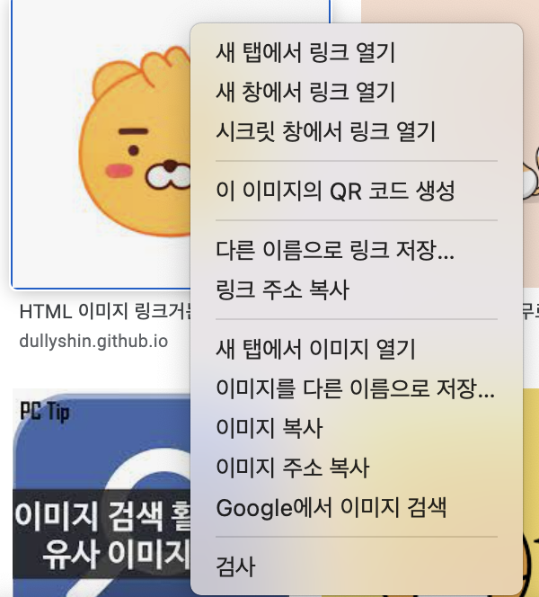

# 문서 객체 모델(DOM) - 2 

## 이벤트 활용
- 문서 객체 모델의 기본적인 내용을 이전 시간에 살펴보았지만, 이것들을 어떻게 사용하여 무엇을 만들어 낼 수 있을지는 여전히 고민거리이다. 이번 시간에는 어떤 형태로 application을 구현할 수 있는지 이벤트와 관련된 내용을 더 살펴보자. 

---
## 이벤트 모델 
- 간단하게 말하자면, `이벤트 모델(Event Model)`이란 <u>이벤트를 연결하는 방법</u>이다. 
- 이벤트 모델의 종류 
	오늘 살펴볼 이벤트 모델의 종류는 아래와 같다;
	1. 표준 이벤트 모델 	
	2. 고전 이벤트 모델(기본 이벤트 모델)
	3. 인라인 이벤트 모델

<br>
	
- 이전 시간에 살펴본 `addEventListener()` 메소드도 
이벤트 모델이다.
```javascript 
document.body.addEventListener('keyup', () => {

})
``` 
	
	아래와 같이 이벤트를 연결시키는 방법은 W3C이 공식으로 지정한 이벤트 모델로 현재 표준으로 사용하고 있는 방법이므로 `표준 이벤트 모델`이라고 부른다. 

```html	 
<!DOCTYPE html>
<html lang="ko">
	<head>
		<script>
			window.onload = function() {
				// 변수 선언 
				var header = document.getElementById('header'b                                                                                                                          n7 f);

				// 이벤트 연결 --> 표준 이벤트 모델 
				header.onclick = function() {
					alert('Click!');

					// 이벤트 제거 
					header.onclick = null;
				};
			}
		</script>
	</head>

	<body> 
		<h1 id="header">Click Me!</h1>  	
	</body>
</html>	
```
- 과거에는 현재 사용되고 있는 '표준 이벤트 모델'과는 다르게 'on'을 접두사로 갖고있는 속성에 함수를 할당해서 이벤트를 연결하고는 했다. ~~아래와 같이;~~ <br>
이와 같은 이벤트 연결 방법을 `고전(기본) 이벤트 모델`이라고 부른다. 
```javascript	 
document.body.onkeyup(event) => {

}
``` 
- 그리고 고전 이벤트 모델처럼 'on'이라는 접두사로 시작하는 속성을 HTML 요소에 직접 넣어서 이벤트를 연결하는 것을 `인라인 이벤트 모델`이라고 부른다. <br>
~~아래가 HTML 문서라고 하면...~~ 
```html	 
<!DOCTYPE html>
<html lang="ko">
	<head>
		<script>
			const listener = (event) => {

			}
		</script>
	</head>

	<!-- 인라인 방식으로 HTML 요소에 on으로 시작하는 속성을
		직접 태그 안에 넣어서 이벤트를 연결 한다. -->
	<body onkeyup="listener(event)">   	
	</body>
</html>	
```
	🧶 다시 말해, 위와 같은 인라인 이벤트 모델(이벤트 연결 방법)을 사용하는 것은 곧 HTML 요소(태그)에 직접 'on'으로 시작하는 이벤트 프로퍼티와 이벤트 핸들러를 넣어주어 이벤트를 해당 HTML 요소와 연결시켜 주는 이벤트 모델(이벤트 연결 방식)이다. 

~~위의 코드에서는 현재 'listener()'이라는 함수(이벤트 핸들러)를 호출하고 있으며, 이때 'onkeyup="listener(event)"'라고 이벤트를 연결해주었기 때문에, 'onkeyup' 속성 내부에 있는 변수 event는 listener() 함수에서 매개변수로 전달되어 활용될 수 있다.~~

- 이때, 등장하는 개념: `이벤트 객체(Event Object)`이다. 
	- 이벤트가 발생하면 이벤트에 관련된 다양한 정보를 담고 있는 '이벤트 객체'라는 것이 동적으로 ~~(cf. 원래부터 있던 것이 아닌데 새롭게 어떤 이벤트가 발생함으로 인해, 그 기점으로부터 새롭게 생성된다)~~ 생성된다. **모든 이벤트 모델은 그 이벤트 모델에 관계없이 이벤트 리스너(이벤트 핸들러)는 생성된 이벤트 객체를 첫 번째 인수로 전달받는다.**
- 2.고전 이벤트 모델과 3.인라인 이벤트 모델은 처리할 수 있는 리스너의 갯수가 1개로 제한되지만, 표준 이벤트 모델과 같은 경우 리스너를 다중 처리 할 수 있다는 장점이 있다. 

- 웹 브라우저에는 많은 이벤트가 있으므로 모든 이벤트와 이벤트 객체의 속성을 모두 설명하고 공부하는 것은 불가능하지만, 많이 사용되는 이벤트 객체 위주로 활용 방법을 살펴보자.  

--- 
> 키보드 이벤트 
- 웹페이지 상에서 사용자의 키보드 입력을 브라주저가 감지하고 처리하는 방법에 대해서 좀 더 알아보자. ~~(그러니까 브라우저는 브라우저 상에서 사용자에 의해 발생한 이벤트를 감지하고 이와 관련된 이벤트 핸들러들을 호출하는 역할을 담당하고 있으니까!)~~
- `키보드 이벤트(Keyboard Event)`는 사용자가 키를 누르거나 키를 놓을 때 발생한다. 키보드 이벤트와 관련하여 아래와 같이 3가지 이벤트는 알기! 

| 이벤트 | 설명 |
|:---:|:---:|
| **keydown** |_키가 눌릴 때 실행되고, 키보드를 꾹 누르고 있을 때도, 입력될 때도 실행된다._|
| ~~**keypress**~~ |_키가 입력되었을 때 실행된다. 하지만 웹 브라우저에 따라서 아시아권의 문자는 잘 처리하지 못한다는 문제가 있다._|
| **keyup** |_키보드에서 키가 떨어질 때 실행된다._|

<br>

키를 누를 때는 `keydown` 타입 이벤트가 발생하고, 키를 놓을 때는 `keyup` 타입 이벤트가 발생한다. `keypress`는 과거에는 사용되었지만, 현재는 deprecated 되어 권장되지 않는다. 셋 중에서는 가장 일반적으로 사용되는 이벤트는 `keyup` 이벤트다.

<br>

>> 키보드 이벤트 객체 
- 위에서 `이벤트 객체`라는 개념에 대해 얘기했었다.(cf. _이벤트가 발생하면 이벤트에 관련된 다양한 정보를 담고 있는 '이벤트 객체'라는 것이 동적으로 생성된다. 그리고 모든 이벤트 모델은 그 이벤트 모델에 관계없이 이벤트 리스너(이벤트 핸들러)는 생성된 이벤트 객체를 첫 번째 인수로 전달받는다.
- 예를들어, 키보드 이벤트가 발생하면 이를 처리하면서 이벤트 객체라는 것이 동적으로 생성되는데, 이를 `키보드 이벤트 객체`라고 부르고, 키보드 이벤트 객체에는 눌리거나 놓아진 키에 대한 다양한 메타정보가 담겨있다. <br>
이제 이 '다양한 메타 정보'가 어떤 형식으로 담겨져 있나 알아보자. 

| 이벤트 속성 이름 (코드값 - 키보드에 관련한 다양한 메타정보) | 설명 |
|:---:|:---:|
| **code** |_입력한 키_|
| **keyCode** |_입력한 키를 나타내는 숫자_|
| **altKey** |_Alt 키를 눌렀는지_|
| **ctrlKey** |_Ctrl 키를 눌렀는지_|
| **shiftKey** |_Shift 키를 눌렀는지_|

<br>

code 속성은 입력한 키를 나타내는 문자열이 들어있고, altKey, CtrlKey, 아liftKey 속성은 해당 키를 눌렀는지 불 자료형 값이 들어있다. 아래와 같이;

```javascript
{
key: "1",
code: "Digit1",
shiftKey: false,
}
```
--- 
## 이벤트 발생 객체 
<!-- (/이벤트가 발생한 대상(요소/이벤트 대상) 얻기) -->
- 코드의 규모가 커지면 이벤트 리스너를 외부로 분리하는 경우가 많아지는데, 이러한 경우 이벤트를 발생시킨 객체에 어떻게 접근할 수 있을까? <br>
두 가지 방법이 존재: 
	1. <u>`event.currentTarget` 속성을 사용</u>
		- 이는 `() -> {}`와 `function () {}` 형태 모두 사용 가능
	2. <u>`this` 키워드를 사용</u>
		- ~~화살표 함수가 아닌~~ function () {} 형태로 함수를 선언한 경우에 사용 
	화살표 함수가 없던 과거에는 2번째 방법을 많이 사용했지만, 현재는 2가지 방법 모두 많이 사용된다. 
<br>
	👉 Tip: 라이브러리와 프레임워크에 따라 선호하는 형태가 다르니 2가지 방법 모두 기억할 것! 

<br>

1. event.currentTarget 속성 
```html
<script>
	const listener = (event) => {
		// 여기서 event.currentTarget이 textarea 가 된다
		const length = event.currenTarget.value.length
		h1.textContent = `글자 수: ${length}`
	}

	document.addEventListener('DOMContentLoaded', () => {
		const textarea = document.querySelector('textarea')
		const h1 = document.querySelector('h1')
		textarea.addEventListener('keyup', listener)
	})
</script>

<body>
	<h1></h1>
	<textarea></textarea>
</body>
```

2. this 키워드 
```html
<script>
	const listener = function (event) {
		// 여기서 this가 textarea 가 된다
		const length = this.value.length
		h1.textContent = `글자 수: ${length}`
	}

	document.addEventListener('DOMContentLoaded', () => {
		const textarea = document.querySelector('textarea')
		const h1 = document.querySelector('h1')
		textarea.addEventListener('keyup', listener)
	})
</script>
```

--- 
<!-- ## 글자 입력 양식 이벤트 
- 사용자로부터 어떤 입력을 받을 때 사용하는 요소를 `입력 양식(Form)`이라고 부른다. ~~우리가 웹에서 어떤 사이트를 들어가서 회원가입을 하거나 댓글을 입력하거나 음식을 주문하거나 등등의 상황에서 한 번쯤은 사용해본 적이 있는 양식이다.~~
- HTML을 기준으로 하면 form, input, textarea, button, select 태그 등이 모두 입력 양식이라고 볼 수 있겠다. 
 
 
 - 조기 리턴 ?
 - 정규 표현식 시용. 언제? 
 - 드롭타운 목록 활용하기 
 - multiple select tage ?? 
 - toFixed() 메소드?? 
 - 체크 박스 활용하기 
 - 라디오 버튼 활요하기 

--- 

-->

## 기본 이벤트 막기 
- `기본 이벤트`란? 
	- 예를 들어, 웹 브라우저는 이미지 위에 마우스를 호버하고 그 상태에서 마우스 오른쪽 버튼을 클릭하면 아래와 같은 `컨텍스트 메뉴(Context Menu)`를 출력한다. 이렇게 어떤 이벤트가 발생했을 때 웹 브라우저가 기본적으로 처리해주는 것을 `기본 이벤트`라고 한다. 
	- 마찬가지로, 링크를 클릭했을 때 이동하는 것, 제출 버튼을 누르면 이동하는 것 등 모두 기본 이벤트에 속한다. 
	
- 이런 기본 이벤트를 제거하려면 event 객체의 `preventDefault()` 메소드를 사용한다. 
	- 이 메소드는 인터넷에서 이미지 `불펌`(cf. 불법+퍼옴의 합성어) `방지` 등을 구현할 때 유용하게 사용되는 코드이므로 기억할 것! 
	- ~~더 어렵게 얘기하자면... 자바스크립트에서 이벤트 전파를 중단하는 4가지 방법 중 하나가 preventDefault() 메소드! (cf. JS에서 이벤트 리스너에 preventDefault(), stopPropagation(), stopImmediatePropagation(), 그리고 return false는 자바스크립트 프로그래밍을 할 때 이벤트 중단을 위해 자주 사용되는 코드들...)~~
- <u>**예시**</u>:
	- 이벤트를 취소할 수 있는 경우, 이벤트의 전파를 막지 않고 그 이벤트를 취소할 때 사용하는 `event.preventdefault()`를 사용해서 체크박스를 클릭할 때 발생하는 동작을 멈추는 방법을 살펴보자: 
	```html
	<html>
		<head>
		<title>preventDefault 예제</title>
		<script type="text/javascript">
			function stopDefAction(evt) {
				evt.preventDefault();
			}
		</script>
		</head>

		<body>
			<p>체크박스 컨트롤을 클릭해 주세요</p>

			<form>
			<input type="checkbox" onclick="stopDefAction(event);"/>
			<label for="checkbox">체크박스</label>
			</form>
		</body>
	</html>
	```
	위에서 살펴본 것처럼 이벤트가 발생할 때 event.preventdefault() 메소드를 호출하게 되면, 일반적으로는 브라우저의 구현에 의해 처리되는 기존의 액션이 동작하지 않게되고, 그 결과 이벤트가 발생하지 않게 되는 것이다.
<br>
	👉 Tip: 이벤트의 취소가능 여부를 알고싶다면 `event.cancelable()`를 사용하면 확인할 수 있다. ~~(cf. 만약 취소불가능한 이벤트에 대해서 preventDefault()를 호출해도 결과는 없다.)~~

--- 
cf. 

https://www.daleseo.com/js-key-events/

https://doitnow-man.tistory.com/135#t4

https://miyakita.tistory.com/126

https://m.blog.naver.com/PostView.nhn?blogId=pika1411&logNo=220735262058&proxyReferer=https:%2F%2Fwww.google.com%2F


https://roseline124.github.io/django/2019/04/10/pickmeal-signupform.html   (회원가입 입력 양식 예시)

https://programmingsummaries.tistory.com/313    (이벤트 전파를 중단하는 4가지 방법)

--- 