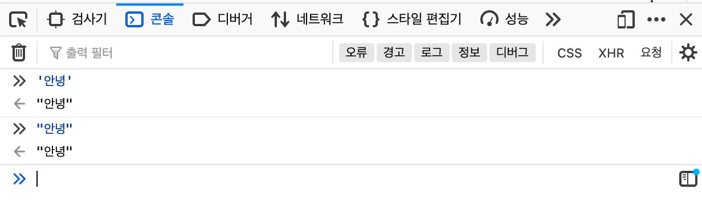
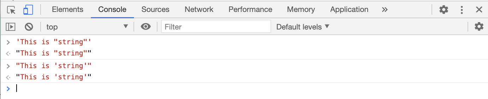
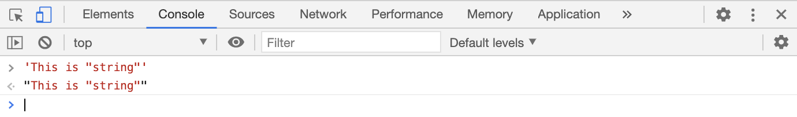
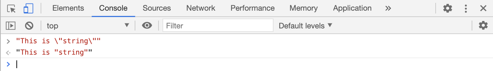
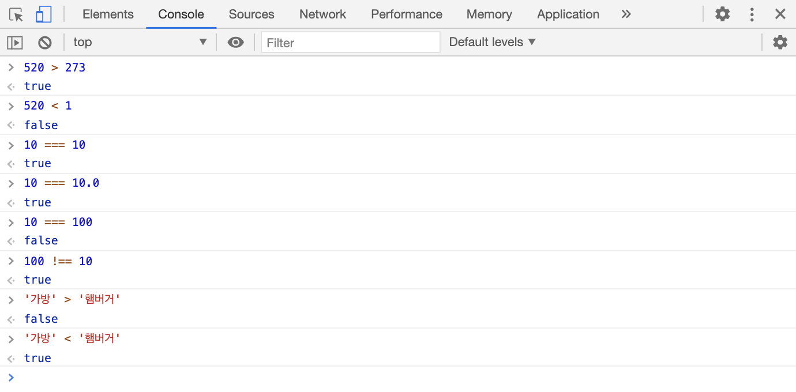
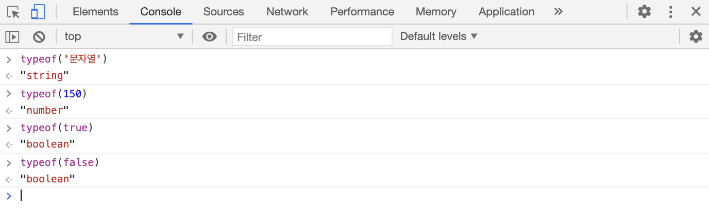
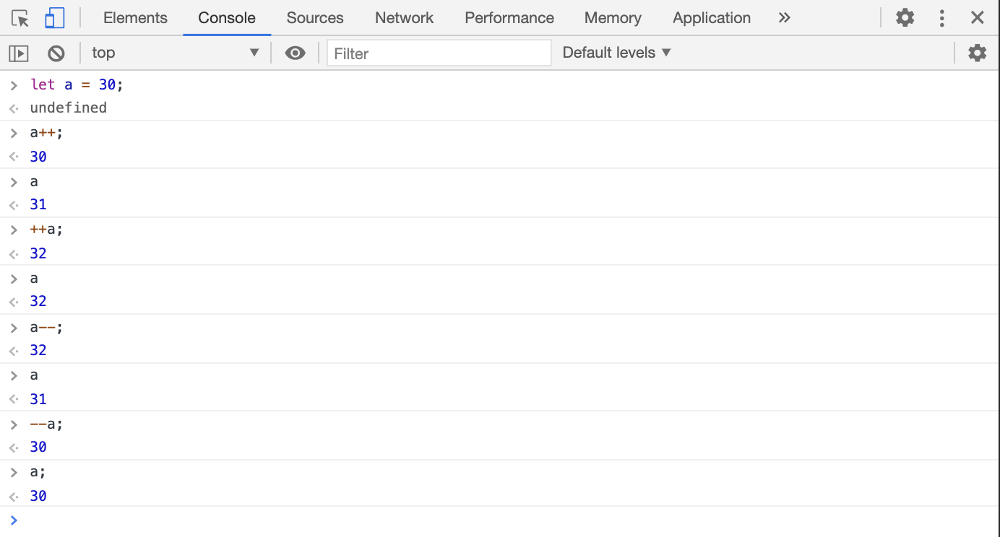
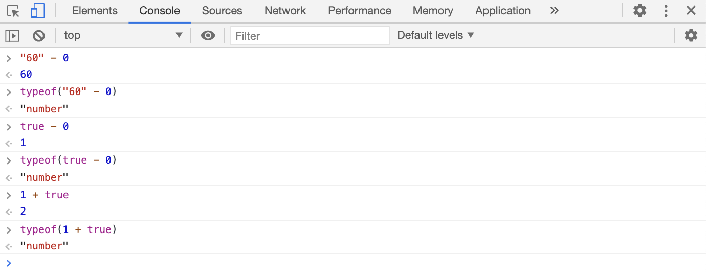
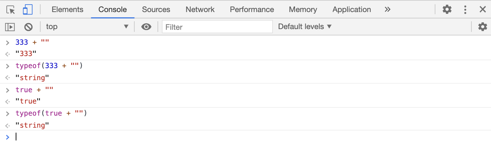
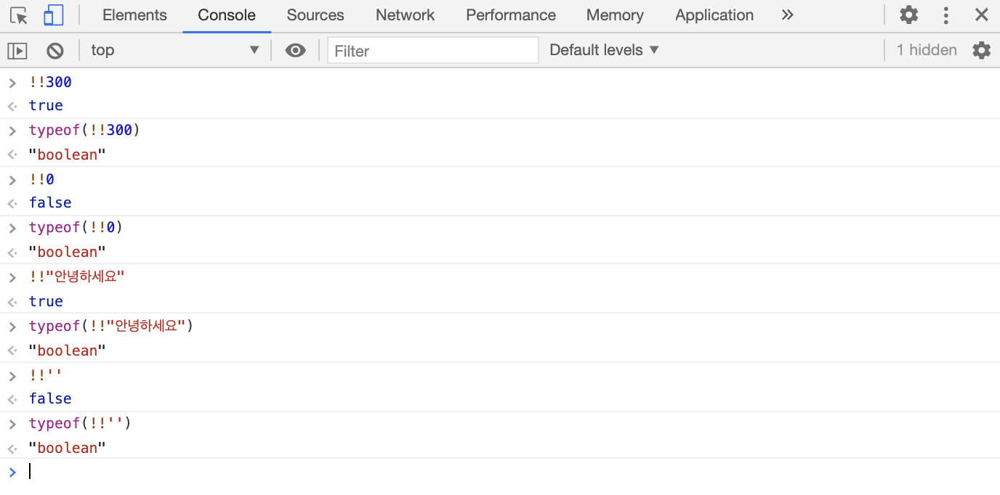

# 자료와 변수 

		프로그램은 자료를 입력받아 처리하고 출력하는 것을 기본으로 한다.
		따라서 이 `자료`라는 것에 대해 이해하는 것이 프로그램 개발의 첫 스텝이라고 할 수 있겠다. 

## 학습 목표 

		1. 자료형에 대해 알아보기 
		2. 상수와 변수에 대해 알아보기 
		3. 자료형 변환에 대해 알아보기 

---
---

## 기본 자료형 

- `자료`(data): 프로그래밍에서 프로그램이 처리할 수 있는 모든 것 
- `자료형`(data type): 
	- 자료 형태에 따라 나눠 놓은 것. 즉, 자료의 종류를 의미한다
	- 자바스크립트는 다양한 종류의 자료형을 제공한다. 
		e.g. 숫자, 문자열, 불 자료형 ... 

---

>> 문자열 자료형 

- `문자열`(string): 문자들의 집합을 문자열이라고 한다. 문자(들)을 표현할 때는 문자열 자료형을 사용하는데, 자바스크립트에서는 문자가 하나든 여러개든 상관없이 모두 `문자열 자료형`이라고 한다.  

<br>

- `문자열 만드는 방법`
	- 자바스크립트는 
		1. 큰따옴표를 사용하여, 
		2. 작은따옴표를 사용하여 
	문자열을 생성할 수 있다. 

	

	다만, 사용하는 따옴표의 종류는 항상 일관되게 사용하는 것이 좋다. 그러나 예외적으로 다음과 같은 상황에서는 큰따옴표와 작은따옴표를 혼용할 수 있다; 

	

	문자열 안에 따옴표를 사용해야 한다면 예외적으로 위와 같이 2가지 따옴표를 모두 사용한다. 내부에 작은 따옴표를 사용하고 싶으면 외부에 큰따옴표를 사용, 반대로 내부에 큰따옴표를 사용하고 싶으면 외부에 작은 따옴표를 사용한다.  

	<br>

	만약 한 종류의 따옴표만 사용하면 다음과 같이 `Unca니ghtSyntaxError:Unexpectedidentifier`란 오류가 발생한다.
	이것은 식별자가 예상하지 못한 위치에서 등장했다는 의미이다. 웹 브라우저는 이 코드를 'This is '와 'string'와 ''의 나열로 인식하낟. 즉, 'This is '와 ''는 문자열 자료형으로 인지하지만, 가운데 있는 string은 단순한 `식별자`(indentifier)로 본다. 그래서 식별자가 갑자기 이유없이 등장했기 때문에 구문 오류를 출력한 것이다. 

	<br>
	이를 해결할 방법은 서로 다른 따옴표를 혼용하여 사용하거나 또는 `이스케이프 문자`(cf. 다양한 이스케이프 문자는 각자 특수한 기능을 수행한다. 특히 지금 사용할 이스케이프 문자 `\`는 문자 그대로 사용하고 싶을 때 해당 문자 앞에 적으면 사용하고 싶은 문자를 그대로 출력해주는 유용한 기능이 있다...)를 사용하는 것이다. 


	- 방법 1) 따옴표의 혼용
		

	- 방법 2) 이스케이프 문자 사용 
		

<br>

- `문자열 연산자`
  - 숫자도 아닌데 문자열을 어떻게 "연산(덧셈, 뺄셈, 곱셈, 나눗셈)"한다는 것일까? 
	- 자바스크립트에서는 숫자 자료와 마찬가지로 문자열도 기호를 사용하여 연산 처리를 할 수 있다. 
		이때, `덧셈 기호(+)`는 문자열을 연결하는 기능을 한다는 의미에서 `문자열 연결 연산자`라고 한다. 

		```javascript
			'안녕' + '하세요'+ '.' + ' ' + '반갑습니다!'   // "안녕하세요. 반갑습니다!"
		``` 

	- 문자열 내부의 문자 하나를 선택할 때는 `문자 선택 연산자`를 사용한다. 
		문자열 뒤에 대괄호([])을 입력하고 광호 안에 선택할 문자의 위치를 숫자로 지정하면 되는데, 이때 위치를 나타내는 숫자는 `인덱스`(index)라고 부르고 숫자 `0`부터 시작한다. 

		```javascript
			> '안녕하세요'[0]                  // "안"
			> '안녕하세요'[1]                  // "녕"
			> '안녕하세요'[0] + '안녕하세요'[1]   // "안녕"
		``` 
<br>

- `문자열 길이 구하기`
	- `문자열 길이`(length): 문자열 내부의 문자 개수를 문자열 길이라고 한다. 
	- 문자열 길이를 구할 때 사용하는 속성을 `length 속성`이라고 한다. 
	- length 속성을 사용할 때는 문자열 뒤에 .(점)을 찍고 length 라고 입력해주면 된다. 
		```javascript
				> '안녕하세요'.length      // 5
				> "JavaScript".length    // 10 
		``` 

<br>

---

>> 숫자 자료형 

- 숫자를 표현할 때는 숫자 자료형을 사용한다.
- 자바스크립트는 `소수점이 없는 숫자`(integer)이든 `소수점이 있는 숫자`(float)이든 상관없이 숫자를 모두 같은 `숫자 자료형`으로 인식한다.

<br>

- `숫자 연산자`: 숫자 자료형을 사용하면 아래와 같은 숫자 연산자로 사칙연산을 할 수 있다. <br> 자바스크립트는 숫자 자료형을 연산할 때 `연산자 우선순위`를 고려한다. 
	
	<br>
	
	`+`: 더하기 연산자 

	`-`: 빼기 연산자 

	`*`: 곱하기 연산자 
	
	`/`: 나누기 연산자 
	
	<br>

	- 아래의 예시의 답은 무엇일까? 

```javascript
   5 + 3 * 2 
```
			만약 16이라고 하면 그것은 연산자 우선순위를 고려하지 않은 것이다. 진짜 답은 11이다. 	 
<br>

- 자바스크립트의 숫자 자료형은 나머지 연산도 할 수 있다. `나머지 연산자(% 연산자)`는 좌변을 우변으로 나눈 *나머지를 출력하는 연산자*이다. 
```javascript
	10 % 2         // 0
	10 % 3         // 1
	10 % 5         // 2 
```

<br>

---

>> 불 자료형 

- 참과 거짓을 표현할 때는 `불 자료형`을 사용한다. `불`은 영어로 `Boolean`이며 [불린]이라고 발음된다. 그래서 `불린`이라고 표기되기도 한다.
- 불 자료형은 `true`와 `false`, 2가지이다.   
불은 간단하게 true와 false를 입력하면 만들 수 있지만, 두 대상을 비교하는 `비교 연산자`를 사용해도 불을 만들 수 있다. 

<br>

**비교 연산자** 

| 연산자 | 설명 |
| :---: |:---:|
| === | 양쪽이 같다 |
| !== | 양쪽이 다르다 |
| > | 왼쪽이 더 크다 |
| < | 오른쪽이 더 크다 |
| >= | 왼쪽이 더 크거나 같다 |
| <= | 오른쪽이 더 크거나 같다 |

<br>



:heavy_check_mark: 위의 예시에서 '가방'은 '햄버거'보다 사전의 앞쪽에 나오기 때문에 사전의 뒤쪽에 나오는 '햄버거'보다 *작다*. 

<br>

- 그렇다면 불 자료형이 대체 어디에 사용되는 것일까?? 

	비교 연산자를 통해 참과 거짓을 판별하는것 말고, 실제로 불 자료형이 사용되는 예시는 다음 시간에 살펴볼 `조건문`과 관련이 있다. 
	
	조건문은 아래와 같은 형태로 사용되는데,

```javascript
	if{불 표현식} {
		불 표현식이 참일 때 실행되고, 거짓일 때 무시될 문장
	}
```
		조건문 괄호() 안의 표현식이 참이면 중괄호{} 속 문장을 실행하고, 거짓이면 중괄호 속 문장을 무시하는 식으로 조건문을 사용한다. 

<br>

- 불 자료형은 불끼리 논리 연산이 가능하다. 다음은 자바스크립트에서 제공하는 3 가지의 `논리 연산자`이다. 

    | 연산자 | 설명 |
    | :---: | :---: |
    | ! | `논리 부정 연산자` |
    | && | `논리곱 연산자` |
    | \|\| | `논리합 연산자` |

<br>
<br>

1. `논리 부정 연산자`: `!`기호를 사용하여 참을 거짓으로, 거짓을 참으로 바꾼다. 

```javascript
		> !true        // false    
		> !false       // true
```

2. `&& 연산자`: 양쪽 변의 값이 모두 true일 때 true를 결과로 낸다. 이 외에는 모두 false로 처리된다. 
```javascript
		> true && true         // true
		> true && false        // false
		> false && true        // false
		> false && false       // false
```

3. `|| 연산자`: 양쪽 변의 값 중 하나만 true여도 true를 결과로 낸다. 
```javascript
		> true || true         // true
		> true || false        // true
		> false || true        // true
		> false || false       // false
```
<br>

---

>> 자료형 검사하기 
- 자바스크립트는 숫자, 문자열, 불 같은 자료형을 확인할 때는 `typeof 연산자`를 사용한다. 
- 자바스크립트의 typeof 연산자는 결과로 `string, number, boolean, undefined, function, object, symbol, bigint`라는 8가지 중에 하나를 출력한다. 

	

<br>

---
---

## 상수와 변수 

<br>

>> 상수 
- `상수`: '항상 같은 수'라는 의미로 값에 한번 지정된 값은 수정할 수 없다. 
- 상수를 만들 때는 `const` 키워드를 사용하여 상수를 `선언`한다. 
	상수를 선언한 뒤 값을 넣는 행위는 `할당`이라고 한다. 
```javascript
		const 이름(식별자) = 값; 
```
- 상수 선언시 유의할 점: 
	- 특정한 이름의 상수는 한 파일에서 한 번만 선언할 수 있다. 만약 같은 이름의 상수를 한 번 더 선언하게 되면 `Identifier has already declared`라는 오류를 발생시킨다는 사실을 기억하자. 
	- 또한 상수는 한 번만 선언할 수 있으므로 선언할 때 반드시 값을 지정해줘야하는데, 만약 상수 선언시 값을 정해주지 않으면 `Missing initializer in const declaration`라는 오류를 발생시킨다. 상수를 선언할 때는 반드시 값을 지정해야 된다는 사실을 기억하자. 
	- 한 번 선언된 상수의 자료는 변경할 수 없다. 만약 값을 변경하려고 하면 `Assignment to constant variable`라는 에러가 뜰 것이란 사실에 유의하자. 값을 지정한 후에, 값을 변경할 일이 있다면 이때는 상수가 아닌 변수를 사용해야 한다. 

<br>

>> 변수
- `변수`: 상수와는 다르게 '변할 수 있는 수'로 값이 지정되고 나서도 값에 계속해서 접근하여 수정할 수 있다. 
- 변수를 만들 때는 `let` 키워드를 사용한다. 
  (cf. 변수에 값을 넣는 것도 `할당`이라고 한다.)
```javascript
		let 이름(식별자) = 값; 
```
- 변수 선언시 유의할 점: 
	- 상수와 마찬가지로 특정한 이름의 변수는 한 파일에서 한 번만 선언할 수 있다. 만약 같은 이름으로 변수를 한 번 더 선언하면 (변수 역시 상수와 마찬가지로) `Identifier has already been declared`라는 오류를 발생시킨다. 상수든 변수든 선언은 한 번만 가능하고, 대신 변수는 선언 후에도 값이 변경될 수 있다는 차이가 있는 것이라는 사실에 유의하자. 

<br>

>> 변수에 적용할 수 있는 연산자 
- 변수는 `복합 대입 연산자`와 `증감 연산자`를 사용할 수 있다. 

<br>

- `복합 대입 연산자`: 복합 대입 연산자는 대입 연산자(=)와 다른 연산자를 함께 사용하는 연산자이다. 자바스크립트에서 사용하는 복합 대입 연산자는 아래와 같다; 

	| 복합 대입 연산자 | 설명 | e.g. | 의미| 
	| :---: | :---: | :---: | :---: |  
	| += | 기존 변수의 값에 값을 더한다 | i += 1 | i = i + 1 | 
	| -= | 기존 변수의 값에 값을 뺀다 | i -= 1 | i = i - 1 | 
	| *= | 기존 변수의 값에 값을 곱한다 | i *= 1 | i = i * 1 | 
	| /= | 기존 변수의 값에 값을 나눈다 | i /= 1 | i = i / 1 | 
	| %= | 기존 변수의 값에 나머지를 구한다 | i %= 1 | i = i % 1 |

<br>

```javascript
		> let i = 100;         // undefined
		> i += 10;             // 110
		> i -= 50;             // 60  
```

- `증감 연산자`: 증감 연산자는 복합 대입 연산자를 약간 간략하게 사용한 형태라고 이해하면 된다. 

	| 증감 연산자 | 설명 |
	| :---: | :---: |
	| 변수++ | 기존의 변수 값에 1을 더한다(후위)|
	| ++변수 | 기존의 변수 값에 1을 더한다(전위)| 
	| 변수-- | 기존의 변수 값에 1을 뺀다(후위)|
	| --변수 | 기존의 변수 값에 1을 뺀다(전위)|
	<br>
	- `전위`(prefix): 헤당 문장을 실행하기 전에 값을 연산하는 것 
	- `후위`(postfix): 해당 문장을 실행한 후 값을 연산하는 것
	
	<br>

		아래 예시를 보면 더 이해가 쉽다; 

	

<br>

>> Undefined 자료형 
- 상수와 변수를 선언하면 `undefined`라고 찍히는 것을 확인할 수 있다. 

	어떤 경우에 undefined 자료형이 나오는지 알아보자.   
<br>

### <i>상수와 변수로 선언하지 않은 식별자</i>

- 상수와 변수로 선언하지 않은 식별자의 자료형을 확인해보면 undefined가 나온다. <br> 	즉, **선언되지 않은 상태의 식별자는 undefined 자료형**이란 의미이다. 

<br>

### <i>값이 없는 변수</i>
- 변수를 선언하면서 **값을 할당하지 않은 경우에 해당 식별자는 undefined 자료형이 된다**. <br> 참고로 const 키워드로 상수를 선언할 때는 반드시 값을 지정해야 하므로 값이 없는 상수는 존재하지 않는다. 

	<i>(cf. 단, var 키워드로 상수를 정의하는 경우는 해당 사항 없음. )</i>

<br>

---
---
## 자료형 변환 
	
	자료형을 변환해야 될 일이 생길 때, 자바스크립트에서는 형변환을 어떻게 할 수 있는지 그 방법과 예시에 대해 살펴보고, 
	또한 자바스크립트에는 2가지의 형변환이 있는데; `암시적 변환`과 `명시적 변환`, 이 둘의 의미와 차이점에 대해 소개하겠다.  

<br>

>> 숫자 자료형으로 변환하기 
- 다른 자료형을 숫자 자료형으로 변환할 때는 `Number()`함수를 사용한다. 
- 숫자가 적혀있는 문자열을 숫자로 변환할 수 있다. 아래와 같이; 
```javascript 
	> Number('273')              // 273
	> typeof(Number('273'))      // "number" 
```
- 다른 문자가 들어있어 숫자로 변환할 수 없는 문자열의 경우 `NaN(Not-a-Number)`이라는 값을 출력한다. 
<br>(cf. `NaN`은 자바스크립트에서 숫자지만, 숫자로 나타낼 수 없는 숫자를 의미한다. 다시 설명하자면, Number() 함수를 사용해서 변환은 했지만, 그래서 자료형은 숫자이지만, 실질적으로 숫자로 변환할 수가 없기때문에 '숫자가 아니다'라는 의미로 NaN이라고 출력되는 것이다. )

```javascript 
	> Number("$273")              // NaN
	> typeof(Number("$273"))      // "number"  --> 자료형은 숫자가 맞다는 사실! 
```

- 불은 숫자로 변환하면 true는 1이되고, false는 0으로 변환된다. 
```javascript 
	> Number(true)              // 1
	> Number(false)             // 0 
```

- Number() 함수를 사용하지 않고도 다른 자료형을 숫자 자료형으로 변환할 수 있다. 바로 숫자 연산자(-, *, /)를 사용하는 것이다. 

	

<br>
<br>

>> 문자열 자료형으로 변환하기 
- 다른 자료형을 문자열 자료형으로 변환할 때는 `String()` 함수를 사용한다. 
```javascript 
	> String(2093.2093)         // "2093.2093" 
	> String(false)             // "false"
```
- String() 함수를 사용하지 않고도 다른 자료형을 문자열 자료형으로 변환할 수 있다. 바로 문자 연결 연산자(+)를 사용하는 것이 그 방법이다. 문자열이 아닌 다른 자료형에 빈 문자열을 연결하면 문자열 자료형으로 변환한다.  

	

<br>
<br>

>> 불 자료형으로 변환하기 
- 다른 자료형을 불 자료형으로 변환할 때는 `Boolean()` 함수를 사용한다. 
- 대부분의 자료는 불로 변환했을 때 true로 변환된다. 다만 `0, NaN, '...', 또는 "..."(빈 문자열), null, undefined`, 이렇게 5개의 자료형은 false로 변환된다. <br> 
(cf. 앞에 언급된 5가지는 암기할 것!)
```javascript 
	> Boolean(0)               // false
	> Boolean(NaN)             // false
	> Boolean("")              // false
	> Boolean(null)            // false
	
	> let 변수                  // undefined
	> Boolean(변수)             // false
```
- `Boolean()` 함수를 사용하지 않고도 다른 자료형을 불 자료형으로 변환할 수 있다. 논리 부정 연산자를 사용해 다른 자료형을 불 자료형으로 변환할 수 있다. 
불이 아닌 다른 자료에 논리 부정 연산자를 2번 사용하면 불 자료형으로 변환한다.  



---
>> 암묵적 변환 VS 명시적 변환  
- 우선 자바스크립트는 매우 유연한 언어라는 사실을 알고 있어야한다. 그런 자바스크립트만의 유연함 때문에 때로는 자바스크립트 엔진이 필요에 따라 `암시적변환(강제 변환)`을 한다. 암시적변환의 반대 개념인 `명시적변환`은 말 그대로 자바스크립트 엔진이 임의로 형변환을 하는 것이 아니라, 개발자의 의도에 따라 형변환이 이루어 지는 것을 의미한다. 
- `암시적 변환`: 자바스크립트 엔진이 필요에 따라 자동으로 데이터타입을 변환 시키는 것 
	- 위에 예시들에서 `연산자(+, -, *, /)`를 활용하면 숫자형을 문자열로, 불 자료형을 문자열로, 문자열을 숫자형으로, 불 자료형을 숫자형으로,... 명시적으로 형변환을 하겠다고 하지는 않았지만 유연한 자바스크립트 엔진이 데이터 타입을 '강제 변환' 시켜준다는 것을 확인할 수 있다. 
- `명시적 변환`: 개발자가 의도적으로 데이터타입을 변환시키는 것 
	- 타입을 변경하는 기본적인 방법으로는 위에서 살펴본 것과 같이 `Number(), String(), Boolean()`등과 같은 함수를 사용하는 것이다. 

<br>

--- 

cf. 
https://medium.com/gdana/자바스크립트의-형변환은-두가지다-b46875be4a88

--- 
# 끝! 다음 시간에 봐요 😊

