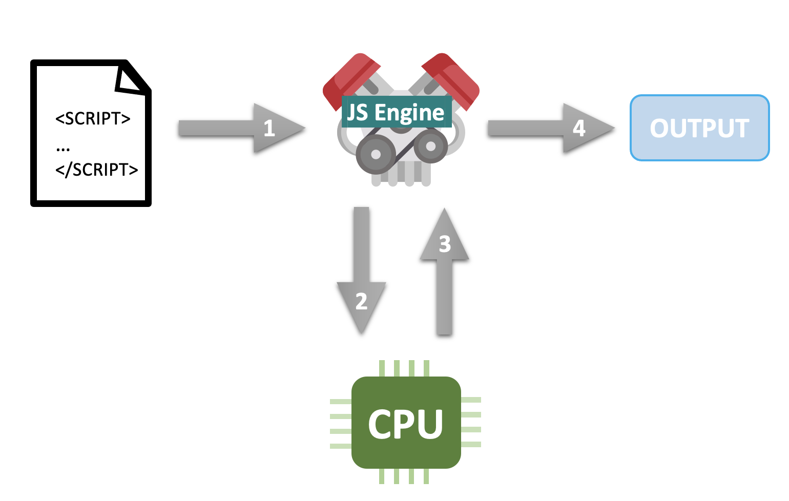
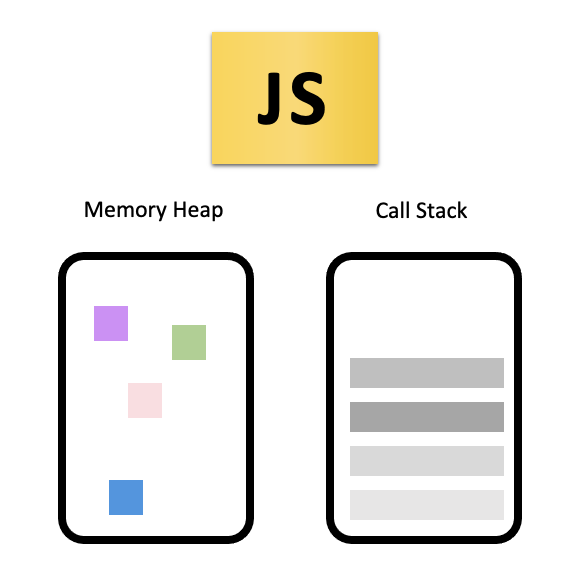

# 다양한 Javascript의 런타임 환경/ 자바스크립트의 동작원리: 엔진, 런타임, 호출 스택 

	

- 스크립트 언어인 자바스크립트가 실행되는 런타임 환경은 여러가지가 있다;
크롬 파이어폭스 사파리 엣지 등 데스크탑 웹 브라우저가 있으며 node,js와 같이 서버로 활용되는 런타임 환경도 있다. 

## 자바스크립트 엔진이란?
- ~~이미 어디선가 들어봤을 수도 있겠지만,~~ 자바스크립트는 인터프리터 프로그래밍 언어이다. 그말은 즉슨, 실행(execution)되기 전에 소스 코드가 이진 코드(binary code)로 컴파일 되지 않는다는 의미다. 그렇다면 이진법으로 구현된 코드가 아닌데 어떻게 컴퓨터가 '평범한(plain) 스크립트'를 이해할 수 있는 것일까?  
그 작업을 하는 아이가 바로 자바스크립트 엔진이다.   
우리는 웹 개발을 할 때 자바스크립트 엔진을 직접적으로(directily) 사용하는 것이 아니라, 자바스크립트 엔진이란 것이 어떠한 환경 내에서 작동하는 것인데, 이 '환경' 내에서는  
- 자바스크립트 엔진(JavaScript Engine)은 소스 코드를 기계가 이해할 수 있게 '기계어(machine code)'로 번환하고 또한 그 변환 결과를 컴퓨터의 CPU(Central Processing Unit)에서 실행하는 프로그램 ~~(혹은 인터프리터)~~ 이다.   
다시, 엔진은 앞서 얘기한 프로그램을 실행하는 '그릇(container)'와 같은 역할을 하는데, 이를 시각화 하자면 아래와 같이 표현될 수 있다;  

	

- 각각의 최신 웹 브라우저에는 자바스크립트 엔진이 탑재되어 있다. 그렇기 때문에 자바스크립트 엔진을 위한 추가적인 소프트웨어 설치는 필요 없다.   
또한 모든 자바스크립트 엔진은 ECMA Script에서 제공하는 사양(specification)을 구현하기 떄문에 브라우저마다 독립적인 자바스크립트 엔진을 개발하고 있다고 해도 스크립트가 구현되는 런타임 환경과는 관계없이 동일한 결과물을 제공할 수 있게끔 보장하고 있다/또는 최소한의 동일한 결과를 제공해야 한다, 오늘날 ECMA Script 사양은 과거보다 더 다이나믹하게 변경되고 있다. 하지만 모든 엔진이 이러한 변화의 속도를 따라잡고 있는 것은 아니기 떄문에 각기 다른 브라우저/자바스크립트의 런타임 환경에 대한 이해가 필요하기도 하다. 
- 당연히 현존하는 자바스크립트 런타임 환경의 특징들을 세세하게 전부 기억할 필요는 없겠지만, 아래의 것들은 기본적으로 기억해 두면 좋을 것 같다;  
|JS Engine|Description|
|**V8**|_오픈소스로 구글에서 개발했다. C++로 작성되었으며, 구글 크롬과 Node.js에서 사용된다. 가장 유명하다._|
|**SpiderMonkey**|_최초의 자바스크립트 엔진이다. 넷스케이프 네비게이터 웹 브라우저를 위해 브랜던 아이크에 의해 개발되었다. 지금은 모질라 파이어폭스에 사용되고 있다._|
|**Rhino**|_모질라 재단에서 운영한다. 오픈소스이며, 전체가 자바로 개발되었다._|
|**JavaScriptCore(Nitro)**|_오픈소스, 니트로라는 이름으로도 알려져 있으며 애플이 사파리를 위해 개발했다._|
|**Chakra(Jscript9)**|_인터넷 익스플로러용이다._|
|**Chakra(JavaScript)**|_마이크로소프트 엣지용이다._|
<!-- |**Nashron**|_오픈JDK의 일환으로 오픈소스이며 Oracle Java Languages and Tool Group이 개발하였습니다. _| -->
<!-- |**JerryScript**|_사물인터넷을 위한 경량 엔진입니다._| -->
<!-- cf. https://edu.goorm.io/learn/lecture/557/한-눈에-끝내는-node-js/lesson/174354/자바스크립트-엔진이란 -->

http://dolszewski.com/javascript/javascript-runtime-environment/

- 자바스크립트 엔진의 대표적인 예는 Google사의 `V8 엔진`이다. V8은 Chrome과 Node.js에서 사용한다. 이 V8이라는 엔진의 구조도를 간단하게 나타내면 아래의 그림과 같다;   

	

- 엔진의 주요 두 구성요소는 아래와 같다;
  - `Memory Heap`: 메모리 할당이 일어나는 곳 
	- `Call Stack(호출 스택)`: 코드 실행에 따라 호출 스택이 쌓이는 곳 

---

### 싱글 스레드 

 

### 콜 스택 (호출 스택)
- 콜 스택 예제 
- 콜 스택 에러 메세지 
- 스택 오버플로우 

https://beomy.github.io/tech/javascript/javascript-runtime/

 

### 논-블로킹
- 블로킹 

https://beomy.github.io/tech/javascript/javascript-runtime/

---

## (자바스크립트) 런타임
https://beomy.github.io/tech/javascript/javascript-runtime/

+ 자바스크립트 언타임 동작 예제 
---

### Web API

 

### 콜백 큐

 

### 이벤트 루프 

---
 ß

---

CLICK ME!

- cf.
	- https://blog.sessionstack.com/how-does-javascript-actually-work-part-1-b0bacc073cf
	- https://joshua1988.github.io/web-development/translation/javascript/how-js-works-inside-engine/

