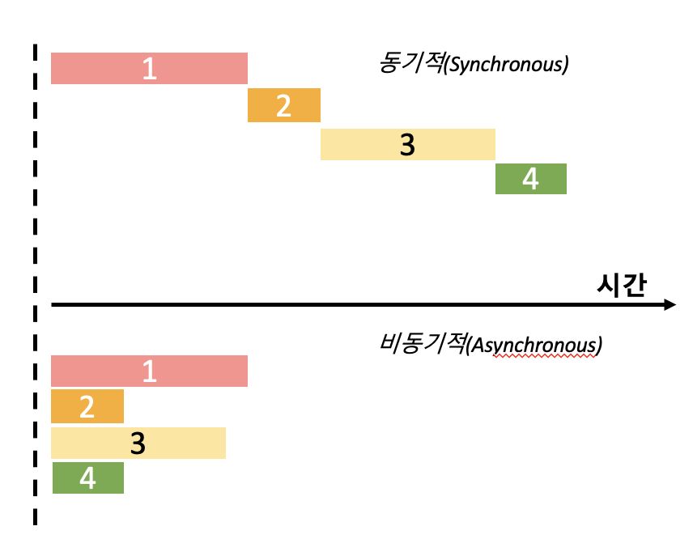

# 자바스크립트의 비동기 처리 
- 자바스크립트에서 비동기 처리를 어떻게 하는지 배워보자. 
- 그 전에 동기적 처리와 비동기적 처리는 무엇이 다른지 살펴보자. 

<br>

## 동기적(Synchronous) 처리와 비동기적(Asynchronous) 처리의 차이점 이해  
- 만약 작업을 동기적으로 처리한다고 하면 <u>하나의 작업이 끝날 때까지 '준비 상태'에 있기 때문에 다른 작업을 수행할 수 없다</u>. 
<div style="margin-left: 50px;">
	
</div>

- 위의 자료처럼 `동기적 처리`는 1번이 끝날 때까지는 2번이 실행될 수 없고, 2번이 끝나야지 3번이, 그리고 3번이 끝나야지만 4번이 실행될 수 있는 구조다.  	
- 하지만, 만약에 작업을 `비동기적으로 처리`하면 우리가 코드가 실행하게 될 때 흐름(flow)가 멈추지 않는다. <u>그래서 동시에 여러가지 작업을 수행할 수 있고, 그리고 기다리는 과정에서 다른 함수를 호출할 수도 있다.</u>
- 코드를 보면서 이해해보자; 
```javascript
	function work() {
		const start = Date.now();   // 현재 날짜를 숫자 형태로 표시해주는 내장함수
		
		for (let i = 0; i < 1000000000; i++) {

		}

		const end = Date.now();
		console.log(end - start + 'ms');
	}

	work();
	console.log('다음 작업');

	// 결과: 
	// ____ms  (계속 달라짐...)
	// 다음 작업 


	// 즉, 함수 work(); 가 끝날 때까지 '다음 작업'이 출력되지 않고 있다가, work 가 끝난 다음에 '다음 작업' 출력되는 것을 알 수 있다.   (이게 동기적 처리...)
	// 만약, 함수 work(); 가 작업이 되는 동안에 다른 작업도 수행하고 싶다고 하면, 함수 work();를 비동기적으로 처리해줘야 한다. 아래와 같이; 


	// 함수를 비동기적으로 처리하기 위해서는 setTimeout이라는 것을 사용하면 된다.  
	// setTimeout의 첫 번째 parameter는 (콜백)함수이고, 두 번째 인자로는 숫자를 넣어주면 된다. 
	// 두 번째 인자로 넣은 숫자는 그 숫자 만큼의 시간(cf. ms단위)이 흐른 후 첫 번째 인자로 넣은 함수를 실행하겠다는 의미이다.  

	function work() {
		setTimeout ( () => {
			const start = Date.now();   // 현재 날짜를 숫자 형태로 표시해주는 내장함수
		
			for (let i = 0; i < 1000000000; i++) {

			}

			const end = Date.now();
			console.log(end - start + 'ms');
		}, 0);
	};

	console.log('작업 시작');
	work();
	console.log('다음 작업');

	// 결과: 
	// 작업 시작 
	// 다음 작업 
	// ___ms

	// 해석: 
	// 일단 '작업 시작'을 출력하고, 이후 work();함수를 실행한다. 
	// work();의 작업이 아직 진행중이어도(/for문이 아직 돌아가고 있어도) '다음 작업'을 출력한다.
	// 이후, work();의 작업이 끝나면 ___ms 값을 출력한다.
``` 
<!-- - 방금 살펴본 예시는 단순히 연산량이 많은 작업을 비동기적으로 처리했지만, 나중에는 'Ajax Web API 요청', '파일 읽기', '암호화/복호화', '작업 에약'을 처리하게 될 것이다.   -->

> setTimeout - 일정 시간 후에 코드 실행하기 
- 자바스크립트에서 setTimeout은 글로벌 객체에 내장된 메소드이다.   
- setTimeout은 두개의 인자를 받는다.
	- 첫 번째 인자는 일정 시간 후 실행될 <u>함수</u>를 정의한다. 
	- 두 번째 인자에는 지연 시간을 지정한다. 지연 시간을 지정할 때는 ms(millisecond, 밀리세컨드) 단위로 설정하면 된다.  
- setTimeout은 두 번째 인자에 넣어준 (지연) 시간 만큼 흐른 뒤에, 첫 번째 인자로 넣어준 함수 코드를 실행한다. 
- 이때, 지연 시간에 0을 넣어도 브라우저는 4ms 이후에 실행을 시작하는데, 이는 브라우저가 지정한 최소 값이기 때문이다. 
<br>
<br>

## Promise 
- `Promise`는 비동기적 작업을 좀 더 편리하게 할 수 있도록 ES6에 도입된 기능이다.  
이전에는 비동기 처리를 할 때는 콜백함수로 처리를 해줬어야 했는데, 비동기적으로 처리해야 할 작업들이 많아질 경우 콜백 함수로 처리를 하면 코드가 쉽게 난잡해지게 되기 마련이었다.  
- 그래서 만들어진 것이 `Promise`이고, 원래는 하나의 라이브러리였지만, 그 기능이 편하다 보니까 아예 일반 자바스크립트 스펙에 추가가 되게 되었다.  
- `Promise`를 배우기 앞서 콜백 함수를 사용하여 비동기적 처리를 했을 때 코드가 얼마나 복잡해 질 수 있는지를 살펴보자; 
```javascript
	// 비동기적으로 incereaseAndPrint라는 함수를 처리하기 위해 setTimeout을 사용한다.  
	function incereaseAndPrint(n, callback) {
		setTimeout( () => {
			const increased = n + 1;
			console.log(increased);

			if (callback) {    // 만약 parameter로 받은 콜백 함수가 있다면
				callback(increased);  // 콜백함수에 increased를 대입...
			}
		}, 1000); 
	}

	// 위에서 increased = n + 1; 이었는데... 
	increaseAndPrint(0, n => {            // 여기서는 n을 0으로 받아서 +1하면 n은 1
		increaseAndPrint(n, n => {          // n은 2
			increaseAndPrint(n, n => {        // n은 3
				increaseAndPrint(n , n => {     // n은 4
					increaseAndPrint(n , n => {   // n은 5
						console.log('작업 끝!');      // 작업 끝!
					})		
				})
			})
		})
	})


	// 위에서 본 것과 같이 비동기적으로 처리할 작업이 많아 지면 많아 질수록 보기에도 어렵고, 난잡해진다. 그래서 이런 코드를 "콜백 지옥"이라고 부른다. 
	// 이런 콜백 지옥을 없애기 위해 나타난 Promise를 알아보자!
```

<br>

> `Promise` 만드는 방법
- `Promise`는 다음과 같은 세 가지의 상태를 갖는다;
	- **대기중(pending)**:
		- 아직 결과가 없는 상태. 약속을 했지만 아직 약속에 대한 결과가 나오지 않은 상태다.
	- **이행됨(fulfilled)**:
		- 비동기 처리가 성공적으로 완료되어 약속을 이행한 상태. 이때 결과로 하나의 값이 전달된다. 
	- **거부됨(rejected)**:
		- 비동기 처리가 실패한 상태. 약속이 거부되고 그 결과로 거절된 이유를 전달한다.
- `Promise`는 두 가지 메소드를 갖는다;
	- **.then(onFulfilled, onReject)**: 
		- 약속이 완료됐을 때 호출될 함수들을 정의한다.   
		이때, 첫 번째 인자로 전달되는 함수는 약속이 성공적으로 이행됐을 때 호출되고,   
		두 번째 인자로 전달된 함수는 거부됐을 때 호출된다.   
		두 전달 인자 함수들은 매개변수를 가지는데 각각의 결과가 매개변수를 통해 전달된다. 
	- **catch(onReject)**:
		- 약속이 거부됐을 때 호출될 함수(onReject)를 등록한다.
- 에시를 통해 알아보자;
```javascript
	// new를 사용해서 Promise를 만들고, resolve와 reject라는 것을 parameter로 받아와야한다. 
	// 이때 promise는 성공할 수도 있고 실패할 수도 있다. 
	// 성공할 때에는 resolve를, 실패할 때는 reject를 호출해주면 된다. 
	const myPromise = new Promise((resolve, reject) => {
		setTimeout(() => {
			resolve('result');
		}, 1000)               // resolve니까 1초 뒤에 성공하는 함수의 예시...
	});

	myPromise.then(result => {
		console.log(result);
	});

	// 결과: 
	// Promise {<pending>}
	// result


	const myPromise = new Promise((resolve, reject) => {
		setTimeout(() => {
			reject(new Error());
		}, 1000)               // reject니까 1초 뒤에 실패하는 함수의 예시...
	});

	myPromise.then(result => {
		console.log(result);
	}).catch(e => {
		console.log(e);
	})

	// 결과: 
	// Promise {<pending>}
	// Error
	// 	at <anonymous>:3:11
```
- 즉, 실패하는 상황에서는 resolve와 .then을 사용학고, 약속이 실패하는 상황에서는 reject와 .catch를 사용한다고 알고 있자. 
- 위에서는 Promise를 만드는 방법과 약속이 성공했을 떄와 실패했을 때 사용하는 메서드를 알아보았다면, 이제는 Promise를 만드는 함수를 만들어 보자; 
```javascript
	function increaseAndPrint(n) {    // 여기서는 따로 콜백 함수를 받지 않는다고 하자.
		return new Promise((resolve, reject) => {      // 여기서도 Promise는 resolve랑 reject를 받아와야 한다는 점!
			setTimeout(() => {
				const value = n + 1;      // value는 n + 1 
				if (value === 5) {        // 만약 value가 5라면 ...
					const error = new Error();   // new Error();로 에러를 생성하고 error에 할당...
					error.name = 'ValueIsFiveError'  // error에게 .name으로 이름을 정해주자...
					reject(error);
					return;                  // 에러 발생시킨 후에는 함수를 종료...
				}
				console.log(value);        // value를 출력해준다 
				resolve(value);            // 성공했을 경우, value = n + 1;
			})
		}, 1000);                      // 지연 시간 정해주는 것 잊지 말기!
	}


	increaseAndPrint(0).then(n => {     // 기댓값: n = 0, 그러면 value는 n + 1이나까 1이 출력될 것!
		console.log('result: ', n);  
	})


	// 다시, 콜백 함수보다는 Promise를 사용 하면 비동기식으로 처리하는 작업들의 코드를 보다 간결하게 작성할 수 있다. 위의 예시에서는 잘 안 와닿을 수 있는데, 만약 아래와 같이 ... .then이 반복되고 .catch도 나오면 ...
	increaseAndPrint(0).then(n => {
		return increaseAndPrint(n);
	}).then(n => {
		return increaseAndPrint(n);
	}).then(n => {
		return increaseAndPrint(n);
	}).then(n => {
		return increaseAndPrint(n);
	}).then(n => {
		return increaseAndPrint(n);
	}).catch(e => {
		console.error(e);
	})
	

	// 위의 코드를 아래처럼 쓸 수 있다;
		
	increaseAndPrint(0).then(increaseAndPrint)
	.then(increaseAndPrint)
	.then(increaseAndPrint)
	.then(increaseAndPrint)
	.then(increaseAndPrint)
	.catch(e => {
		console.error(e);
	})

	// 결과 (결과는 둘 다 똑같이 나온다): 
	// Promise { <pending> }
	// 1
	// 2
	// 3 
	// 4
	// Error [ValueIsFiveError]
	//	 at Timeout._onTimeout (REPL30:6:20)
```
- 즉, Promise를 사용하면 비동기 처리를 하는 작업이 많아져도 코드의 깊이가 깊어지지 않는다는 장점이 있다.
- 하지만 이런 Promise도 단점이 있는데, 하나는 에러를 잡을 때 어떤 지점에서 에러가 발생한 건지 파악하기가 어렵고, 또 특정 조건에 따라 분기를 나눠야 할 때 Promise는 .then으로 이어지기 때문에 분기를 나누기가 굉장히 번거로워 진다. 
- 이런 단점들을 보완하기 위해 사용하는 것이 바로 `async, await`이다.    
이것들에 대해 알아보자...

<br>
<br>

## async, await 
- 여기부터 다시!!!!!!
<!-- 

여기부터 다시!!!! 
 -->
```javascript
```

<br>
<br>

## Promise all, Promise.race

```javascript
```

<br>
<br>


#

<br>
<br>


#
```javascript
```
```javascript
```
```javascript
```
<br>
<br>

---
<details>
<summary>CLICK ME!</summary>

- cf. 
	- 
	-
	-
	-
	-
	-
	-
	-


</details>

---