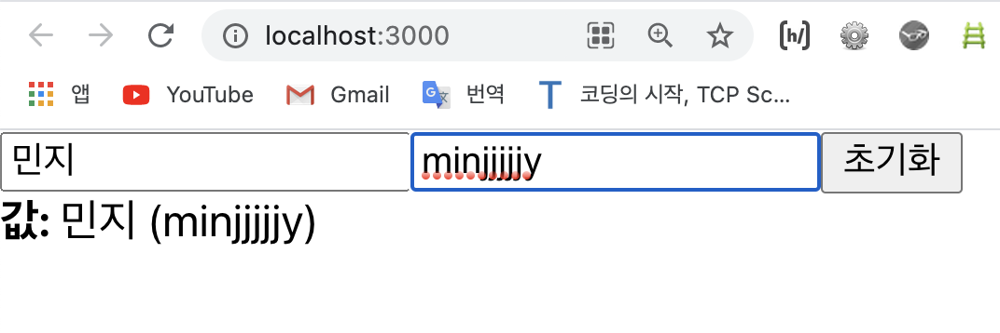

# 여러개의 input 상태 관리하기 

> 오늘의 공부 목표 
- 지난 튜토리얼에서는 input 상태 관리하는 방법에 대해 알아보는 시간을 가졌는데, 오늘은 input이 여러개일 때는 어떻게 관리하는지에 대해 알아보도록 하겠다. 
- input 태그 안에 내용이 비어있을 때 input에 대한 간략한 설명이라고 할 수 있는 `placeholder` 값도 설정해보는 연습을 할 예정이다. 

<br>

> 예시를 통한 이해 
- 저번 시간에 만들어 놓은 InputSample.js 파일에 들어가서 기존에 내용을 일부 아래와 같이 지운다; 

[InputSample.js]
```javascript
	import React, { useState } from 'react';

	function InputSample() {
		const [inputs, setInputs] = useState({
			// 이제는 객체 형태로 상태를 관리해줄 것!
			name: '',
			nickname: '',
		});
		// 나중에 name이랑 nickname을 사용할 수 있도록 비구조할당 문법을 통해서 추출을 해준다... 
		const {name, nickname} = inputs;
		
		const onChange = (e) => {
			// console.log(e.targer.name);  // 아래에서 지정한 Input의 name 속성값이 콘솔창에 출력될 것이다... 
			// console.log(e.targer.value);
			// 위의 두 console.log();를 비구조할당 문법으로 한줄로 요약! 
			const {name, value} = e.target;

			// // 리액트에서 객체를 업데이트 할 때는 기존의 방법을 사용할 수 없다... 
			// // 리액트에서 객체를 업데이트 하려면 객체를 "복사"해줘야 한다. (cf. 스프레드 문법!)
			// const nextInputs = {
			// 	...inputs
			// 	[name]: value, 
			// };
			// // 그리고 nextInputs의 name의 값을 현재 input인 e.target.value로 (하지만 앞에 e.target은 비구조할당 문법으로 인해 안써도 됨!) 덮어쓰겠다고 적는다! 아래와 같이;
			// nextInputs[name] = value;
			// // 이때, 위와 같이 적어도 되지만, 그냥 nextInputs안에다 넣어버려도 된다... -> [name]: value

		// 근데, 사실 nextInput을 따로 만들 필요도 없이... 그냥 바로 setInputs()의 괄호 안에 다 넣어버려도 됨! 
			setInputs({
				...inputs,
				[name]: value
			});
		};

		const onReset = () => {
			setInputs({
				name: '',
				nickname: '',
			})
		};


		return (
			<div>
				{/* name="" 이라는 속성을 활용해서 여러개의 input들을 관리한다 */}
				<input 
					name="name" 
					placeholder="이름" 
					onChange={onChange} 
					value={name}
				/>
				<input 
					name="nickname" 
					placeholder="닉네임" 
					onChange={onChange} 
					name={nickname} 
				/>
				<button onClick={onReset}>초기화 </button>
				<div>
					<b>값: </b>
					{name} ({nickname})
				</div>
			</div>
		);
	}

	export default InputSample;
```
- 위와 같이 코드를 실행하면 화면은 다음과 같아진다; 

<div style="padding-left: 45px;">
		
</div>

<br>

📌 우리가 오늘 기억해야할 부분은 <u>객체 상태를 업데이트 할 거라면 꼭!! 기존의 상태를 복사하고 (cf. **스프레드 문법** ), 거기다가 특정 값을 덮어씌우고 (cf. [name]: value), 그걸 새로운 상태로 설정을 해줘야만 한다 (cf.setInputs({....blahblahblah.....}))!!</u>    
이렇게 하는 것을 "불변성을 지킨다"라고 하는데, 불변성을 지켜줘야지만 _리액트 컴포넌트에서 상태가 업데이트 됐음을 감지할 수 있고, 이에 따라 필요한 렌더링이 발생하게 된다. 만약에 불변성을 지키지 않는다면 (즉, 기존의 상태를 복사해서 그걸 새로운 상태로 설정하지 않는다면...), 컴포넌트를 수정한다고 해도, 업데이트가 안 된다는 점! 유의하자!! 꼭!!!_ 😉

<br>
<br>

---
<details>
	<summary>CLICK ME!</summary>

- cf. 
	- https://react.vlpt.us/basic/09-multiple-inputs.html
	- https://2dubbing.tistory.com/79

</details>
---

