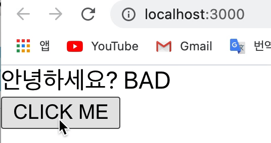

# Context API 를 사용한 전역 값 관리

<br>

> 리액트의 Context 간단 정리 
- React에서 일반적으로 데이터를 자손에게 전달하는 방법은 위에서부터 아래로 (부모에서 자식까지) "하향식"으로 props를 통해 전달한다. 이것을 top-down 방식이라고 부르는데, 이런 top-down 방식은 특정 경우에 매우 성가신 일이 된다.      
- 만약 컴포넌트의 구조가 매우 단순하다면 1-2개의 컴포넌트를 중간다리 삼아서/거쳐서 데이터를 하위 컴포넌트에게 전달하는 것은 문제가 되지 않는다. 하지만 만약 컴포넌트 구조가 매우 복잡해지고 많은 수의 컴포넌트를 거져야지만 원하는 컴포넌트에 데이터 전달을 할 수 있다면 문제가 될 것이다.     
`Context`는 바로 이렇게 level이 깊어질 수록 데이터를 전달하는데 불편함을 해소해주는 역할이다.    
Context를 사용하면 컴포넌트 트리의 모든 레벨을 prop으로 거치지 않아도 원하는 데이터를 컴포넌트들에 공유할 수 있게 한다.  
다시, 이 때 Context API를 사용하면 중첩 구조가 복잡한 상황이어도 비교적 쉽게 데이터를 전달할 수 있다.       
~~(cf. 이를 해결하기 위한 방법으로 flux, reflux, redux, mobx 등을 이용하는데, React 16.3 부터는 **Context API**를 이용해서 트리의 모든 레벨에 값을 공유하는 방법을 제공한다.)~~     
- Context API 사용하기 위해서 기억해야 할 것은 `React.createContext`이다.     
이에 대해 더 알아보기 위해, begin-react 폴더의 src로 들어가서 `ContextSample.js`라는 파일을 만들어 준다. 그리고 아래와 같이 작성한다;    
e.g.    

[ContextSample.js]

```javascript
	import React, { createContext, useContext } from 'react'; // createContext, useContext 

	// 위의 createContext, useContext 를 사용하기 앞서 컴포넌트 4가지를 만들어 준다 -> Child, Parent, GrandParent, ContextSample

	function Child({text}) {    // {text}라는 props를 받아와서 
		return <div>안녕하세요? {text}</div>    // 렌더링 한다 
	}
	function Parent({text}) {
		return <Child text={text} />
	}
	function GrandParent({text}) {
		return <Parent text={text} />
	}
	function ContextSample() {
		return <GrandParent text="Good" />
	}

	export default ContextSample; 
```

<br>

[index.js]

```javascript
	import React from 'react';
	import ReactDOM from 'react-dom';
	import './index.css';
	// import App from './App';
	import reportWebVitals from './reportWebVitals';
	import ContextSample from './ContextSample';

	ReactDOM.render(
		<ContextSample />,
		document.getElementById('root')
	);

	// If you want to start measuring performance in your app, pass a function
	// to log results (for example: reportWebVitals(console.log))
	// or send to an analytics endpoint. Learn more: https://bit.ly/CRA-vitals
	reportWebVitals();
```

- 위와 같이 ContextSample.js 파일을 작성했다면 화면은 아래와 같아야한다;    
<div style="padding-left: 40px;">
		
</div>

- 위의 코드를 설명하자면 ContextSample에 text 값으로 있던 "Good"이란 값이 GrandParent의 {text}로 넘어가고, 이후 Parent의 {text}로, 그리고 Parent의 {text}로, 그리고 마지막은 Child의 {text}로 넘어가서 화면에는 `<div>안녕하세요? Good</div>`이 렌더링 된 것이다. 
- 하지만 우리가 하고 싶은 것은 `Context API`를 통해서 다른 컴포넌트를 거치지 않고 ContextSample에서 Child 컴포넌트의 {text}로 바로 넘겨주는 것이다.    
그래서 이를 위해 `const MyContext = createContext('');`와 `const text = useContext(MyContext);`를 사용한다; 

[ContextSample.js]

```javascript
	import React, { createContext, useContext } from 'react'; 

	// createContext 사용하기 -> Context 생성
	const MyContext = createContext('defaultValue');

	function Child() {             // {text}를 받는 것이 아니라 text라는 상수에 useContext를 활용하여  MyContext를 받아온다 
		const text = useContext(MyContext);

		return <div>안녕하세요? {text}</div>    
	}
	function Parent({text}) {
		return <Child text={text} />
	}
	function GrandParent({text}) {
		return <Parent text={text} />
	}
	function ContextSample() {
		return <GrandParent text="Good" />
	}

	export default ContextSample; 
```
- 그러면 화면은 아래와 같아진다;    
<div style="padding-left: 40px;">
		
</div>

- 만약 `MyContext`의 값을 지정하고 싶다면, Context를 사용하는 가장 상위 컴포넌트인 `ContextSample`에서 MyContext 안에 있는 `Provider`라는 컴포넌트를 사용해야 한다;    

[ContextSample.js]

```javascript
	import React, { createContext, useContext } from 'react'; 

	const MyContext = createContext('defaultValue');

	function Child() {             
		const text = useContext(MyContext);

		return <div>안녕하세요? {text}</div>    // 단, 여기있는 {text}는 위에서 받아오는 MyContext의 값임을 유의! 밑에서 MyContext.Provider의 value로 값을 지정했다고 해도 이부분은 지우면 안 됨!
	}
	function Parent() {
		return <Child />
	}
	function GrandParent() {
		return <Parent />
	}
	function ContextSample() { 
		return(
			{/* MyContext.Provider 라는 컴포넌트로 GrandParent 컴포넌트를 감싸고, MyContext.Provider 안에 value="" 형태로 값을 지정해준다. 그리고 모든 text/{text}는 필요없어지니 지운다. */}
			<MyContext.Provider value="Gooooood!!">        
				<GrandParent />        
			</MyContext.Provider>	
		)
	}

	export default ContextSample; 
```
- 위와 같이 `MyContext.Provider`를 통해서 `value="Gooooood!!"`로 설정하면 렌더링 된 화면은 아래와 같아야 한다;     
<div style="padding-left: 40px;">
		
</div>

<br>

> 오늘 공부 내용 정리!

📌 위와 같이 MyContext와 같은 <u>`Context`는 다른 파일에서 작성할 수도 있고, 다른 파일에서 작성한 Context를 내보낸 뒤, 어디서든지 불러오는 것도 가능하다는 큰 장점</u>이 있다. 😉 

📌 다음 시간에는 App 컴포넌트에서 Context를 만들고, 이를 내보낸 다음, User 컴포넌트에서 불러와서 사용해 볼 예정이다. 

📌 다시 복습!     
- 우리는 Context를 만들때는 `createContext()` 함수를 사용하는데, 이때 괄호 () 안에 들어가는 파라미터는 **기본값**이다.   
- 이 기본값은 만약에 `Provider` 컴포넌트가 사용되지 않았을 때의 기본적인 값이고, 만약 그 값을 `Provider` 컴포넌트의 `value=""`를 통해 직접 설정했을 경우 설정한 값이 Context의 값이 된다. 
- 그리고 이 Context의 값이란 것은 **유동적으로 변할 수도 있다**;        
e.g. 

[ContextSample.js]

```javascript
	// createContext, useContext, useState 
	import React, {createContext, useContext, useState } from 'react'; 

	const MyContext = createContext('defaultValue');   


	function Child() {
		const text = useContext(MyContext);     

		return <div>안녕하세요? {text}</div>
	}

	function Parent() {
		return <Child />
	}

	function GrandParent() {
		return <Parent />
	}

	function ContextSample() {
		const [value, setValue] = useState(true);    // useState 사용. 기본값은 true

		return (
			{/* 만약 value 가 true면 'GOOD'을 false면 'BAD'를 Context 값으로 설정하곘단 의미다. */}
			<MyContext.Provider value={value ? 'GOOD' : 'BAD'}>       
				<GrandParent />
				{/* onClick시 -> useState의 setValue. 즉, value 다음 상태는 !value 하란 의미. true면 false로, false면 true로...! */}
				<button onClick={() => setValue(!value)}>CLICK ME</button>    
			</MyContext.Provider>	
		)
	}

	export default ContextSample; 
```

<div style="padding-left: 40px;">
		
</div>

<br>
 
📝 다음 시간에는 App 컴포넌트에서 Context API를 사용하는 방법에 대해 알아보겠다!  

<br>
<br>

<!-- > Context API vs Redux 
- ~~~ 한 점 때문에 Context API 라는 것을 사용하는데... 근데 또 그런 역할을 할 수 있는 아이가 또 Redux... 그렇다면 무엇을 사용?? 
- Redux: 어떠한 상태를 프로젝트에서 전역적으로 사용하는 것을 가능하게 해주는 라이브러리다. 
- 즉, props를 거쳐서 상위 컴포넌트에서 하위 컴포넌트로 상태를 전달할 필요가 없이 Redux라는 라이브러리를 사용하면 어떠한 상태를 전역적으로 프로젝트 내에서 사용할 수 있다는 의미다. 
- 하지만 Context API를 통하면 이런 글로벌 상태 관리를 라이브러리 없이 꽤나 편하게 할 수 있다.    
다시, 더 이상 여러 컴포넌트를 거쳐서 값을 전달해주는 것이 아니라 Context를 통해서 원하는 값이나 함수를 바로 전달해줄 수 있다. -->

---

<details>
	<summary>CLICK ME!</summary>

- cf. 
	- https://ko.reactjs.org/docs/context.html
	- https://im-developer.tistory.com/184
	- https://react.vlpt.us/basic/20-useReducer.html
	- https://xiubindev.tistory.com/99
	- https://velog.io/@kwonh/React-Context-API-%EC%82%AC%EC%9A%A9%ED%95%98%EA%B8%B0-React.createContext
	- https://ko.reactjs.org/docs/hooks-reference.html#usecontext
	- https://im-developer.tistory.com/184
	- https://pks2974.medium.com/react-context-%EA%B0%84%EB%8B%A8-%EC%A0%95%EB%A6%AC-9c35ce6617fc
	- https://kyounghwan01.github.io/blog/React/react-context-api/
	- https://medium.com/react-native-seoul/react-%EB%A6%AC%EC%95%A1%ED%8A%B8%EB%A5%BC-%EC%B2%98%EC%9D%8C%EB%B6%80%ED%84%B0-%EB%B0%B0%EC%9B%8C%EB%B3%B4%EC%9E%90-05-context-api-d053f92cd645
	- https://ideveloper2.tistory.com/136
	- https://velog.io/@noyo0123/%EB%A6%AC%EC%95%A1%ED%8A%B8-Context-API-%EC%A0%95%EB%A6%AC-r5k4dingb9
	- https://ko.reactjs.org/docs/context.html
	- https://react.vlpt.us/basic/22-context-dispatch.html
	
</details>

---


	