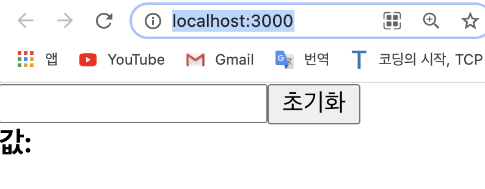

# input 상태 관리하기 
- 오늘은 리액트에서 사용자가 입력할 수 있는 input 태그의 상태를 관리하는 방법에 대해 알아보자.    
~~(cf. begin-react의 src 폴더에 InputSample.js라는 파일을 생성 및 아래와 같이 작성...)~~   
e.g.  

[InputSample.js]

```javascript
	import React from 'react';

	function InputSample() {
		return (
			<div>
				<input />
				<button>초기화</button>
				<div>
					<b>값: </b>
				</div>
			</div>
		)
	}

	export default InputSample;
```
- 그리고 InputSample 컴포넌트를 App 에서 렌더링한다; 
[App.js]

```javascript
import React from 'react';
import InputSample from './InputSample';

function App() {
  return (
		<InputSample />
	);
}

export default App;
```
- `http://localhost:3000`에 들어가면 화면은 아래와 같을 것;    
<div style="padding-left: 40px;">
		
</div>

<br>

> useState의 사용 
- 이번에도, `useState` 함수를 사용한다.   
이번에는 `input`의 `onChange` 라는 이벤트를 사용할 것이다.  
이벤트에 등록하는 함수에서는 이벤트 객체 `e`를 파라미터로 받아와서 사용 할 수 있는데, 이 객체의 `e.target`은 이벤트가 발생한 DOM인 **input DOM** 을 가르킨다.   
이 DOM 의 value 값, 즉 `e.target.value`를 조회하면 현재 input에 입력한 값이 무엇인지 알 수 있다.    
(cf. 이 값을 useState 를 통해서 관리를 해주면 된다.)
- 예시를 통해 더 살펴보자;   
e.g.    

[InputSample.js] 

```javascript
```


<br>
<br>


> 

[]
e.g.
[InputSample.js]
```javascript
```
e.g.
```javascript
```

<div style="padding-left: px;">
		
</div>

<div style="padding-left: px;">
		
</div>

<br>
<br>

---
<details>
	<summary>CLICK ME!</summary>

- cf. 
	- 
	- 
	- 
	- 
	- 

</details>
---

