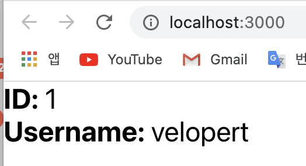
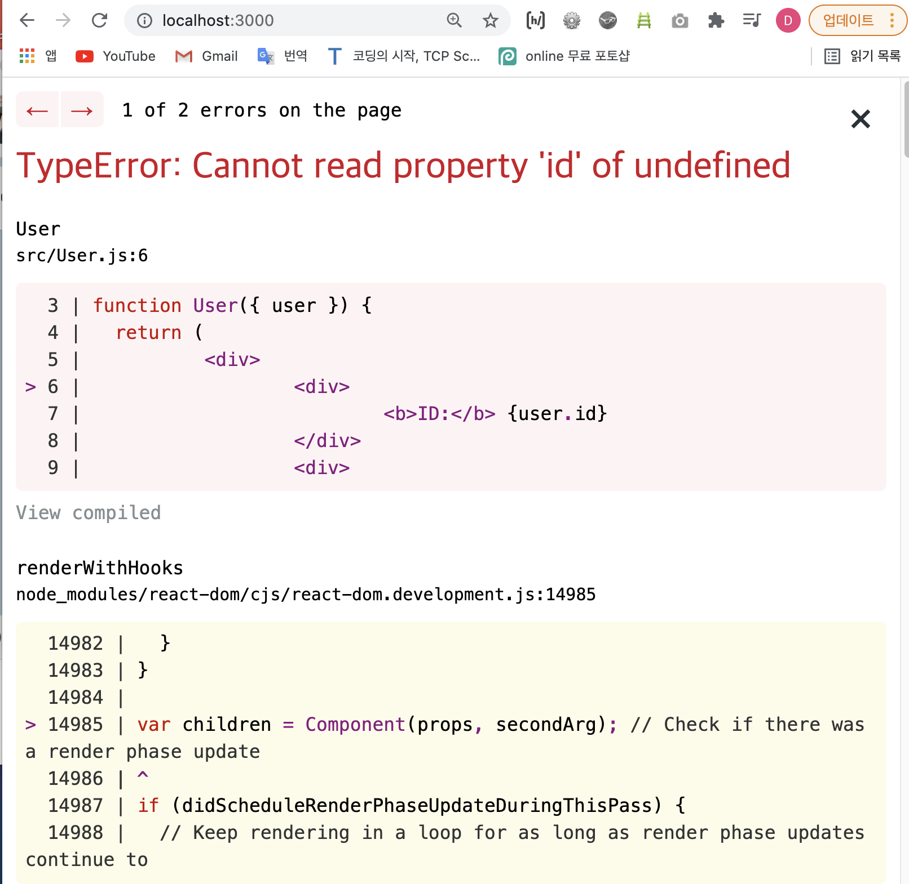
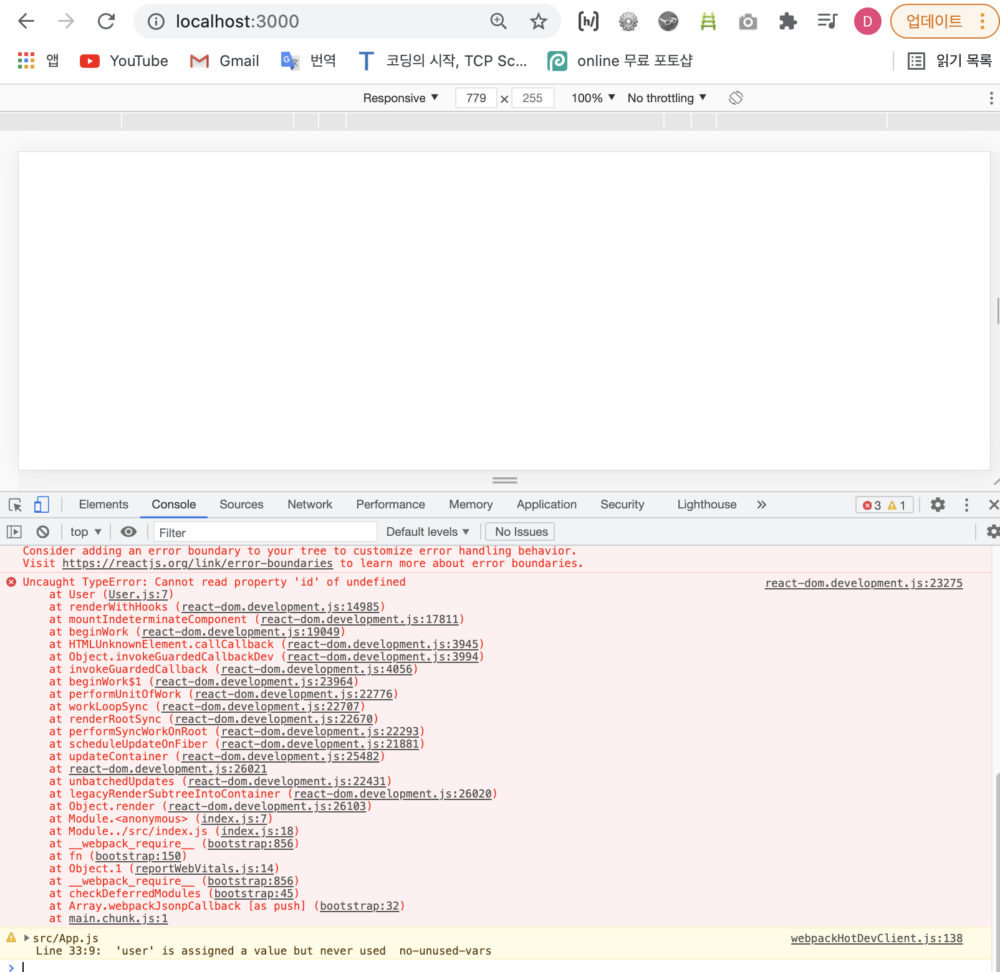
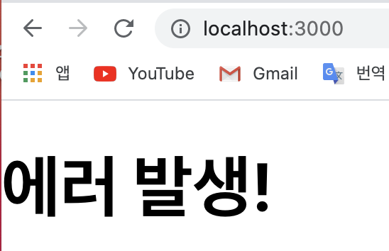

# LifeCycle Method

<br>

> 라이프사이클 메서드의 이해 
-  React 컴포넌트는 생명 주기가 있다.   
생애 주기 또는 라이프사이클(Life cycle)이라고도 표현한다.   
- `LifeCycle Method`는 한국어로 "생명주기 메서드"라고 부른다.   
<u>생명주기 메서드는 컴포넌트가 브라우저상에 나타나고(마운트), 업데이트되고, 사라지게(언마운트) 될 때 호출되는 메서드들이다. 추가적으로 컴포넌트에서 에러가 났을 때 호출되는 메서드도 있다.</u> 
- 라이프사이클 메서드는 종류는 총 9가지인데, **Will** 접두사가 붙은 메서드는 어떤 작업을 작동하기 **전**에 실행되는 메서드이고, **Did** 접두사가 붙은 메서드는 어떤 작업을 작동한 **후**에 실행되는 메서드이다.    
이 메서드들은 우리가 컴포넌트 클래스에서 덮어 써 선언함으로써 사용할 수 있다.
- 유의사항: 생명주기 메서드는 클래스형 컴포넌트에서만 사용 할 수 있다. 
- 팁! 
	- 라이프사이클 메서드는 앞으로 사용 할 일이 별로 없을 것.  
	다만, 어떤 것들이 있는지만 알아두고 나중에 사용해야 할 일이 있다면 '메뉴얼'을 보고 사용할 수 있게만 학습할 것! 

<br>

> 라이프사이클 메서드 살펴보기 
- `라이프사이클`은 <u>1.마운트, 2.업데이트, 그리고 3.언마운트</u> 카테고리로 나뉘는데, 이 큰 카테고리에 따라 호출하는 메서드들이 다르다;    
	- 1. 마운트  	
		- `constructor`
		- `getDerivedStateFromProps`
		- `render`
		- `componentDidMount`
	- 2. 업데이트 
		- `getDerivedStateFromProps`
		- `shouldComponentUpdate`
		- `render
		- `getSnapshotBeforeUpdate`
		- `componentDidUpdate`
	- 3. 언마운트 
		- `componentWillUnmount`

<br>

>> render 메서드 
- `render` 메서드는 컴포넌트의 모양새를 정의한다.  
우리가 준비한 UI 컴포넌트를 (리)렌더링하는 가장 중요한 메서드기 때문에, 라이프사이클 메서드 중 유일한 필수 메서드이다.    
- 이 메서드 안에서 this.props와 this.state에 접근할 수 있으면, 리액트 요소를 반환(return)한다.   

<br>

>> constructor 메서드 
- `constructor` 메서드는 컴포넌트의 생성자 메서드로 컴포넌트를 만들 때 가장 먼저 실행되는 메서드이다.   
이 메서드에서는 초기 state를 정할 수 있다. 

<br>

>> getDerivedStateFromProps 메서드 
- `getDerivedStateFromProps`는 props로 받아온 것을 state에 넣어주고 싶을 때 사용한다.    
- 또는 컴포넌트의 props나 state가 바뀌었을때도 이 메서드가 호출된다. 
- 다른 생명주기 메서드와는 달리 앞에 static을 필요로 하고, 이 안에서는 this롤 조회 할 수 없다. 여기서 특정 객체를 반환하게 되면 해당 객체 안에 있는 내용들이 컴포넌트의 state로 설정이 된다.    
반면 null 을 반환하게 되면 아무 일도 발생하지 않습니다.
- 참고로 이 메서드는 컴포넌트가 처음 렌더링 되기 전에도 호출 되고, 그 이후 리렌더링 되기 전에도 매번 실행됩니다.

<br>

>> componentDidMount 메서드 
- `componentDidMount` 메서드는 컴포넌트의 첫번째 렌더링이 마치고 나면 호출되는 메서드다.   
이 메서드가 호출되는 시점에는 우리가 만든 컴포넌트가 화면에 나타난 상태인데, 이 메서드 안에서 다른 자바스크립트 라이브러리 또는 프레임워크의 함수를 호출하거나 이벤트 등록, setTimeout, setInterval, 네트워크 요청 같은 비동기 작업을 처리하면 된다. 

<br>

>> shouldComponentUpdate 메서드 
- `shouldComponentUpdate` 메서드는 리렌더링 할지 말지를 결정하는 메서드다.     
- 이 메서드는 props 또는 state를 변경했을 때, 리렌더링을 시작할지의 여부를 지정하는데 이 메서드에서는 반드시 true 값 또는 false 값을 반환해야 한다.    
만약 컴포넌트를 만들 때 이 메서드를 따로 생성하지 않으면 기본적으로 언제나 true 값을 반환한다. 이 메서드가 false 값을 반환한다면 업데이트 과정은 여기서 중지된다. 
- 이 메서드 안에서 현재 props와 state는 this.props와 this.state로 접근하고, 새로 설정될 props 또는 state는 nextProps와 nextState로 접근할 수 있다. 
- 해당 메서드는 주로 최적화 할 때 사용한다. 

<br>

>> getSnapshotBeforeUpdate 메서드 
- `getSnapshotBeforeUpdate` 메서드는 render에서 만들어진 결과물이 브라우저에 실제로 반영되기 직전에 호출된다.   
- 이 메서드에서 반환하는 값은 componentDidUpdate에서 세 번째 파라미터인 snapshot 값으로 전달받을 수 있는데. 주로 업데이트하기 직전의 값을 참고할 일이 있을 때 활용된다. (e.g. 스크롤바 위치 유지 etc.)

<br>

>> componentDidUpdate 메서드 
- `componentDidUpdate` 메서드는 리렌더링을 마치고, 화면에 우리가 원하는 변화가 모두 반영되고 난 뒤 호출되는 메서드다.  
- 업데이트가 모두 끝난 직후이므로, DOM 관련 처리를 해도 무방하다. 여기서는 prevProps 또는 prevState를 사용하여 컴포넌트가 이전에 가졌던 데이터에 접근할 수 있다.    
- 또 3번째 파라미터로 getSnapshotBeforeUpdate에서 반환한 값이 있다면 여기서 snapshot 값을 조회 및 전달 받을 수 있다.

<br>

>> componentWillUnmount 메서드 
- `componentWillUnmount` 메서드는 컴포넌트를 DOM에서 제거할 때 실행한다.
- componentDidMount에서 등록한 이벤트, 타이머, 직접 생성한 DOM이 있다면 여기서 제거 작업을 해야한다. 

<br>

>> componentDidCatch 메서드 
- `componentDidCatch` 라는 생명주기 메서드는 컴포넌트 렌더링 도중에 에러가 발생했을 때, 어플리케이션이 먹통이 되지 않고 오류 UI를 보여 줄 수 있게 해준다.
- 사용방법;   
```javascript 
	componentDidCatch(error, info) {
		this.setState({
			error: true
		});
		console.log({error, info});
	}
```
- 여기서 error는 파라미터에 어떤 에러가 발생했는지 알려주면, info 파라미터는 어디에 있는 코드에서 오류가 발생했는지에 대한 정보를 준다.
- 유의!
	- 그러나 이 메서드는 컴포넌트 자신에게 발생하는 에러를 잡아낼 수는 없고, 자신의 this.props.children으로 전달되는 컴포넌트에서 발생하는 에러만 잡아낼 수 있는 점을 유의해야 한다.   

<br>
<hr>
<br>

## componentDidCatch 로 에러 잡아내기 
- 이번에는 `componentDidCatch` 라는 생명주기 메서드를 사용하여 리액트 애플리케이션에서 발생하는 에러를 처리하는 방법을 좀 더 자세히 알아보자.
- 먼저, 이번 튜토리얼을 진행 하기 위하여 새로운 프로젝트를 만든다;      
```xml
	$ npx create-react-app error-catch
```
- 그 다음에, 해당 디렉터리를 에디터로 열고, 개발 서버를 시작한다;      
```xml
	$ cd error-catch
	$ yarn start  
```
- 여기까지 성공했다면, 이제 리액트 앱이 어떤 상황에서 에러가 발생하게 되는지 알아보자.    
우선, `User.js`라는 파일을 src 디렉터리에 생성하여 다음과 같이 컴포넌트 코드를 작성한다;   
e.g.    

[User.js]    

```javascript
	import React from 'react';

	function User({ user }) {   // 컴포넌트 User는 user라는 props를 받아와서 해당 데이터의 id와 username 값을 보여준다 
		return (
			<div>
				<div>
					<b>ID</b>: {user.id}
				</div>
				<div>
					<b>Username:</b> {user.username}
				</div>
			</div>
		);
	}

	export default User;
```
- 그리고 User 컴포넌트를 App 컴포넌트에서 사용한다;    
e.g.      

[App.js]      

```javascript
	import React from 'react';
	import User from './User';

	function App() {
		const user = {
			id: 1,
			username: 'velopert'
		};
		return <User user={user} />;
	}

	export default App;
```
- 여기까지 성공했다면 화면은 아래와 같을 것이다;   

<div style="padding-left: 40px;">
		
</div>

- 이때, 만약 `user`의 props를 제대로 설정하지 않았다면 어떨까? 
e.g.      

[App.js]      

```javascript
	import React from 'react';
	import User from './User';

	function App() {
		const user = {
			id: 1,
			username: 'velopert'
		};
		return <User />;   // user={user}가 빠짐 
	}

	export default App;
```
- 결론: 에러가 발생하게 된다.   
<div style="padding-left: 40px;">
		
</div>

- 이 화면은 개발환경에서만 보여지는 에러화면이고, 우측 상단의 X 버튼을 누르면 실제 환경에서 보여지는 화면이 나타나게 된다.
<div style="padding-left: 40px;">
		
</div> 

- 즉, 실제 환경에서는 아무것도 렌더링되지 않고 흰 페이지만 나타나게 되는데 만약 만들어진 서비스가 사용자에게 안보이게 된다면 당황스러운 상황이 연출될 것이다.    
그래서 이번에는 <u>이런 의도치 않은 상황에서 흰 화면을 보여주는 대신 에러가 발생했다는 것을 알려주는 방법에 대해 알아보도록 하자</u>.     
이에 대해 알아보기 전에 **어떤 상황에서 이런 에러가 발생하는지**, 그리고 **에러를 방지할 수 있는 방법**에 대해 먼저 알아보도록 하자;   
- 일단, 위와 같이 흰 화면만 렌더링 되는 에러를 방지하려면 User 컴포넌트에서 아래와 같은 작업을 하면 된다;    
e.g.  

[User.js]    

```javascript  
	import React from 'react';

	function User({ user }) {
		if (!user) {     // 만약 user props가 없다면...
			return null;   // null 을 반환하라 
		}

		return (
				<div>
					<div>
						<b>ID</b>: {user.id}
					</div>
					<div>
						<b>Username:</b> {user.username}
					</div>
				</div>
			);
		}
	export default User;
```
- 이렇게 하면 user 값이 존재하지 않아도 null을 렌더링하게 된다.   
리액트 컴포넌트에서 null을 렌더링하게되면 아무것도 나타나지 않게된다. 그리고 이를 `null checking`이라고 한다.  
- 코드를 이렇게 작성해주시면, 화면에 아무것도 보여지지 않는것은 마찬가지이지만, 적어도 에러는 발생하지 않게된다.    
- 옵션 2. 아니면 `<div>로딩중</div>`과 같은 결과물을 렌더링해도 된다.

<br>

> 에러가 발생 할 수 있는 또 다른 상황 
- e.g.1.  

[User.js]      

```javascript
	function Users({ users }) {
		return (
			<ul>
				{users.map(user => (
					<li key={user.id}>{user.username}</li>
				))}
			</ul>
		);
	}
```
- 위와 같은 컴포넌트에 `users` 값을 설정해주지 않았을 때에도 렌더링 과정에서 오류가 발생한다. `users`가 `undefined`면 당연히 배열의 내장함수인 `map` 또한 사용할 수 없기 때문이다.   
때문에 아래와 같이 users가 없으면 다른 결과물을 반환하는 코드를 입력해줘야지 에러를 방지할 수 있다.     

[User.js]       

```javascript
	function Users({ users }) {
		if (!users) return null; // users가 없으면 null 을 반환 

		return (
			<ul>
				{users.map(user => (
					<li key={user.id}>{user.username}</li>
				))}
			</ul>
		);
	}
```
- 또 다른 상황;    

e.g.2.    

[User.js]       

```javascript
	function Users({ users, onToggle }) {
		if (!users) return null;

		return (
			<ul>
				{users.map(user => (
					<li key={user.id} onClick={() => onToggle(user.id)}>
						{user.username}
					</li>
				))}
			</ul>
		);
	}
```
- 만약 위 컴포넌트에서 `onToggle` props를 전달하지 않으면, 에러가 발생하게 될 것이다.   
에러를 방지하기 위해서 onToggle을 props로 넣어주는 것을 까먹지 않아야한다. 이를 위해서 아래처럼 `defaultProps` 설정을 해주는 방법이 있다;   

[User.js]       

```javascript
	function Users({ users, onToggle }) {
		if (!users) return null;

		return (
			<ul>
				{users.map(user => (
					<li key={user.id} onClick={() => onToggle(user.id)}>
						{user.username}
					</li>
				))}
			</ul>
		);
	}

	Users.defaultProps = {
		onToggle: () => {
			console.warn('onToggle is missing!');
		}
	};
```

<br>

> componentDidCatch 로 에러 잡아내기
- 이제, `componentDidCatch` 생명주기 메서드를 사용하여 우리가 사전에 예외처리를 하지 않은 에러가 발생 했을 때 사용자에게 에러가 발생했다고 알려주는 화면을 보여주는 방법을 알아보자.     
- 우선, src 디렉토리에가서 `ErrorBoundary`라는 컴포넌트를 만든다. 그리고 아래와 같이 입력한다;    

[ErrorBoundary.js]        

```javascript
	import React, { Component } from 'react';

	class ErrorBoundary extends Component {
		state = {
			error: false
		};

		componentDidCatch(error, info) {
			console.log('에러가 발생했습니다.');
			console.log({
				error,
				info
			});
			this.setState({
				error: true     // componentDidCatch 메서드에서 현재 컴포넌트 상태 error 를 true 로 설정 해주고
			});
		}

		render() {         // render() 메서드에서는 만약 this.state.error 값이 true 라면 에러가 발생했다는 문구를 렌더링하도록 하고 그렇지 않다면 this.props.children 을 렌더링하도록 처리
			if (this.state.error) {
				return <h1>에러 발생!</h1>;
			}
			return this.props.children;
		}
	}

	export default ErrorBoundary;
```
- `componentDidCatch` 메서드는 두개의 파라미터를 사용; <u>1. 에러의 내용</u>, 그리고 <u>2. 에러가 발생한 위치</u>.   
이 메서드에서 현재 컴포넌트 상태 `error`를 `true`로 설정해주고, `render()` 메서드에서는 만약 `this.state.error` 값이 `true`라면 에러가 발생했다는 문구를 렌더링하도록 하고 그렇지 않다면 `this.props.children`을 렌더링하도록 처리한다.     
- 그 다음에 App 컴포넌트에서 `<User />` 컴포넌트를 감싸준다.     
 
[App.js]     

```javascript
	import React from 'react';
	import User from './User';
	import ErrorBoundary from './ErrorBoundary';

	function App() {
		const user = {
			id: 1,
			username: 'velopert'
		};
		return (
			<ErrorBoundary>
				<User />
			</ErrorBoundary>
		);
	}

	export default App;
```
- 그리고 이전에 작성했던 User 컴포넌트에서 null checking 하는 코드를 주석처리한다;    

[User.js]       

```javascript
	import React from 'react';

	function User({ user }) {
		// if (!user) {
		//   return null;
		// }

		return (
			<div>
				<div>
					<b>ID</b>: {user.id}
				</div>
				<div>
					<b>Username:</b> {user.username}
				</div>
			</div>
		);
	}

	export default User;
```
- 그리고 나서 브라우저를 열어보면 다음과 같이 아까전에 봤었던 에러 화면이 나타나겠지만, 우측 상단의 X 버튼을 누르고 나면 흰 화면이 아닌 "에러 발생!" 이라는 문구가 보여지게 될 것이다;    '
<div style="padding-left: 40px;">
		
</div> 

<br>

📌 이번 시간에는 생명주기 메서드들과 componentDidCatch로 에러 잡아내는 방법을 익혔다.   
다음 시간에는 컴포넌트 스타일링에 대해 알아보는 시간을 갖겠다. 그럼 Adios... 😉

<br>
<br>

---

<details>
	<summary>CLICK ME!</summary>

- cf. 
	- https://react.vlpt.us/basic/25-lifecycle.html
	- https://ko.reactjs.org/docs/react-component.html
	- https://www.zerocho.com/category/React/post/579b5ec26958781500ed9955
	- https://www.zerocho.com/category/React/post/5f9a6ef507be1d0004347305
	- https://soldonii.tistory.com/113    (확인하기!)

</details>

---
