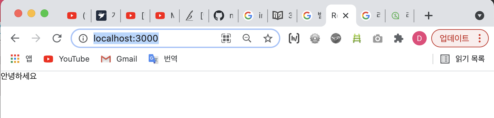

# 리액트는 어쩌다가 만들어졌는가? 

- 왜 `리액트`라는 라이브러리가 만들어 졌는지를 이해하면 리액트를 이해하는데 도움이 될 것이다. 
- vanilla javascript를 사용하여 HTML 로 구성한 요소를 제어해 봤다면, DOM(cf. 각 HTML element에 대한 정보를 지니고 있는 javascript의 객체)를 변형 시키기 위해서 브라우저에 `DOM Selector API`(e.g. getElementById, querySelector, etc.)를 사용해서 특정 DOM을 선택한 뒤, 특정 이벤트가 발생하면 변화를 주도록 설정해야한다는 사실을 알 것이다.   
이런 DOM 제어는 사용자와의 인터렉션이 적다면 별로 상관 없겠지만, 만약 인터렉션이 빈번하고 이에 따라 브라우저가 동적으로 UI를 표현해야하는 상황이 많아진다면 관리하기가 굉장히 어려워질 것이다.   
- 즉, DOM을 하나 하나 직접 접근해서 이벤트를 발생시켜야 된다면 코드는 분명 여기 저기서 서로를 참조하게 되고 유지보수가 어려워지는 난잡한 코드가 될 것이다.
- 그래서, 위와 같은 상황을 방지하기 위해 `Ember, Backbone, AngularJS` 등의 프레임워크가 만들어졌었는데, 이 프레임워크들은 작동방식이 각각 다르지만, 자바스크립트의 특정 값이 바뀌면 특정 DOM의 속성이 바뀌도록 연결을 해주어서, 업데이트 하는 작업을 간소화해주는 방식으로 웹개발의 어려움을 해결해주었다. 
- 하지만 우리가 배울 `리액트`의 경우에는 약간의 다른 아이디어에서 출발해서 만들어진 라이브러리다.   
리액트는 어떤 DOM의 상태가 바꼈을 때, 그 상태에 따라 DOM을 어떻게 업데이트 할 지 규칙을 정하는 것이 아니라, <u>아예 다 날려버리고 처음부터 모든 것을 새로 만들어서 보여주겠다</u>라는 아이디어에서 개발된 라이브러리다. 
- 업데이트를 어떻게 해야할 지에 대한 고민을 안해도 되기 때문에 개발 측면에서는 굉장히 쉬워질 수는 있겠지만, 동적으로 UI를 보여주기 위해 모든 것을 날려버리고, 또 모든 것을 새로 만들어서 보여주는 것은 속도면에서는 느려질 것이라고 예상할 수 있다.   
리액트는 이런 문제점을 `Virtual DOM`이라는 것을 사용하여 해결했다.  


## 리액트의 작동 원리 

- `Virtual DOM`이란 가상의 DOM이다.   
브라우저에 실제로 보여지는 DOM이 아니라 그냥 메모리에 가상으로 존재하는 DOM 으로서 그냥 JavaScript의 객체이기 때문에 **작동 성능이 실제로 브라우저에서 DOM을 보여주는 것보다 속도가 훨씬 빠르다는 장점**이 있다.   
리액트는 상태가 업데이트 되면, 업데이트가 필요한 곳의 UI를 Virtual DOM 을 통해서 렌더링한다.    
그리고 나서 리액트 개발팀이 만든 매우 효율적인 비교 알고리즘을 통하여 실제 브라우저에 보여지고 있는 DOM 과 비교를 한 후, 차이가 있는 곳을 감지하여 이를 실제 DOM 에 패치시켜준다(cf. 여기서, 패치시킨다는 것은 차이를 확인해서 필요한 변화를 반영시켜준다는 의미!).   
이렇게 리액트에서는 정말 필요한 변화만을 발생시키게 되면서, "업데이트를 어떻게 할 지" 에 대한 고민을 하지 않고, "UI를 어떻게 보여줄지"에만 집중하여, 빠른 성능(performance)을 지켜낼 수 있게 하는 것이다.
- cf. 리액트에서는 UI를 `컴포넌트`라는 것을 통해서 선언을 하게 되는데, 이 컴포넌트라는 것은 일종의 UI 조각이라고 이해하면 된다.  
```javascript
	const Hello = ({name}) => <div>Hello, {name}</div>
```
이 컴포넌트라는 것에는 다양한 기능들이 들어있다.   
(cf. 나중에 더 많이 다룰 예정!)

# 리액트 작업환경 준비 
- 리액트 공부에 들어가기 앞서 작업환경 준비 방법에 대해 알아보자! 
- 아래의 항목들을 설치해야 한다; 
	- **Node.js**:
		- `Webpack`과 `Babel` 같은 도구들이 자바스크립트 런타임인 `Node.js`를 기반으로 만들어져있다. 그렇기에 해당 도구들을 사용하기 위해서 `Node.js` 를 설치한다.   
		- ~~여기서 웹팩과 바벨은 리액트 프로젝트를 진행하면서 컴포넌트를 여러가지 파일로 분리해 저장할 것인데, 또 이 컴포넌트는 일반 자바스크립트가 아닌 `JSX`라는 문법으로 작성하게 될 것이다.   
		여러가지의 파일을 한개로 결합하는 작업이 필요한다 우리는 웹팩이라는 도구를 사용할 예정이고, JSX를 비롯한 새로운 자바스크립트 문법들을 사용하기 위해서는 바벨이라는 도구를 사용하게 될 것이다.~~
	- **Yarn**:
		- `Yarn`은 조금 개선된 버전의 npm 이라고 생각하면 되겠다.   
		npm 은 Node.js 를 설치하게 될 때 같이 딸려오는 패키지 매니저 도구다.   
		프로젝트에서 사용되는 라이브러리를 설치하고 해당 라이브러리들의 버전 관리를 하게 될 때 사용하는데, 우리가 Yarn 을 사용하는 이유는, 더 나은 속도, 더 나은 캐싱 시스템을 사용하기 위함이다.
	- **코드 에디터**:   
		- e.g. VS Code
	- **Git bash**: 
		- 윈도우의 경우, Git for Windows를 설치해서 앞으로 터미널에 무엇을 입력하라는 내용이 있으면 함께 설치되는 Git Bash 를 사용하면 되고, 윈도우가 아니라면 설치하지 않아도 무방하다.  
		~~(cf. 설치는 기본 옵션으로 진행하면 된다.)~~ 

<br>

📌 만약, 현재 사용중인 컴퓨터에 프로그램을 설치하기 어려운 상황이라면, [Codesandbox](https://codesandbox.io/) 의 [리액트 샌드박스](https://codesandbox.io/s/new) 를 사용하여 개발을 하시면 됩니다. 😉

<br>

> Node.js
- [Node.js 공식 홈페이지](https://nodejs.org/) 에서 LTS 버전을 설치
- MacOS / Linux의 경우엔, [nvm](https://github.com/nvm-sh/nvm)이라는 도구를 사용하여 Node.js를 설치
```
	$ curl -o- https://raw.githubusercontent.com/creationix/nvm/v0.33.8/install.sh | bash

	$ nvm install --lts
```

<br>

> Yarn
- 만약 npm을 사용하고 있다면, yarn 설치를 생략핻도 된다.   
- yarn 설치는 [Yarn 공식 홈페이지](https://yarnpkg.com/en/docs/install)를 참고
<br>

> VS Code
- [VS Code 공식 홈페이지](https://code.visualstudio.com/) 참고해서 섪치

<br>
<br>

>> 새 프로젝트 만들기 

📌 작업환경이 모두 준비되었다면 <u>새 프로젝트를 만들어보자</u>!
1. 터미널을 연다. 그리고 아래의 명령어를 실행한다.   
(cf. 윈도우 사용자는 Git Bash 를 사용)
```
	$ npx create-react-app begin-react
```
2. 그러면 begin-react 라는 디렉터리가 생기고 그 안에 리액트 프로젝트가 생성될 것이다. 
3. 생성이 끝나면 `cd 명령어`를 사용하여 해당 디렉터리에 들어간다.
```
	$ cd begin-react
```
4. 디렉토리로 이동했다면, `yarn start` 명령어를 입력한다.
(cf. yarn 이 없다면 `$ npm start` 라고 명령어를 입력하면 된다)
``` 
	$ yarn start
```
5. 위와 같이 했다면, 브라우저에 `http://localhost:3000/`라는 리액트 프로젝트 개발 서버가 열리고, 돌아가는 리액트 아이콘이 보일 것이다.   
(cf. 자동으로 페이지가 열리지 않으면 브라우저에 주소를 집적입력해서 들어가면 된다.)   
!리액트 새 프로젝트 만들기 끝! 

<br>
<br>

>> 리액트 컴포넌트 만들기 
📌 리액트 컴포넌트를 만드는 방법을 학습해보자! 
- 아래와 같은 Hello.js 파일이 있다고 가정해보자;
```javascript
	// 불러오기 
	import React from 'react';

	// 함수 
	function Hello() {
		return <div>안녕하세요</div>    // 마치 HTML 같지만, 이건 JSX!
	}

	// 내보내기
	export default Hello;
```
- 리액트 컴포넌트를 만들 땐, js 파일의 상단에 아래의 코드를 통해 리액트를 불러와줘야 한다.
```javascript
	import React from 'react';
```   
- 리액트 컴포넌트는 함수형태로 작성 할 수도 있고 클래스형태로도 작성 할 수도 있지만, 지금은 함수로 작성하는 방법에 대해서만 알아보겠다.     
리액트 컴포넌트에서는 XML 형식의 값을 반환해줄 수 있는데 이를 `JSX` 라고 부른다.   
~~(cf. JSX에 대해서는 다음 시간에 더 알아볼 예정!)~~
- 코드의 최하단에는 아래의 코드를 통해 컴포넌트를 내보내줘야 한다.   
아래의 코드는 Hello 라는 컴포넌트를 내보내곘다는 의미로, 이렇게 해주면 다른 컴포넌트를 불러와서 사용 할 수 있다. 
```javascript
	export default Hello;  // tip! 이때, 세미 콜론은 생략 가능
``` 
- Hello 컴포넌트를 App.js 에서 불러와서 사용해보자.   
```javascript
	// App.js

	import React from 'react';
	import Hello from './Hello';   // Hello 컴포넌트 불러내기 

	function App() {
		return (
			<div>
				<Hello />
			</div>
		);
	}

	export default App;           
```
- 지금까지 잘 따라 왔다면 리액트 프로젝트 개발 서버를 들어가면 아래와 같은 화면이 보여야한다;   

- <u>컴포넌트는 일종의 UI 조각</u>이다.   
그리고 컴포넌트는 쉽게 재사용 할 수도 있다.    
e.g. App.js 파일에 아래와 같이 코드를 바꾸고 리액트 프로젝트 개발 서버로 가서 확인하면 화면은 아래의 이미와 같을 것이다; 
```javascript
	import React from 'react';
	import Hello from './Hello';


	function App() {
		return (
			<div>
				<Hello />
				<Hello />
				<Hello />
			</div>
		);
	}

	export default App;
```

- 이제 `index.js` 파일을 열어서 살펴보자.   
파일을 열면 이런 코드가 보일 것이다; 
```javascript
	import React from 'react';
	import ReactDOM from 'react-dom';
	import './index.css';
	import App from './App';
	import * as serviceWorker from './serviceWorker';

	ReactDOM.render(<App />, document.getElementById('root'));   // id가 root인 것을 찾아서 리액트 App을 그 안에다가 넣어 렌더링 하겠다는 의미

	// If you want your app to work offline and load faster, you can change
	// unregister() to register() below. Note this comes with some pitfalls.
	// Learn more about service workers: https://bit.ly/CRA-PWA
	serviceWorker.unregister();
```
- 여기서 ReactDOM.render 의 역할은 브라우저에 있는 실제 DOM 내부에 리액트 컴포넌트를 렌더링하겠다는 것을 의미한다.    
- `document.getElementById('root'));`라고 했으니 id값이 'root'인 DOM을 선택한다는 것이고,    
또한 이 DOM은 'public/index.html' 이란 파일에 가면 `<div id="root"></div>`에 해당하는 HTML 요소라는 것을 확인 할 수 있다.   
결국, 리액트 컴포넌트가 렌더링 될 때에는, 렌더링 된 결과물이 위의 div 내부에 렌더링 되는 것이다.  

<br>
<br>

---
<details>
	<summary>CLICK ME!</summary>

- cf.   
	- https://react.vlpt.us/basic/02-prepare.html

</details>
---

