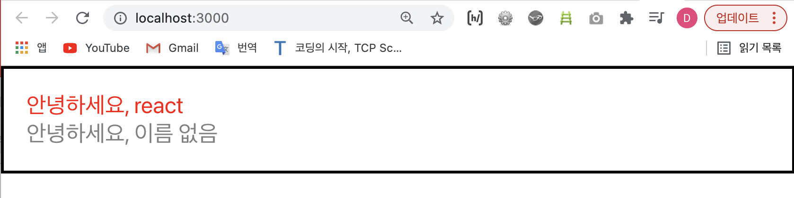

# props를 통해 컴포넌트 값 전달하기 
- 이번에는 컴포넌트의 props 라는 개념에 대해서 알아보자.
- `props`는 'properties'의 줄임말이다. 
- `props`는 우리가 어떤 특정 값을 컴폼넌트에 전달해줘야 할 때 사용하는 아이다.
더 자세한 부분은 코드를 통해 알아보자;  

<br>
<br>


> props 의 기본 사용법
- 아래와 같이 js 파일 두 개가 작성되어 있다고 하면... 
- e.g.   

[App.js]

```javascript
	import React from 'react';
	import Hello from './Hello';

	function App() {
		return (
			<Hello name="react" />
		);
	}

	export default App;
```
- e.g.   

[Hello.js]
```javascript
	import React from 'react';

	function Hello() {
		return <div>안녕하세요</div>
	}

	export default Hello;
```
- 여기서 이제 Hello 컴포넌트에서 **name**이라는 값을 사용하고 싶을 떄는 어떻게 해야하는지 알아보자.   
우선 App.js에는 Hello라는 컴포넌트의 name이 "react"로 적혀져 있다는 것을 알 수 있고, Hello라는 function은 Hello.js 파일에 정의되어 있다는 것을 알 수 있다. 이때 Hello의 인자로 (props)를 받아오면 된다.    
아래와 같이;
- Hello.js
e.g.
```javascript
	import React from 'react';

	function Hello(props) {   // 파라미터로 props를 전달...
	  // props라는 객체가 가지고 있는 속성중 name을 조회하고 싶으면 props.name
		// 거기다 props.name이라는 값을 조회하고 그 값을 그대로 받아오고 싶으면 중괄호 {}를 사용하면 된다!  
		return <div>안녕하세요 {props.name}</div>  
	}

	export default Hello;
```
- 위와 같이 컴포넌트에게 전달되는 props라는 파라미터를 통하여 값을 조회할 수 있고, props는 **객체 형태로 전달된다**.  
만약, `name` 값을 조회하고 싶다면 `props.name`을 조회하면 된다. 
- 응용 e.g.     

[App.js]
```javascript
	import React from 'react';
	import Hello from './Hello';

	function App() {
		return (
			// color는 red
			<Hello name="react" color="red" />
		);
	}

	export default App;
```

[Hello.js]

```javascript
	import React from 'react';

	function Hello(props) {
		// return <div style={}>안녕하세요</div>  // style에 위에서 정의된 값 자체를 받아올 거니까 중괄호 {}를 사용
		return <div style={{
			color: props.color
		}}>안녕하세요, {props.name}</div>;
	}

	export default Hello;
```
- 여기서 또 추가적으로 반복적으로 사용되는 `props.`을 생략하고 싶으면 **비구조할당(/구조분해)** 라는 문법을 사용해주면 된다;  

[Hello.js]

```javascript
	import React from 'react';

	function Hello({color, name}) {   // 비구조할당으로 {color, name}값을 미리 추출해 줄 수 있다...
		return <div style={{
			// color: color   -> 또는 객체에서 그냥 color만 해줘도 상관없음! 
			color  
		}}>안녕하세요, {name}</div>;
	}

	export default Hello;
```

<br>

> props를 사용하지 않고 기본적으로 사용 할 값을 설정하는 방법 
- 컴포넌트에 props를 지정하지 않았을 때 기본적으로 사용 할 값을 설정하고 싶다면 컴포넌트에 `defaultProps`라는 값을 설정하면 된다.
- e.g.   

[App.js]

```javascript	
	import React from 'react';
	import Hello from './Hello';

	function App() {
		return (
			<>
				<Hello name="react" color="red" />  
				<Hello color="gray" />
			</>
		);
	}

	export default App;
```

<br>

[Hello.js]

```javascript
	import React from 'react';

	function Hello({color, name}) {  // 비구조할당 문법 
		return <div style={{
			// color: color 
			color  
		}}>안녕하세요, {name}</div>;   // name 값을 불러와도 props를 사용해 name에 할당해준 값이 존재하지 않는 상황이다  
	}

	// 이떄, props 를 사용하지 않고도 기본적으로 사용할 값을 지정해줄 수 있는데...
	// 이럴 때 사용하는 것이 .defaultProps라는 아이다... 
	// 사용 방법은 아래와 같다;
	Hello.defaultProps = {   
		name: '이름 없음'
	};
	// 이러면 App.js 에서 name값이 이미 설정됐으면 설정된 값을 사용할 것이고, 그게 아니라면 defualtProps로 설정해준 기본값을 사용하게 될 것이다...

	export default Hello;
```
- 위의 코드의 결과는 아래와 같다;    
<div style="padding-left: 50px;">
	
</div>

- 다시, <u>만약에 특정 값을 빠뜨렸을 때 기본적으로 사용해줄 값을 설정하는 것이 바로 `.defaultProps`다.</u>

<br>
<br>

> props.children
- 이번에는 `props.children`에 대해서 알아보자. 
- `props.children`란 **컴포넌트 태그** 사이에 넣어준 값을 조회하고 싶을 때 사용한다.   
e.g.
```xml
	<Wrapper>내가 바로 컴포넌트 태그 사이에 작성된 값이쥐!!!</Wrapper>
```
- props.children에 대해 더 알아보기 위해 일단 'wrapper'라는 컴포넌트를 만들어보자;   
(cf. Wrapper.js를 begin-react 폴더의 src 디렉터리에 만든다...)

<br>

[Wrapper.js]

```javascript
	import React from 'react';

	function Wrapper() {
		const style = {
			border: '2px solid black',
			padding: 16
		};

		return <div style={style}></div>
	}; 

	export default Wrapper;
```
- 그리고 새로 만든 Wrapper라는 컴포넌트를 App.js에서 사용해보자/연동시켜주자... 

<br>

[App.js]

```javascript
import React from 'react';
import Hello from './Hello';
import Wrapper from './Wrapper';   // 요렇게 컴포넌트 Wrapper와 App.js를 연동~

function App() {
  return (
    // Hello 컴포넌트를 불러오는 것... 그러니까 <> 안에는 Hello...
    // 그리고 Hello 컴포넌트를 감싸는 컴포넌트는 Wrapper... 즉, Hello 컴포넌트는 Wrapper의 children 요소로 있는거... 
    // 여기서 <Wrapper></Wrapper>안에 위치한 Hello의 값을 조회하고 싶다면 props.children을 사용할 수 있다... 
    <Wrapper>
      <Hello name="react" color="red">안녕하세요</Hello>
      <Hello color="gray">안녕하세요</Hello>
    </Wrapper>
  )
}

export default App;
```
- 위와 같이 코드를 짜고 화면을 보면, 2px solid black을 border로 갖고, padding 을 16px로 갖고있는 Wrapper 컴포넌트밖에 보이지 않을 것이다.    
왜냐면 Wrapper 컴포넌트의 children격인 Hello 컴포넌트 두개는 그 값을 불러내지 않았기 때문이다.   
내부의 내용이 보여지게 하기 위해서는 Wrapper 에서 `props.children`을 렌더링해주어야 한다.    
사용방법은 아래와 같다;   

<br>

[Wrapper.js]

```javascript
	import React from 'react';

	function Wrapper({children}) {   // 비구조할당 문법 ... 
		const style = {
			border: '2px solid black',
			padding: 16
		};

		return <div style={style}>{children}</div>   // 여기서 props.children으로 값을 불러온다... 
	}; 

	export default Wrapper;
```
- 위와 같은 코드는 아래와 같은 화면을 보여준다;  
<div style="padding-left: 40px;">
	
</div>

<br>
<br>

---
<details>
	<summary>CLICK ME!</summary>

- cf. 
	- https://react.vlpt.us/basic/02-prepare.html
	- http://tcpschool.com/xml/xml_intro_basic
	- https://ko.reactjs.org/docs/introducing-jsx.html
	- https://velog.io/@kim-jaemin420/JSX-%EA%B8%B0%EB%B3%B8-%EA%B7%9C%EC%B9%99
	- https://dabo-dev.tistory.com/20
	- https://jeonghwan-kim.github.io/series/2019/12/22/frontend-dev-env-babel.html

</details>
---

