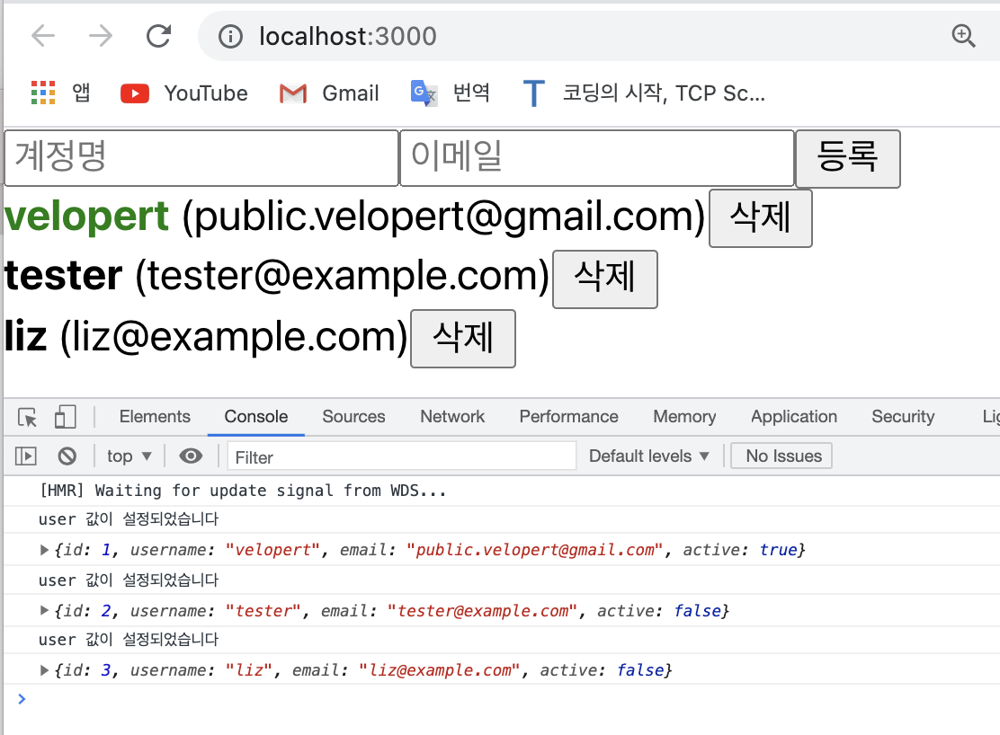
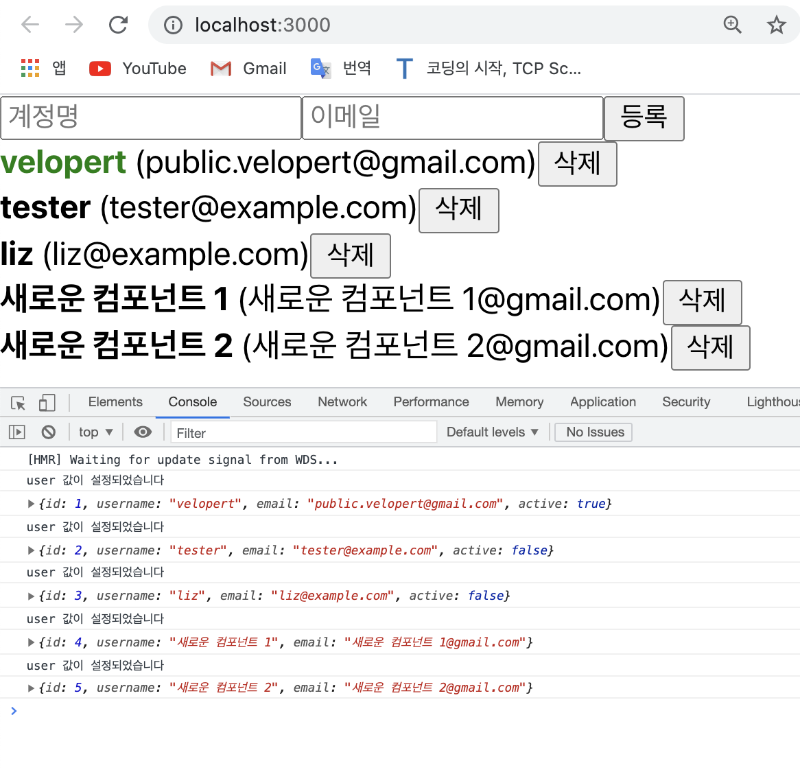
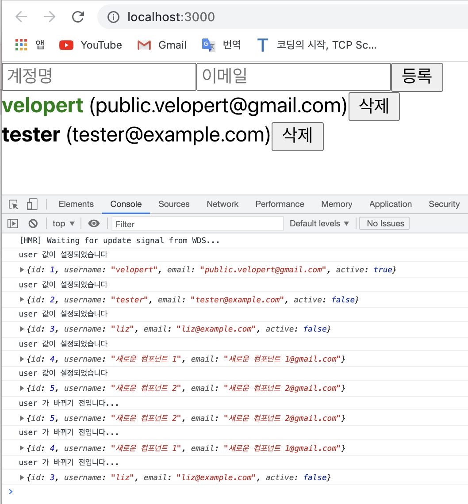
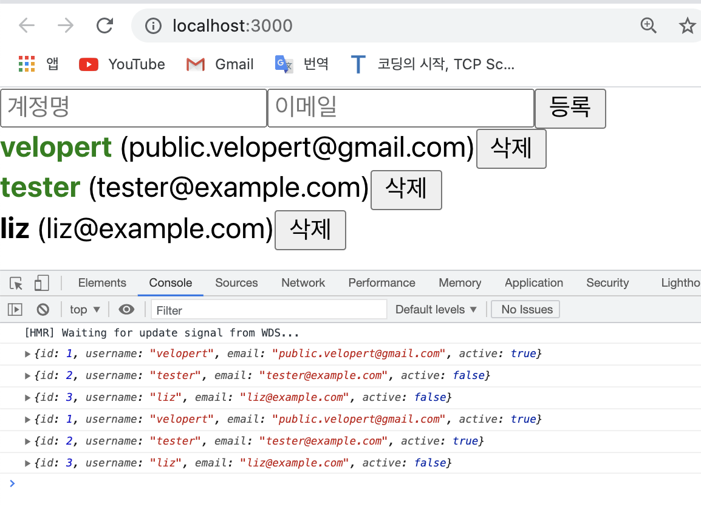

# useEffect Hook: useEffect를 사용하여 마운트/언마운트/업데이트시 할 작업 설정하기
- `useEffect`라는 Hook은 컴포넌트가 마운트 됐을 때 (cf. 우리가 만든 컴포넌트가 처음 화면에 나타났을 때), 언마운트 됐을 때 (cf. 컴포넌트가 화면에서 사라질 때), 그리고 컴포넌트의 상태가 바뀌어 업데이트 될 때 (cf. 특정 props가 바뀔 때) 사용한다.    
이번에는 `useEffect` 사용해서 특정 작업을 처리하는 방법에 대해서 알아보자.

<br>

## 마운트 / 언마운트
- 우선, 마운트(cf. 화면에 컴포넌트가 나타날 때 할 작업)를 관리해보겠다;
-	e.g.    

[UserList.js]

```javascript
	import React, { useEffect } from 'react';    // useEffect

	function User({user, onRemove, onToggle}) {
		useEffect(() => {                         // useEffect
			console.log('컴포넌트가 화면에 나타났습니다');  // 마운트 될 때 
		}, []);      // cf. 배열 [] 안에다가는 의존되는 값들(dependency)을 넣어주는데, 만약에 그 값들이 비어있다면 컴포넌트가 처음 화면에 나타날 때만 실행이 된다 

		return (
			<div>
				<b
					style={{
						cursor: 'pointer',
						color: user.active ? 'green' : 'black'
					}}
					onClick={() => onToggle(user.id)}
				>
					{user.username}
				</b>
				&nbsp;
				<span>({user.email})</span>
				<button onClick={() => onRemove(user.id)}>삭제</button>
			</div>
		);
	}

	function UserList({users, onRemove, onToggle}) {
	return (
			<div>
				{users.map(user => (
					<User
						user={user}
						key={user.id}
						onRemove={onRemove}
						onToggle={onToggle}
					/>
				))}
			</div>
		);
	}

	export default UserList;
```
- 위의 코드는 컴포넌트가 화면에 나타나면 컴포넌트의 수만큼 '컴포넌트가 화면에 나타났습니다'라고 출력되야 한다.   
아래와 같이 (cf. 아래의 경우 UserList에 포함된 User가 3개이기 때문에 3번 출력됨.); 
<div style="padding-left: 40px;">
		
</div>

- 만약 위의 상태에서 컴포넌트를 추가하면 추가한 만큼 '컴포넌트가 화면에 나타났습니다'라고 출력된다; 
<div style="padding-left: 40px;">
		
</div>

<br>

- 이번에는 언마운트(cf. 화면에서 컴포넌트가 사라질 때 할 작업)를 관리해보겠다;    
-	e.g.      

[UserList.js]

```javascript
	import React, { useEffect } from 'react';    // useEffect

	function User({user, onRemove, onToggle}) {
		useEffect(() => {                         // useEffect
			console.log('컴포넌트가 화면에 나타났습니다');  // 마운트 될 때 
			// Tip! 
			// 컴포넌트가 마운트 될 때, 여기다가 예를 들면 ... 
			// props로 받은 값을 컴포넌트의 state로 설정하는 작업...
			// 또는 REST API 등을 요청하는 작업도 여기서 이루어 질 수 있겠다...! 
			// 또는 외부 라이브러리 e.g. D3, Video.js 를 사용할 때,
			// setInterval, setTimeout 등도 여기서 사용 가능하다! 
			return () => {
				// Tip! 
				// 여기에는 보통 어떤 작업들이 이루어지냐면... 
				// clearInterval, clearTimeout
				// 라이브러리를 사용해서 만든 인스턴스를 제거하는 작업 등...
				console.log('컴포넌트가 화면에서 사라졌습니다');  // 언마운트 될 때
			};
		}, []);      
		// cf. useEffect를 사용할 때는 첫 번째 파라미터에는 함수, 두 번째에는 "의존값"이 들어있는 배열(deps)를 넣어준다.
		// 즉, 배열 [] 안에다가는 의존되는 값들(dependency)을 넣어주는데, 만약에 그 값들이 비어있다면 컴포넌트가 처음 화면에 나타날 때만 useEffect에 등록한 함수가 호출된다.  

		return (
			<div>
				<b
					style={{
						cursor: 'pointer',
						color: user.active ? 'green' : 'black'
					}}
					onClick={() => onToggle(user.id)}
				>
					{user.username}
				</b>
				&nbsp;
				<span>({user.email})</span>
				<button onClick={() => onRemove(user.id)}>삭제</button>
			</div>
		);
	}

	function UserList({users, onRemove, onToggle}) {
	return (
			<div>
				{users.map(user => (
					<User
						user={user}
						key={user.id}
						onRemove={onRemove}
						onToggle={onToggle}
					/>
				))}
			</div>
		);
	}

	export default UserList;
```
- 컴포넌트를 지우면 콘솔창에는 '컴포넌트가 화면에서 사라졌습니다'라는 문구가 사라진 컴포넌트 수 만큼 출력돼야 한다.    
아래와 같이; 
<div style="padding-left: 40px;">
		
</div>

<br>

## deps 에 특정 값 넣기
- 이번에는 deps (cf. 위의 코드에 있던 "의존값"들이 들어가던 배열)에 특정 값을 넣어보도록 하자.   
<u>deps 에 특정 값을 넣게 된다면, 컴포넌트가 처음 마운트 될 때에도 호출이 되고, 지정한 값이 바뀔 때에도 호출이 된다. 그리고, deps 안에 특정 값이 있다면 언마운트시(컴포넌트가 사라질 때)에도 호출이되고, 값이 바뀌기(컴포넌트가 업데이트 되기) 직전에도 호출이 된다</u>.    
- 이를 확인해보기 위해 코드를 아래와 같이 작성한다;   
- e.g.    

[UserList.js]

```javascript
	import React, { useEffect } from 'react';

	function User({ user, onRemove, onToggle }) {
		useEffect(() => {
			console.log('user 값이 설정되었습니다');
			console.log(user);
			return () => {
				console.log('user 가 바뀌기 전입니다...');
				console.log(user);
			};
		}, [user]);     // -> deps 에 user 라는 값을 넣어줌!! 
		// 이렇게 deps에 값을 넣어주면 user라는 값이 설정되거나(cf. 마운트되거나) 바뀔때마다(cf. 컴포넌트 값이 업데이트) 호출된다.
		return (
			<div>
				<b
					style={{
						cursor: 'pointer',
						color: user.active ? 'green' : 'black'
					}}
					onClick={() => onToggle(user.id)}
				>
					{user.username}
				</b>
				&nbsp;
				<span>({user.email})</span>
				<button onClick={() => onRemove(user.id)}>삭제</button>
			</div>
		);
	}


	function UserList({ users, onRemove, onToggle }) {
		return (
			<div>
				{users.map(user => (
					<User
						user={user}
						key={user.id}
						onRemove={onRemove}
						onToggle={onToggle}
					/>
				))}
			</div>
		);
	}

	export default UserList;
```
- 위와 같이 코드를 작성하고 콘솔창을 보면 처음 화면이 새로고침 되었을 때는 아래와 같이 나온다;     
<div style="padding-left: 40px;">
		
</div>

- 위의 상태에서 새로운 컴포넌트를 만들면 화면은 아래와 같아지고; 
<div style="padding-left: 40px;">
		
</div>


- 위의 상태에서 컴포넌트를 삭제하면 콘솔창에는 아래와 같이 출력된다;
<div style="padding-left: 40px;">
		
</div>

- 즉, deps 안에 useEffect 안에서 사용하는 상태나, props 가 있다면, useEffect의 deps에 꼭 넣어주어야 한다.    
만약 useEffect 안에서 사용하는 상태나 props를 deps에 넣지 않게 된다면 useEffect에 등록한 함수가 실행 될 때 최신 props/상태를 가르키지 않게 된다!!     
**유의**할 것!! 

<br>

## deps 파라미터를 생략하기
- deps 파라미터를 생략할 수도 있긴하다.   
하지만 `deps 파라미터`를 생략한다면 자식 컴포넌트가 리렌더링 될 때마다 부모 컴포넌트가 호출이 된다. 
- e.g.     

[UserLis.js]   

```javascript
	import React, { useEffect } from 'react';

	function User({ user, onRemove, onToggle }) {
		useEffect(() => {
			console.log(user);
		});
		return (
			<div>
				<b
					style={{
						cursor: 'pointer',
						color: user.active ? 'green' : 'black'
					}}
					onClick={() => onToggle(user.id)}
				>
					{user.username}
				</b>
				&nbsp;
				<span>({user.email})</span>
				<button onClick={() => onRemove(user.id)}>삭제</button>
			</div>
		);
	}


	function UserList({ users, onRemove, onToggle }) {
		return (
			<div>
				{users.map(user => (
					<User
						user={user}
						key={user.id}
						onRemove={onRemove}
						onToggle={onToggle}
					/>
				))}
			</div>
		);
	}


	export default UserList;
```
- 위와 같이 코드를 작성하고 브라우저에 가서 active 값이 false인 두 번째 컴포넌트를 클릭하면 우선, user.id 부분의 색이 초록으로 변한다는 점 말고도 콘솔창에 보면 <u>방금 클릭한 User 컴포넌트만 출력되는 것이 아니라 User 컴포넌트 전체가 리렌더링 되서 콘솔창에 출력된 것을 확인할 수 있다</u>;    
<div style="padding-left: 40px;">
		
</div>

<br>

📌 명쾌한 설명 One more time :)    
- _다시. 리액트에서는 부모 컴포넌트가 리렌더링 되면 자식 컴포넌트도 리렌더링 된다.    
User 컴포넌트의 부모 컴포넌트는 UserList이고, UserList에서 users 배열이 바뀌게 된다면 UserList가 리렌더링 되는 것이고, 그래서 결국에는 **모든** User 컴포넌트가 리렌더링 되게 된다! 바뀐 내용이 없다 할지라도!!    
~~물론 실제 DOM에 변화가 반영되는 것은 바뀐 내용이 있는 컴포넌트에만 해당한다. 하지만 Virtual DOM에는 모든 걸 다 렌더링하고 있다는 것을 명심하자!~~_ 😉

<br>
<br>

---

<details>
	<summary>CLICK ME!</summary>

- cf. 
	- https://react.vlpt.us/basic/15-array-modify.html
	- https://xiubindev.tistory.com/99

	
</details>

---


	