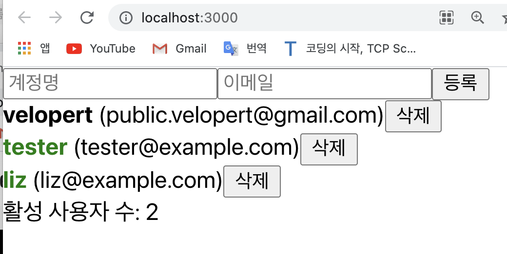
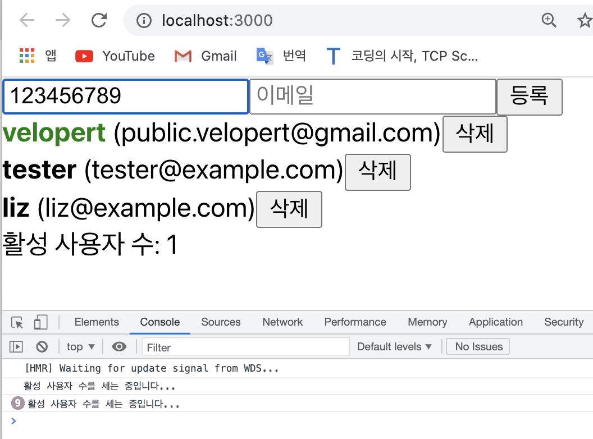
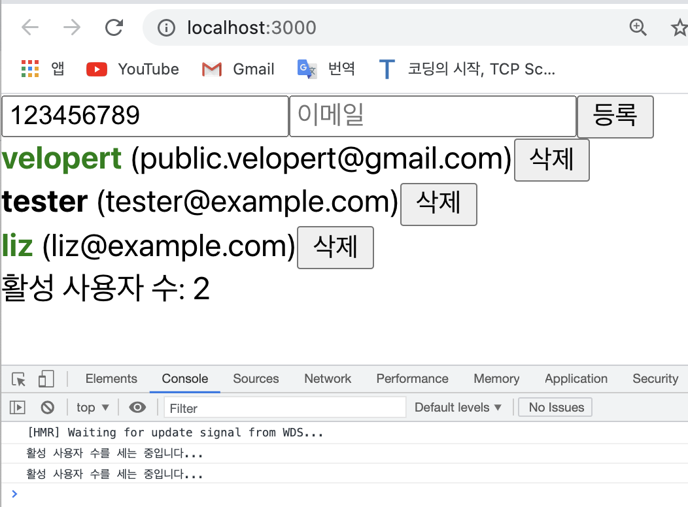

# useMemo 를 사용하여 연산한 값 재사용하기
- 학습목표: 
	- 이번에는 이전에 연산된 값을 `useMemo`라는 React Hook을 사용하여 재사용하는 방법을 알아보도록 하겠다.
- 이 `useMemo`라는 훅은 "성능 최적화"를 위해 사용한다.    
e.g. 

[App.js] 

```javascript
	// App.js 에 active의 갯수를 카운트 해주는 함수를 만든다고 가정해보자; 

	import React, { useRef, useState } from 'react';
	import UserList from './UserList';
	import CreateUser from './CreateUser';

	function countActiveUsers(users) {      // 이 함수는 users 배열을 parameter로 가져온다 
		console.log("활성 사용자 수를 세는 중입니다...");
		
		return users.filter( user => user.active).length;    // users 라는 배열에서 user.active의 값만 가져온다. 그리고 그렇게 가져온 active가 true인 active들이 담겨있는 배열의 length를  return 해주면 된다 ! 
	}


	function App() {
		const [inputs, setInputs] = useState({
			username: '',
			email: ''
		});
		const { username, email } = inputs;
		const onChange = e => {
			const { name, value } = e.target;
			setInputs({
				...inputs,
				[name]: value
			});
		};
		const [users, setUsers] = useState([
			{
				id: 1,
				username: 'velopert',
				email: 'public.velopert@gmail.com',
				active: true
			},
			{
				id: 2,
				username: 'tester',
				email: 'tester@example.com',
				active: false
			},
			{
				id: 3,
				username: 'liz',
				email: 'liz@example.com',
				active: false
			}
		]);

		const nextId = useRef(4);
		const onCreate = () => {
			const user = {
				id: nextId.current,
				username,
				email
			};
			setUsers(users.concat(user));

			setInputs({
				username: '',
				email: ''
			});
			nextId.current += 1;
		};

		const onRemove = id => {
			// user.id 가 파라미터로 일치하지 않는 원소만 추출해서 새로운 배열을 만듬
			// = user.id 가 id 인 것을 제거함
			setUsers(users.filter(user => user.id !== id));
		};
		const onToggle = id => {
			setUsers(
				users.map(user =>
					user.id === id ? { ...user, active: !user.active } : user
				)
			);
		};

		const count = countActiveUsers(users);   // 위에서 생성한 함수 countActiveUsers에다가 users를 파라미터로 넣어준 뒤 호출한다 


		return (
			<>
				<CreateUser
					username={username}
					email={email}
					onChange={onChange}
					onCreate={onCreate}
				/>
				<UserList users={users} onRemove={onRemove} onToggle={onToggle} />
				<div>활성 사용자 수: {count}</div>    {/* count 값 여기서 불러오기! */}
			</>
		);
	}

	export default App;

```
- 여기까지 App.js 파일에 코드가 잘 작성되었다면 화면에서 초록색을 띄고있는 (active 값이 true인 사용자의 수/) user만큼 활성 사용자 수가 렌더링 되어 있을 것이다;
<div style="padding-left: 40px;">
		
</div>

- 여기까지는 당연한건데...    
그런데 여기서 발생하는 **성능적 문제** 한 가지가 있다!!!    
<u>바로 input의 값을 바꿀때에도 `countActiveUsers` 함수가 호출된다는 것이다!</u>   
아래의 사진을 보면 input 태그에 1부터 9까지 입력값을 9번 넣어줬더니 9번 "활성 사용자 수를 세는 중입니다..."라는 문구가 콘솔창에 출력된 것을 확인할 수 있다; 
<div style="padding-left: 55px;">
		
</div>

- 즉, 활성 사용자 수를 세는 것은 users에 변화가 있을 때만 그래야 하는데, input 값이 바뀔 때에도 컴포넌트가 리렌더링 되므로 불필요하게 자원이 낭비되고 있다는 말이다.   
이럴 때 사용할 수 있는 것이 바로... `useMemo` 함수다. 이런 상황에서 `useMemo`라는 훅을 사용하면 성능을 최적화 할 수 있다.    
(cf. 여기서 'Memo'는 "memoized" 를 의미하는데, 이는 이전에 계산 한 값을 재사용한다는 의미를 가지고 있다.)   

<br>

- 예시를 통해 더 살펴보자;    

[App.js]

```javascript
	import React, { useRef, useState, useMemo } from 'react';   // useMemo
	import UserList from './UserList';
	import CreateUser from './CreateUser';

	function countActiveUsers(users) {
		console.log('활성 사용자 수를 세는중...');
		return users.filter(user => user.active).length;
	}

	function App() {
		const [inputs, setInputs] = useState({
			username: '',
			email: ''
		});
		const { username, email } = inputs;
		const onChange = e => {
			const { name, value } = e.target;
			setInputs({
				...inputs,
				[name]: value
			});
		};
		const [users, setUsers] = useState([
			{
				id: 1,
				username: 'velopert',
				email: 'public.velopert@gmail.com',
				active: true
			},
			{
				id: 2,
				username: 'tester',
				email: 'tester@example.com',
				active: false
			},
			{
				id: 3,
				username: 'liz',
				email: 'liz@example.com',
				active: false
			}
		]);

		const nextId = useRef(4);
		const onCreate = () => {
			const user = {
				id: nextId.current,
				username,
				email
			};
			setUsers(users.concat(user));

			setInputs({
				username: '',
				email: ''
			});
			nextId.current += 1;
		};

		const onRemove = id => {
			// user.id 가 파라미터로 일치하지 않는 원소만 추출해서 새로운 배열을 만듬
			// = user.id 가 id 인 것을 제거함
			setUsers(users.filter(user => user.id !== id));
		};
		const onToggle = id => {
			setUsers(
				users.map(user =>
					user.id === id ? { ...user, active: !user.active } : user
				)
			);
		};

		// countActiveUsers() 함수를 호출 할 때, 함수를 useMemo로 감싸준다!! 
		const count = useMemo(() => countActiveUsers(users), [users]);
		// 단, 첫 번째 파라미터는 함수를 넣고, 두 번째 파라미터로는 deps 배열을 넣어주면 된다! 즉, 결국에는 이 useMemo 안에 넣어준 deps 값을 두 번째 파라미터로 넣어줘야지 이 값에 변화가 생겨야만 이 값을 새로 연산/업데이트 해주겠다는 의미! 
		// 이렇게 넣어주면, countActiveUsers()라는 함수는 users의 값이 바뀔 때에만 호출이 되고, 그렇지 않으면 이전에 만들어 놨던 값을 재사용 한다.
		
		
		return (
			<>
				<CreateUser
					username={username}
					email={email}
					onChange={onChange}
					onCreate={onCreate}
				/>
				<UserList users={users} onRemove={onRemove} onToggle={onToggle} />
				<div>활성 사용자 수 : {count}</div>
			</>
		);
	}

	export default App;
```
- 위와 같이 useMemo를 사용하면 계정명을 클릭하고 input 값에 변화를 줘도 결국 활성 사용자 수는 active 가 true인 user의 갯수로 렌더링 된다;   
<div style="padding-left: 40px;">
		
</div>

<br>

📌 오늘은 컴포넌트의 성능 최적화를 위해 `useMemo`를 활용하는 방법을 알아보았다! 😉

<br>
<br>

---

<details>
	<summary>CLICK ME!</summary>

- cf. 
	- https://react.vlpt.us/basic/17-useMemo.html
	- https://xiubindev.tistory.com/99

</details>

---


	