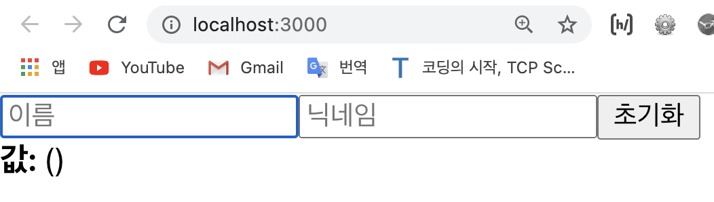

# useRef로 특정 DOM 선택하기 

> useRef란?
- 자바스크립트에서 우리가 특정 DOM을 선택해야하는 상황에서 e.g. `getElementById`, `querySelector`와 같은 DOM Selector 함수를 사용해서 DOM을 선택한다. 
- 마찬가지로 리액트를 사용할 때도 가끔 DOM을 직접 선택해야 하는 상황이 발생할 때도 있다. 리액트는 이런 상황에서 `ref`라는 것을 사용한다.    
- 함수형 컴포넌트에서 `ref`를 사용할 때는 `useRef`라는 Hook 함수를 사용한다.    
~~(cf. 클래스형 컴포넌트에서는 콜백 함수를 사용하거나 React.createRef 라는 함수를 사용하는데, 이에 대해서는 나중에 더 다룰 예정...)~~

<br>

📌 오늘의 학습 목표:    
- 지난번에 만든 InputSample에서는 초기화 버튼을 누르면 포커스가 초기화 버튼에 그대로 남아있었다.    
- 오늘은 초기화 버튼을 클릭했을 때 이름 input에 포커스가 잡히도록 useRef를 사용하여 기능을 구현해보자!
 
<br>

> 예시를 통한 이해
- e.g.    
기존에 작성한 InputSample.js 내용은 아래와 같다;   

[InputSample.js]

```javascript
	import React, {useState} from 'react';

	function InputSample() {
		const [inputs, setInputs] = useState({
			name: '',
			nickname: '',
		});
		const {name, nickname} = inputs;   // cf. 비구조화 할당 
		
		// events
		const onChange = (e) => {
			// console.log(e.target);
			// console.log(e.target.value);
			const {name, value} = e.target;
			
			setInputs({
				// 꼭 객체 상태를 업데이트 할떄는 스프레드 문법이든 뭐든 복사를 해서 사용할 것... 
				...inputs,      // cf. 스프레드 문법 
				// 그리고 복사한 객체에 새롭게 값을 덮어씌울 것! 
				[name]: value,  // 위에서 비구조화 할당을 해서 값을 추출한 것을 사용!
			});
		}
		const onReset = () => {
			setInputs({
				name: '',
				nickname: '',
			});
		} 


		return (
			<div>
				<input 
					name="name" 
					onChange={onChange} 
					placeholder="이름" 
					value={name}
				/>
				<input 
					name="nickname" 
					onChange={onChange} 
					placeholder="닉네임" 
					value={nickname}
				/>
				<button onClick={onReset}>초기화</button>
				<div>
					<b>값: </b>
					{name} ({nickname})
				</div>
			</div>
		)
	}

	export default InputSample;
```

<br>

- 여기서 이제 `useRef`를 어떻게 사용하는지 알아보자;   

[InputSample.js]

```javascript
	// step 1) useRef를 불러온다... 
	import React, {useState, useRef} from 'react';

	function InputSample() {
		const [inputs, setInputs] = useState({
			name: '',
			nickname: '',
		});
	
		// step 2) useRef를 사용해서 nameInput이라는 객체를 만든다
		const nameInput = useRef();

		const {name, nickname} = inputs;  
		
		const onChange = (e) => {
			const {name, value} = e.target;
			
			setInputs({
				...inputs,      
				[name]: value,  
			});
		}
		const onReset = () => {
			setInputs({
				name: '',
				nickname: '',
			});
			// step 4) ref={nameInput}으로 선택하고 싶은 DOM을 선택했다면 이제 아래와 같이 초기화 버튼을 눌렀을 때, 즉, 이벤트 함수 onReset이 실행될 때 focus를 받게끔 한다...
			nameInput.current.focus();    // nameInput.current라고 하면 nameInput 이라는 DOM을 가르키게된다
		} 


		return (
			<div>
				<input 
					name="name" 
					onChange={onChange} 
					placeholder="이름" 
					value={name}
					// step 3) 위에서 nameInput이라는 객체를 만든 것을 아래와 같이 "선택하고 싶은 DOM"에다가 ref={nameInput}라고 적어준다
					ref={nameInput}

				/>
				<input 
					name="nickname" 
					onChange={onChange} 
					placeholder="닉네임" 
					value={nickname}
				/>
				<button onClick={onReset}>초기화</button>
				<div>
					<b>값: </b>
					{name} ({nickname})
				</div>
			</div>
		)
	}

	export default InputSample;
```
- 결과:
	- 초기화 버튼을 누르면 focus가 이름 input으로 가는 모습을 확인 할 수 있다; 

<div style="padding-left: 80px;">
		
</div>

<br>
<br>
---
<details>
	<summary>CLICK ME!</summary>

- cf. 
	- https://react.vlpt.us/basic/10-useRef.html
	- https://ko.reactjs.org/docs/hooks-reference.html

</details>
---

