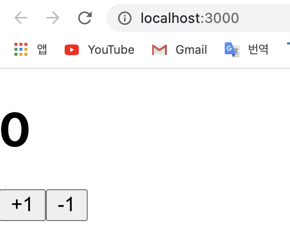
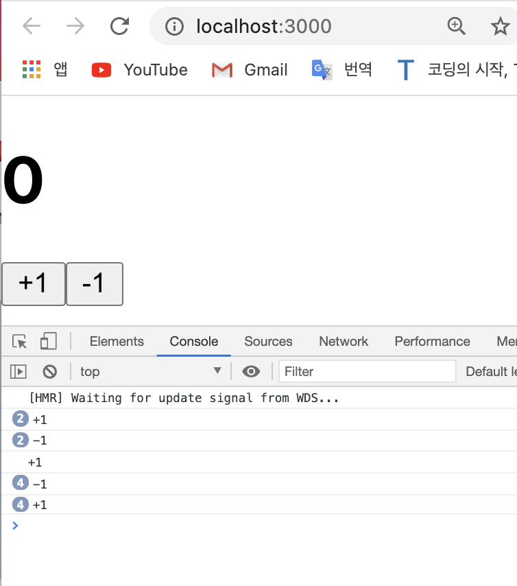

# useState 를 통해 컴포넌트에서 바뀌는 값 관리하기
- 리액트 컴포넌트에서 **동적인 값을 상태(state)** 라고 부른다.   
사용자의 인터랙션에 따라 컴포넌트의 상태값이 동적으로 바뀔 경우에는 상태를 관리하는 것이 필요하다.    
(cf. 우리가 아직 자세히 다루지 않은 내용 중 'React Hooks' 가 있는데, 이 React Hook이란 개념이 나오기 전까지는 **class 기반의 클래스 컴포넌트** 를 작성하여 상태값을 관리하곤 했다.   
클래스 컴포넌트는 간단한 상태 관리 조차도 함수형 컴포넌트에 비해 복잡하여 유지보수가 힘들다는 단점이 있었는데, 리액트 16.8 ver.부터 Hooks라는 기능이 도입되면서 **함수형 컴포넌트에서도 상태를 관리할 수 있게(/class 없이 state를 사용할 수 있게) 되었다.** 이 Hooks 중에 `useState()`가 있는데, 이를 통해 `함수형 컴포넌트에서도 상태 관리를 할 수 있게 됐다.`)
- 지금까지 우리가 리액트 컴포넌트를 만들 때, 동적으로 값이 바뀌는 일이 없었는데, 이번에는 컴포넌트에서 보여줘야 하는 내용이 사용자의 인터렉션에 따라 바뀌는 상황에서 이를 어떻게 구현할 수 있는지에 대해서 알아보자;
	- ~~리액트 16.8 이전 버전에서는 함수형 컴포넌트에서는 상태를 관리할 수 없었는데, 리액트 16.8 에서 Hooks 라는 기능이 도입되면서 함수형 컴포넌트에서도 상태를 관리할 수 있게 되었다.   
	이번에는 useState 라는 함수를 사용해보게 될텐데, 이게 바로 리액트의 Hooks 중 하나다.~~
- 정말 "classic" 한 예제인 '버튼을 누르면 숫자가 바뀌는 Counter 컴포넌트'를 예시로 살펴보면서 useState() 함수에 대해 이해해보자!       
~~( cf. begin-react 폴더에 src 디렉터리에 Counter.js 라는 파일을 생성할 것...!)~~

- e.g.    

<br>

[Counter.js]

```javascript
	import React from 'react';

	function Coutner() {
		return (
			<div>
				<h1>0</h1>
				<button>+1</button>
				<button>-1</button>
			</div>
		); 
	}

	export default Counter;
```
- 위의 Counter 컴포넌트를 App.js에서 불러준다;   
<br>

[App.js]

```javascript
	import React from 'react';
	import Counter from './Counter';

	function App() {
		return <Counter />
	}

	export default App;
```
- 그러면 브라우저에는 아래와 같이 렌더링 돼야한다; 
<div style="padding-left: 40px;">
		
</div>

<br>
<br>

> 이벤트 설정하기 
- 하지만 화면에 띄워진 버튼을 클릭해봐도 아무런 이벤트가 일어나지 않는 것을 확인할 수 있을텐데, 이벤트를 넣어주려면 Counter.js 파일에 가서 Counter 컴포넌트에 함수를 작성해준다;    

<br>

[Counter.js]

```javascript
	import React from 'react';

	function Counter() {
		// 함수 onIncrease와 onDecrease를 화살표함수로 ...
		const onIncrease = () => {
			console.log('+1');
		}
		const onDecrease = () => {
			console.log('-1');
		}
		return (
			<div>
				<h1>0</h1>
				// 클릭이벤트가 먹히도록 onClick을 사용... 
				<button onClick={onIncrease}>+1</button>
				<button onClcik={onDecrease}>-1</button>
			</div>
		); 
		// 주의!!! 단, 위에서 이벤트를 적용하기 위해 함수 이름을 적어줘야지 함수를 호출해버리면 안된다.
		// 즉, 일반 HTML에서 하는 것처럼... {onIncrease()}를 해버리면 리액트 컴포넌트가 렌더링 될 때 함수 onIncrease가 호출이 돼버린다는 사실!! 리액트에서는 그렇게 안함! 우리는 리액트 컴포넌트가 렌더링 됐을 때가 아닌 이 요소가 클릭 됐을 때 함수를 호출하고 싶은 거니까... 함수를 호출하지 않도록 그냥 함수 이름만 넣어줘야 한다는 점을 꼭 유의하자! 
	}

	export default Counter;
```
- 위의 코드를 실행하면 아래와 같아진다; 
<div style="padding-left: 40px;">
		
</div>

<br>
<br>

> useState를 사용하여 동적인 값 끼얹기
- 이제 `useState`라는 함수를 사용해서 컴포넌트에서 동적인 값을 의미하는 `상태(state)`를 관리하는 방법을 알아보자;   
~~(cf. Counter 컴포넌트를 아래와 같이 수정...)~~   
e.g.   

[Counter.js]

```jsx
	// 여기서 { useState } 라고 적으면, 리액트의 useState라는 함수를 불러와주는 것... 
	import React, { useState } from 'react';

	function Counter() {
		const [number, setNumber] = useState(0);  // 해석: 배열 비구조화 할당을 사용. useState()에 인자로 0을 넣어 초기 변수의 값을 0으로 만들어준다.
		// 첫 번째 원소는 number 그리고 두 번째 원소는 setNumber인데... 
		// number은 초깃값을 0으로 갖는 변수를 의미하고, 두번째 원소인 setNumber은 state값을 업데이트 해주는 값(/함수)을 의미한다...
		// 예시를 통해 더 살펴보자;
		const onIncrease = () => {
			// console.log('+1');
			
			// 여기서 number에다가 onIncrease 함수가 호출 될 때마다 +1을 해주는, state값을 갱신해주는 함수를 작성해준다...  
			setNumber(number + 1);
		}
		const onDecrease = () => {
			// console.log('-1');
			setNumber(number - 1);
			
			// cf. 
			// 이때, 위에서는 업데이트 하고 싶은 새로운 값을 파라미터로 넣어주고 있다.
			// 하지만, 그 대신 기존 값을 어떻게 업데이트 할지에 대한 로직/함수를 등록하는 방식으로도 값을 업데이트 할 수 있다.
			// 그래서 setNumber() 안에 함수를 넣어줘도 된다;
			// setNumber(prevNumber => prevNumber - 1)   
			// 이를 함수형 업데이트라고 하는데, 함수형 업데이트는 나중에 컴포넌트를 최적화할 때 사용하게 된다. 더 자세히는 나중에...		
		}

		return (
			<div>
				{// 여기서도 마찬가지로... <h1>0</h1>에서 0 대신 number을 넣어준다...}
				<h1>{number}</h1>
				// 클릭이벤트가 먹히도록 onClick을 사용... 
				<button onClick={onIncrease}>+1</button>
				<button onClcik={onDecrease}>-1</button>
			</div>
		); 
	}

	export default Counter;
```

<br>
<br>

---
<details>
	<summary>CLICK ME!</summary>

- cf. 
	- https://ko.reactjs.org/docs/hooks-intro.html
	- https://xiubindev.tistory.com/97
	- https://velog.io/@vies00/React-Hooks

</details>
---

