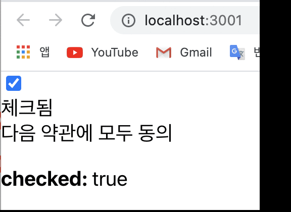
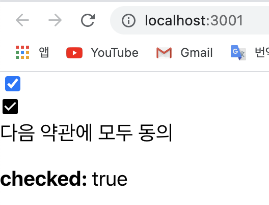
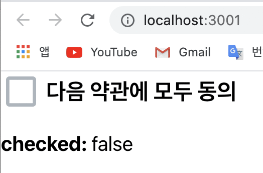

# 리액트 컴포넌트 스타일링하기

<br>


## 2. CSS Module
- 이번에는 `CSS Module`이라는 기술에 대해서 알아보자.   
<u>리액트 프로젝트에서 컴포넌트를 스타일링 할 때 `CSS Module`이라는 기술을 사용하면, CSS 클래스가 중첩되는 것을 완벽히 방지할 수 있다</u>.
- CRA(create-react-app)으로 만든 프로젝트에서 CSS Module 를 사용 할 때에는, CSS 파일의 확장자를 `.module.css`로 하면 된다.          
- e.g.    
Box.module.css라는 파일을 만들게 된다면...       

[Box.module.css]       

```css
	.Box {
		background: black;
		color: white;
		padding: 2rem;
	}
```
- <u>리액트 컴포넌트 파일에서 해당 CSS 파일을 불러올 때 CSS 파일에 선언한 클래스 이름들이 모두 고유해진다</u>.    
그리고 고유 CSS 클래스 이름이 만들어지는 과정에서는 파일 경로, 파일 이름, 클래스 이름, 해쉬값 등이 사용 될 수 있다.       
- e.g.    
Box 컴포넌트를 만든다면 다음과 같이 코드를 작성하는데...      

[Box.js]        

```javascript
	import React from "react";
	import styles from "./Box.module.css";

	function Box() {
		return <div className={styles.Box}>{styles.Box}</div>;   // 여기서 styles.Box는 기존의 Box.module.css 파일에서 .Box라는 클래스 이름을 고유화 된 이름이다
	}

	export default Box;
```
- 그래서 이렇게 CSS 클래스가 중첩되는 것을 완벽히 방지할 수 있도록 하는 이 기술을 어디다 쓰면 좋을까??   
이 기술은 아래와 같은 상황에 사용하면 유용하다;    
	- 레거시 프로젝트에 리액트를 도입 할 때 **CSS 클래스 네이밍 규칙 만들기 귀찮을 때**      
	(기존 프로젝트에 있던 CSS 클래스와 이름이 중복되어도 스타일이 꼬이지 않게 해준다)
	- CSS 클래스를 중복되지 않게 작성하기 위하여 **CSS 클래스 네이밍 규칙을 만들기 귀찮을 때** 

<br>

- 이제, 새로운 리액트 프로젝트를 생성해서 CSS Module 기술을 사용하여 커스텀 체크박스 컴포넌트를 만드는 방법을 배워보자;       
우선, 새로운 프로젝트를 생성한다;    
```xml 
	$ npx create-react-app styling-with-css-module
```
- 그리고 프로젝트를 에디터로 열고, src 디렉토리에 components 디렉토리를 만든 후, 그 안에 `CheckBox.js`를 생성한다.     
CheckBox.js 파일을 열고 아래와 같이 체크박스 컴포넌트의 틀 부터 만든다;     

e.g.     

[components/CheckBox.js]       

```javascript
	import React from 'react';

	function CheckBox({ children, checked, ...rest }) {
		return (
			<div>
				<label>
					<input type="checkbox" checked={checked} {...rest} />
					<div>{checked ? '체크됨' : '체크안됨'}</div>
				</label>
				<span>{children}</span>
			</div>
		)
	}

	export default CheckBox;
```
- 그리고 App 컴포넌트에서 렌더링한다;    

[App.js]       

```javascript
	import React, {useState} from 'react';
	import CheckBox from './components/CheckBox';

	function App() {
		const [check, setCheck] = useState(false);
		const onChange = e => {
			setCheck(e.target.checked);
		};

		return (
			<div>
				<CheckBox onChange={onChange} checked={check}>
					다음 약관에 모두 동의
				</CheckBox>
				<p>
					<b>checked: </b>
					{check ? 'true' : 'false'}
				</p>
			</div>
		)
	}

	export default App;
```
- 이제 `npm start` 명령어를 사용해서 개발 서버를 열고 체크박스를 체크하면 '체크됨'과 'true'가 그리고 체크박스를 체크하지 않으면 '체크안됨'과 'false'가 렌더링되는지 확인해 본다;     
<div style="padding-left: 40px;">
		
</div>

- 여기까지 완성됐으면 이제 스타일링을 해보자.     
스타일링을 하기 전에 `react-icons`라는 라이브러리를 설치한다;      
```xml 
	$ yarn add react-icons
```
- `react-icons`라는 라이브러리를 _Font Awesome, Ionicons, Material Design Icons, 등_의 아이콘들을 컴포넌트 형태로 쉽게 사용 할 수 있다.   
- 사용방법:     
해당 라이브러리의 [문서](https://react-icons.netlify.com/#/)를 열어 원하는 아이콘들을 불러와서 사용하면 되는데, 지금은 [Material Design Icons](https://react-icons.netlify.com/#/icons/md)의 **MdCheckBox**, **MdCheckBoxOutline** 을 사용해보겠다.  

<br>

- CheckBox 컴포넌트를 아래와 같이 수정;     

[components/CheckBox.js]      

```javascript
	import React from 'react';
	import {MdCheckBox, MdCheckBoxOutlineBlank} from 'react-icons/md';

	function CheckBox({children, checked, ...rest}) {
		return (
			<div>
				<label>
					<input type="checkbox" checked={checked} {...rest} />
					{/* <div>{checked ? '체크됨' : '체크안됨'}</div> */}
					<div>{checked ? <MdCheckBox /> : <MdCheckBoxOutlineBlank />}</div>
				</label>
				<span>{children}</span>
			</div>
		)
	}

	export default CheckBox;
```
- 이렇게 코드를 수정하면 텍스트 대신 아이콘이 나타나게 될 것이다;
<div style="padding-left: 40px;">
		
</div>

<br>

- 이제 스타일링을 해보자.    
`CheckBox.module.css` 파일을 components 디렉터리에 생성힌 뒤 아래와 같이 코드를 입력한다;      

[CheckBox.module.css]         

```css
	.checkbox {
		display: flex;
		align-items: center;
	}

	.checkbox label {
		cursor: pointer;
	}

	/* 실제 input 을 숨기기 위한 코드 */
	.checkbox input {
		width: 0;
		height: 0;
		position: absolute;
		opacity: 0;
	}

	.checkbox span {
		font-size: 1.125rem;
		font-weight: bold;
	}

	.icon {
		display: flex;
		align-items: center;
		/* 아이콘의 크기는 폰트 사이즈로 조정 가능 */
		font-size: 2rem;
		margin-right: 0.25rem;
		color: #adb5bd;
	}

	.checked {
		color: #339af0;
	}
```
- 이때, CSS Module을 작성할 때는 CSS 클래스 이름이 다른 곳에서 사용되는 CSS 클래스 이름과 중복될 일이 없기 때문에 `.icon`, `.checkbox` 같은 짧고 흔한 이름을 사용해도 상관없다. 
- CSS 코드를 다 작성했으면 CheckBox.js에서 사용한다;    

[components/CheckBox.js]       

```javascript
	import React from 'react';
	import { MdCheckBox, MdCheckBoxOutlineBlank } from 'react-icons/md';
	import styles from './CheckBox.module.css';

	function CheckBox({ children, checked, ...rest }) {
		return (
			<div className={styles.checkbox}>
				<label>
					<input type="checkbox" checked={checked} {...rest} />
					<div className={styles.icon}>
						{checked ? (
							<MdCheckBox className={styles.checked} />
						) : (
							<MdCheckBoxOutlineBlank />
						)}
					</div>
				</label>
				<span>{children}</span>
			</div>
		);
	}

	export default CheckBox;
```
- 이제, 여기까지 컴포넌트의 스타일이 잘 반영됐는지 확인해본다;     
<div style="padding-left: 40px;">
		
</div>

<br>
 
- 그리고 CSS Module을 사용하면 각 CSS 파일에 있는 클래스 이름들이 **고유해지는 기능**이 있다는 것을 확인 하려면 개발자 도구로 가서 엘리먼트를 선택해 보면 확인할 수 있다;      
<div style="padding-left: 40px;">
		
</div>

<br>

- 하지만 CSS Module을 사용하면 분명 좋은 점이 있지만, `styles.icon` 이런 식으로 객체안에 있는 값을 조회해야 하는데, 만약 클래스 이름에 `-`가 들어가면 `styles['my-class']`이런 식으로 사용해야하고, 또 만약 여러개가 있다면 `${styles.one}` 그리고 `${styles.two}`. 이런 식으로 사용해야하는 번거로움이 있다. 심지어 만약 조건부 스타일링을 해야한다면, 예를 들어, `${styles.one} ${condition ? styles.two : ''}`와 같은 형태로 사용을 해야한다는 어려움이 있다.      
그래서!!     
우리가 이전 섹션에서 Sass 를 배울 때 썼던 [classnames](https://github.com/JedWatson/classnames) 라는 라이브러리의 [bind](https://github.com/JedWatson/classnames#alternate-bind-version-for-css-modules) 기능을 사용해서 위에서 말한 CSS Module의 번거로운 점을 보완해보겠다.     
- 우선 설치부터;     
```xml 
	$ yarn add classnames
```
- 그 다음, CheckBox.js 를 다음과 같이 수정;    

[components/CheckBox.js]      

```javascript
	import React from 'react';
	import { MdCheckBox, MdCheckBoxOutlineBlank } from 'react-icons/md';
	import styles from './CheckBox.module.css';
	import classNames from 'classnames/bind';

	const cx = classNames.bind(styles);

	function CheckBox({ children, checked, ...rest }) {
		return (
			<div className={cx('checkbox')}>
				<label>
					<input type="checkbox" checked={checked} {...rest} />
					<div className={cx('icon')}>
						{checked ? (
							<MdCheckBox className={cx('checked')} />
						) : (
							<MdCheckBoxOutlineBlank />
						)}
					</div>
				</label>
				<span>{children}</span>
			</div>
		);
	}

	export default CheckBox;
```
- `classnames`의 `bind` 기능을 사용하면, CSS 클래시 이름을 지정해 줄 때 **cx**('클래스이름') 과 같은 형식으로 편하게 사용 할 수 있다.       
(cf. 여러개의 CSS 클래스를 사용해야하거나, 조건부 스타일링을 해야할 때 편함!)        

e.g.             

```js
	cx('one', 'two')
	cx('my-component', {
		condition: true
	})
	cx('my-component', ['another', 'classnames'])
```

<br>
<hr>
<br>

### 기타 내용 
- 참고로, CSS Module 은 Sass 에서도 사용 할 수 있다.    
사용 방법은 그냥 확장자를 `.module.scss`로 바꿔주는 것이다.      
~~(cf. 물론, 그 전에 node-sass 를 설치해야함!)~~
- 그리고, <u>CSS Module을 사용하고 있는 파일에서 클래스 이름을 고유화 하지 않고 전역적 클래스이름을 사용하고 싶다면</u>... 다음과 작성하면 된다;      

e.g.      

```css
	:global .my-global-name {

	}
```
- 만약 Sass 를 사용한다면 다음과 같이 할 수도 있다;     
```scss
	:global {
		.my-global-name {

		}
	}
```
- 반대로, CSS Module을 사용하지 않는 곳에서 특정 클래스에서만 고유 이름을 만들어서 사용하고 싶다면 다음과 같이 할 수 있다;     
```css
	:local .make-this-local {

	}
```
- 바로 위의 CSS 코드를 Sass로 하면 이렇게;     
```scss
	:local {
		.make-this-local {

		}
	}
```

<br>

📌 정리!      
이번 시간에는 CSS Module을 사용하는 방법을 배웠는데, 이 기술은 레거시 프로젝트에 리액트를 도입하게 될 때, 또는 클래스 이름 짓는 규칙을 정하기 힘든 상황이거나 번거로울 때 사용하면 편하다.    
다음 시간에 to be continued... 😉

<br>
<br>

---

<details>
	<summary>CLICK ME!</summary>

- cf. 
	- https://react.vlpt.us/styling/02-css-module.html
	- https://eunvanz.github.io/react/2018/06/05/React-create-react-app%EC%9C%BC%EB%A1%9C-%ED%94%84%EB%A1%9C%EC%A0%9D%ED%8A%B8-%EC%8B%9C%EC%9E%91%ED%95%98%EA%B8%B0/    
	(cf. create-react-app이란?)
	- https://velopert.com/3447
	- https://backback.tistory.com/328
	
</details>

---
