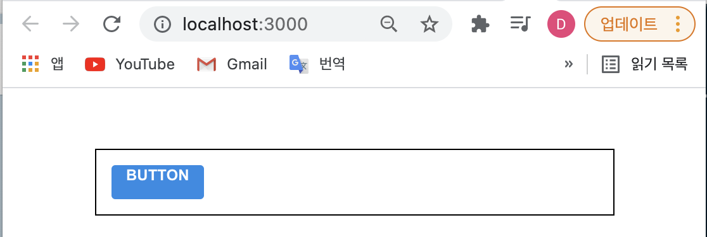

# 리액트 컴포넌트 스타일링하기
- 리액트에서 컴포넌트를 스타일링할 때는 다양한 방식을 사용할 수 있다. 리액트에서 컴포넌트를 스타일링 하는 가장 기본적인 방법은 css 파일을 만들어서 컴포넌트에서 import 해서 사용하는 것이다. 이 방법은 어떤 사람들에게는 충분히 편리할 수도 있지만, 컴포넌트를 스타일링 할 때 다른 도구들을 사용하면 훨씬 더 편하게 작업을 할 수 있다.    
이번 시간에는 리액트 프로젝트에서 컴포넌트를 스타일링 할 때 자주 사용되는 다음과 같은 기술들에 대해 알아보겠다;    
	- **Sass**: 자주 사용되는 CSS 전처리기 중 하나로 확장된 CSS 문법을 사용하여 CSS 코드를 더욱 쉽게 작성할 수 있도록 해 준다
	- **CSS Module**: 스타일을 작성할 때 CSS 클래스가 다른 CSS 클래스의 이름과 절대 충돌하지 ㅇ낳도록 파일마다 고유한 이름을 자동으로 생성해주는 옵션이다
	- **Styled-components**: 스타일을 자바스크립트 파일에 내장시키는 방식으로 스타일을 작성함과 동시에 해당 스타일이 적용된 컴포넌트를 만들 수 있게 해준다

<br>
<hr>
<br>

## 1. Sass
- Sass _(cf. Syntactically Awesome Style Sheets: 문법적으로 짱 멋진 스타일시트)_ 는 **CSS pre-processor**로서, 복잡한 작업을 쉽게 할 수 있게 해주고, 코드의 재활용성을 높여줄 뿐 만 아니라, 코드의 가독성을 높여주어 유지보수에도 도움을 준다.       
~~(cf. Sass에 대해 더 알아보고 싶다면 [링크1](https://velopert.com/1712), [링크2](https://sass-guidelin.es/ko/) 클릭!)~~
- Sass 에서는 두가지의 확장자 (.scss/.sass) 를 지원한다.     
~~Sass 가 처음 나왔을떈 sass 만 지원되었다. 하지만 기존 css와는 달라 개발자들에게 혼란스러운 부분이 있었다. 그래서 나온것이 scss이고, scss는 css와 조금 더 유사한 면이 있다. 더 많은 차이점은 [링크](https://sass-lang.com/guide) 클릭!~~     
보통은 `.scss` 확장자를 많이 사용한다.     
그리고 여기서도 예시로 사용되는 것은 scss 문법일테지만 그냥 sass라고 읽을 것이다.     

<br>
<br>

> 시작하기 
- 본격적으로 Sass를 사용해보자. 먼저 새로운 리액트 프로젝트를 만든다;     
```xml
	$ npx create-react-app styling-with-sass
```
- 그 다음, 해당 프로젝트 디렉터리로 이동해서 `node-sass`라는 라이브러리 ~~(cf. 이 라이브러리는 Sass 를 CSS 로 변환해주는 역할을 한다)~~ 를 설치한다;    
```xml
	$ cd styling-with-sass
	$ yarn add node-sass
```

<br>
<br>

> Button 컴포넌트 만들기
- Button 이라는 컴포넌트를 만들고, Sass 를 사용해서 스타일링을 해보자. styling-with-sass 폴더 안에 src 디렉터리러 이동한 뒤, components 디렉터리를 생성 한다. 그리고 그 안에 Button 컴포넌트를 이라고 만든다;      

e.g.    

[components/Button.js]    

```javascript
	import React from 'react';
	import './Button.scss';

	function Button({ children }) {
		return <button className="Button">{children}</button>;
	}

	export default Button;
```
- 그리고, components 디렉터리에 Button.scss 파일도 만든다;    

e.g.     

[components/Button.scss]     

```scss
	$blue: #228be6; // scss 에서 변수 선언시 $ 를 사용 

	.Button {
		display: inline-flex;
		color: white;
		font-weight: bold;
		outline: none;
		border-radius: 4px;
		border: none;
		cursor: pointer;

		height: 2.25rem;
		padding-left: 1rem;
		padding-right: 1rem;
		font-size: 1rem;

		background: $blue; // 위에서 변수로 만들어준 색 배경색상으로 지정
		&:hover {
			background: lighten($blue, 10%); // 호버시 lighten이란 함수로 색상 10% 밝게
		}

		&:active {
			background: darken($blue, 10%); // 클릭시 darken이란 함수로 색상 10% 어둡게
		}
	}
```
- 위와 같이 기존의 css에서는 사용하지 못하던 문법(e.g. 변수의 사용, lighten/darken과 같은 함수 등)들을 사용해보았다.  
- 이제 이 버튼을 App 컴포넌트에서 사용해보자;    
e.g.    

[App.js]    

```javascript
	import React from 'react';
	import './App.scss';
	import Button from './components/Button';

	function App() {
		return (
			<div className="App">
				<div className="buttons">
					<Button>BUTTON</Button>
				</div>
			</div>
		)
	}

	export default App;
```
- 이때, 기존의 App.css 파일은 `App.scss`로 파일 이름을 수정한 뒤, 내용도 아래와 같이 수정해줘야한다;   

[App.scss]      

```scss
	.App {
		width: 512px;
		margin: 0 auto;
		margin-top: 4rem;
		border: 1px solid black;
		padding: 1rem;
	}
```
- 그러면 아래와 같은 화면이 보일 것이다;    

<div style="padding-left: 40px;">
		
</div>

- 여기까지 성공했다면 이제 보다 다양한 옵션들을 가진 버튼들을 만들어보자;   

<br>
<br>

> 버튼 사이즈 조정하기 (👉 버튼의 size props 설정하기)
- 방금 만들었던 버튼을 large, medium, small 크기별로 렌더링 될 수 있게 버튼의 사이즈를 조정해보자.
- 우선, Button.js에서 아래와 같이 `defaultProps`를 통하여 `size`의 기본값을 `medium`으로 설정하고, 이 값은 button의 className에 넣어보자;    

e.g.    

[Button.js]       

```javascript
	import React from 'react';
	import './Button.scss';

	function Button({ children, size }) {    // children, size라는 props를 설정. 이때, size는 large, medium, small 
		
		{/* size로 받아온 값을 className에다 넣어줄건데, 이를 구현하기 위해서는 배열을 하나 만들고, 그 배열 안에 'Button'과 size를 넣고, 그리고 .join()메서드를 사용해서 공백(' ')을 가지고 조인시키면... e.g. 받아온 size 값이 'medium'이라고 가정하면 className은 "Button medium"이런식으로 형성될 것이다! */}
		{/* 옵션 2. 아니면은 템플릿 리터럴을 사용해서 className을 정해줘도 괜찮다. e.g. <button className={`Button ${size}`}> 
		하지만! 나중에 size말고도 다른 props를 받아올 것을 계획하고 있다면 옵션 1.과 같이 배열을 만들어서 공백으로 join시키는 것을 추천! */}
		return <button className={['Button', size].join(' ')}>   {children}</button>;
	}

	Button.defaultProps = {
		size: 'medium'
	};

	export default Button;
```
- 하지만!!    
조건부로 CSS 클래스를 넣어주고 싶을때 문자열을 직접 조합해주는 것 보다 [classnames](https://github.com/JedWatson/classnames)라는 라이브러리를 사용하는 것이 훨씬 편하다.    
`classNames` 라이브러리를 사용하면 아래와 같이 조건부 스타일링을 할 때 함수의 인자에 문자열, 배열, 객체 등을 전달하여 손쉽게 문자열을 조합할 수 있다;    
```javascript
	classNames('foo', 'bar'); // => 'foo bar'
	classNames('foo', { bar: true }); // => 'foo bar'
	classNames({ 'foo-bar': true }); // => 'foo-bar'
	classNames({ 'foo-bar': false }); // => ''
	classNames({ foo: true }, { bar: true }); // => 'foo bar'
	classNames({ foo: true, bar: true }); // => 'foo bar'
	classNames(['foo', 'bar']); // => 'foo bar'

	// 동시에 여러개의 타입으로 받아올 수 도 있다.
	classNames('foo', { bar: true, duck: false }, 'baz', { quux: true }); // => 'foo bar baz quux'

	// false, null, 0, undefined 는 무시된다.
	classNames(null, false, 'bar', undefined, 0, 1, { baz: null }, ''); // => 'bar 1'
``` 
- `classNames` 라이브러리 설치 방법;     
```xml
	$ yarn add classnames
```
- 그리고 Button.js 에서 사용;    

e.g.     

[Button.js]     

```javascript
	import React from 'react';
	import classNames from 'classnames';
	import './Button.scss';

	function Button({ children, size }) {
		return <button className={classNames('Button', size)}>{children}</button>;
	}

	Button.defaultProps = {
		size: 'medium'
	};

	export default Button;
```
- 화면은 아래와 같을 것이다;     
<div style="padding-left: 40px;">
		
</div>

- 이제 Button.scss 에서 다른 크기를 지정해주자;    
        
[Button.scss]       

```scss
	$blue: #228be6;

	.Button {
		display: inline-flex;
		color: white;
		font-weight: bold;
		outline: none;
		border-radius: 4px;
		border: none;
		cursor: pointer;

		// 사이즈 관리
		&.large {              
			height: 3rem;
			padding-left: 1rem;
			padding-right: 1rem;
			font-size: 1.25rem;
		}

		&.medium {
			height: 2.25rem;
			padding-left: 1rem;
			padding-right: 1rem;
			font-size: 1rem;
		}

		&.small {
			height: 1.75rem;
			font-size: 0.875rem;
			padding-left: 1rem;
			padding-right: 1rem;
		}

		background: $blue;
		&:hover {
			background: lighten($blue, 10%);
		}

		&:active {
			background: darken($blue, 10%);
		}

		& + & {
			margin-left: 1rem;
		}
	}
```
- 이때, 알아둘 점!  
```scss
	// 위의 코드에서 아래의 코드가 의미하는 것은... 
	.Button {
		&.large {

		}
	}

	.Button.large {

	}
	// 이다!! 
	/* 결국, Button과 large CSS 클래스가 함께 적용되어 있으면 
	우리가 원하는 스타일을 적용하겠다는 것을 의미한다 */


	// 그리고 ...
	& + & {
		margin-left: 1rem;
	}
	// 에서 & + & 가 의미하는 것은 .Button + .Button 이다
	// 만약 함께 있다면 우측에 있는 버튼에 여백이 생길 수 있도록 설정한 코드이다 
```
- 여기까지 코드를 작성했으면 App.js에서 버튼들을 2개 더 렌더링하고, size 값도 설정해준다;      

[App.js]    

```javascript
	import React from 'react';
	import './App.scss';
	import Button from './components/Button';

	function App() {
		return (
			<div className="App">
				<div className="buttons">
					<Button size="large">BUTTON</Button>
					<Button>BUTTON</Button>
					<Button size="small">BUTTON</Button>
				</div>
			</div>
		);
	}

	export default App;
```
- 여기까지 성공적으로 코드를 작성하였으면 화면은 아래와 같을 것이다;     
<div style="padding-left: 40px;">
		
</div>

<br>
<br>

> 버튼 색상 설정하기 (👉 버튼의 color props 설정하기)
- 이번에는 버튼에 파란색 외의 다른 색상을 설정하는 작업에 대해서 알아보겠다.
- 학습 목표:     
버튼의 색상에 _blue, gray, pink_ 색을 설정 할 수 있도록 구현해보자.   
- 우선,  Button에서 `color`라는 props를 받아올 수 있도록 해주고, 기본 값을 blue로 설정한다.    
그리고, `size`와 마찬가지로 `color`값을 className에 포함시켜준다;      

e.g.    

[components/Button.js]      

```javascript
	import React from 'react';
	import classNames from 'classnames';
	import './Button.scss';

	function Button({ children, size, color }) {   // `color`라는 props를 받아올 수 있도록 해준다
		return (
			<button className={classNames('Button', size, color)}>{children}</button>     // color값을 className에 포함시켜준다
		);
	}

	Button.defaultProps = {
		size: 'medium',
		color: 'blue'    // 기본 디폴트 컬로 블루! 
	};

	export default Button;
```
- 그런 다음 Button.scss 파일도 수정한다;     

[components/Button.scss]     

```scss
	// 새로운 색상 변수 선언
	$blue: #228be6;
	$gray: #495057;
	$pink: #f06595;

	.Button {
		display: inline-flex;
		color: white;
		font-weight: bold;
		outline: none;
		border-radius: 4px;
		border: none;
		cursor: pointer;

		// 사이즈 관리
		&.large {
			height: 3rem;
			padding-left: 1rem;
			padding-right: 1rem;
			font-size: 1.25rem;
		}

		&.medium {
			height: 2.25rem;
			padding-left: 1rem;
			padding-right: 1rem;
			font-size: 1rem;
		}

		&.small {
			height: 1.75rem;
			font-size: 0.875rem;
			padding-left: 1rem;
			padding-right: 1rem;
		}

		// 색상 관리
		&.blue {
			background: $blue;

			&:hover {
				background: lighten($blue, 10%);
			}

			&:active {
				background: darken($blue, 10%);
			}
		}

		&.gray {
			background: $gray;

			&:hover {
				background: lighten($gray, 10%);
			}

			&:active {
				background: darken($gray, 10%);
			}
		}

		&.pink {
			background: $pink;

			&:hover {
				background: lighten($pink, 10%);
			}

			&:active {
				background: darken($pink, 10%);
			}
		}

		& + & {
			margin-left: 1rem;
		}
	}
```
- 코드의 상단에서 색상 변수를 선언해주었고, 하단에서 CSS 클래스에 따라 다른 색상이 적용되도록 코드를 작성해주었다.    
이때, 위의 코드를 보면 반복되는 코드들이 있는데, 반복되는 코드는 Sass [mixin](https://sass-guidelin.es/ko/#mixins)라는 기능을 사용하면 쉽게 재사용이 가능한 코드로 만들 수 있다.   
`button-color`라는 mixin을 만들어서 사용해보자;     

[components/Button.scss]     

```scss
$blue: #228be6;
$gray: #495057;
$pink: #f06595;


// 여기다가 button-color라는 mixin을 만들어서... 
@mixin button-color($color) {
	background: $color;
	&:hover {
    background: lighten($color, 10%);
  }
  &:active {
    background: darken($color, 10%);
  }
}


.Button {
  display: inline-flex;
  color: white;
  font-weight: bold;
  outline: none;
  border-radius: 4px;
  border: none;
  cursor: pointer;

  // 사이즈 관리
  &.large {
    height: 3rem;
    padding-left: 1rem;
    padding-right: 1rem;
    font-size: 1.25rem;
  }	

  &.medium {
    height: 2.25rem;
    padding-left: 1rem;
    padding-right: 1rem;
    font-size: 1rem;
  }

  &.small {
    height: 1.75rem;
    font-size: 0.875rem;
    padding-left: 1rem;
    padding-right: 1rem;
  }

	// 여기서 mixin 적용! 
	&.blue {
    @include button-color($blue);
  }

  &.gray {
    @include button-color($gray);
  }

  &.pink {
    @include button-color($pink);
  }


  & + & {
    margin-left: 1rem;
  }
}
// 훨씬 깔끔한 색상 관리 코드를 확인할 수 있다! 
```
- 이제 위의 색상 관리 코드가 잘 작동하는지 확인하자. App 컴포넌트에서 아래와 같이 다른 색상을 가진 버튼들을 렌더링 한다;       

[App.js]     

```javascript
	import React from 'react';
	import './App.scss';
	import Button from './components/Button';

	function App() {
		return (
			<div className="App">
				<div className="buttons">
					<Button size="large">BUTTON</Button>
					<Button>BUTTON</Button>
					<Button size="small">BUTTON</Button>
				</div>
				<div className="buttons">
					<Button size="large" color="gray">
						BUTTON
					</Button>
					<Button color="gray">BUTTON</Button>
					<Button size="small" color="gray">
						BUTTON
					</Button>
				</div>
				<div className="buttons">
					<Button size="large" color="pink">
						BUTTON
					</Button>
					<Button color="pink">BUTTON</Button>
					<Button size="small" color="pink">
						BUTTON
					</Button>
				</div>
			</div>
		);
	}

	export default App;
```
- 여기까지 성공적으로 코드를 작성하였으면 화면은 아래와 같을 것이다;     
<div style="padding-left: 40px;">
		
</div>

- 위 아래로 너무 붙어있는 버튼들에게 여백을 준다;   

[App.scss]   

```scss
	.App {
		width: 512px;
		margin: 0 auto;
		margin-top: 4rem;
		border: 1px solid black;
		padding: 1rem;

		.buttons + .buttons {
			margin-top: 1rem;
		}
	}
```
- 그럼 이제 다음과 같이 나타나게 될 것이다;    
<div style="padding-left: 40px;">
		
</div>

<br>
<br>

> outline 옵션 만들기 (👉 outline props 설정하기)
- 이번에는 `outline`이라는 옵션을 주면 버튼에서 테두리만 보여지도록 설정을 해보겠다;      
e.g.    

[components/Button.js]      

```javascript
	import React from 'react';
	import classNames from 'classnames';
	import './Button.scss';

	function Button({ children, size, color, outline }) {
		return (
			<button className={classNames('Button', size, color, { outline })}>
				{children}
			</button>       // outline 값을 props 로 받아와서 객체 안에 집어 넣은 다음에 classNames()에 포함시켜줬다
		);
	}

	Button.defaultProps = {
		size: 'medium',
		color: 'blue'
	};

export default Button;
```
- 위의 코드에서는 `outline` 값을 props로 받아와서 객체 안에 집어넣은 다음에 `classNames()`에 포함시켜줬다. 이렇게 하면 `outline` 값이 `true`일 때만 `button`에 `outline` CSS 클래스가 적용된다.   
만약 `outline` CSS 클래스가 있다면 테두리만 보여지도록 scss 코드를 수정하자;      
 
[components/Button.scss]         

```scss
	$blue: #228be6;
	$gray: #495057;
	$pink: #f06595;

	@mixin button-color($color) {
		background: $color;

		&:hover {
			background: lighten($color, 10%);
		}

		&:active {
			background: darken($color, 10%);
		}

		&.outline {           // outline 클래스가 있으면 테두리 만드는 scss 코드
			color: $color;
			background: none;
			border: 1px solid $color;

			&:hover {
				background: $color;
				color: white;
			}
		}
	}

	.Button {
		display: inline-flex;
		color: white;
		font-weight: bold;
		outline: none;
		border-radius: 4px;
		border: none;
		cursor: pointer;

		// 사이즈 관리
		&.large {
			height: 3rem;
			padding-left: 1rem;
			padding-right: 1rem;
			font-size: 1.25rem;
		}

		&.medium {
			height: 2.25rem;
			padding-left: 1rem;
			padding-right: 1rem;
			font-size: 1rem;
		}

		&.small {
			height: 1.75rem;
			font-size: 0.875rem;
			padding-left: 1rem;
			padding-right: 1rem;
		}

		// 색상 관리
		&.blue {
			@include button-color($blue);
		}

		&.gray {
			@include button-color($gray);
		}

		&.pink {
			@include button-color($pink);
		}

		& + & {
			margin-left: 1rem;
		}
	}
```
- 그리고 App 컴포넌트에서 사용해본다;    

[App.js]     

```javascript
	import React from 'react';
	import './App.scss';
	import Button from './components/Button';

	function App() {
		return (
			<div className="App">
				<div className="buttons">
					<Button size="large">BUTTON</Button>
					<Button>BUTTON</Button>
					<Button size="small">BUTTON</Button>
				</div>
				<div className="buttons">
					<Button size="large" color="gray">
						BUTTON
					</Button>
					<Button color="gray">BUTTON</Button>
					<Button size="small" color="gray">
						BUTTON
					</Button>
				</div>
				<div className="buttons">
					<Button size="large" color="pink">
						BUTTON
					</Button>
					<Button color="pink">BUTTON</Button>
					<Button size="small" color="pink">
						BUTTON
					</Button>
				</div>
				<div className="buttons">
					<Button size="large" color="blue" outline>
						BUTTON
					</Button>
					<Button color="gray" outline>
						BUTTON
					</Button>
					<Button size="small" color="pink" outline>
						BUTTON
					</Button>
				</div>
			</div>
		);
	}

	export default App;
```
- 여기까지 성공적으로 코드를 작성하였으면 화면은 아래와 같을 것이다;     
<div style="padding-left: 40px;">
		
</div>


<br>
<br>

> 전체 너비 차지하는 옵션 (👉 fullWidth props 설정하기)
- 이번에는 `fullWidth`라는 옵션이 있으면 버튼이 전체 너비를 차지하도록 구현을 해보겠다.    
- 우선, Button.js을 아래와 같이 수정한다;     

[components/Button.js]     

```javascript
	import React from 'react';
	import classNames from 'classnames';
	import './Button.scss';

	function Button({ children, size, color, outline, fullWidth }) {
		return (
			<button
				className={classNames('Button', size, color, { outline, fullWidth })}
			>
				{children}
			</button>
		);
	}

	Button.defaultProps = {
		size: 'medium',
		color: 'blue'
	};

	export default Button;
```
- 그리고 scss 파일도 수정한다;      

[components/Button.scss]      

```scss
	$blue: #228be6;
	$gray: #495057;
	$pink: #f06595;

	@mixin button-color($color) {
		background: $color;
		&:hover {
			background: lighten($color, 10%);
		}
		&:active {
			background: darken($color, 10%);
		}
		&.outline {
			color: $color;
			background: none;
			border: 1px solid $color;
			&:hover {
				background: $color;
				color: white;
			}
		}
	}

	.Button {
		display: inline-flex;
		color: white;
		font-weight: bold;
		outline: none;
		border-radius: 4px;
		border: none;
		cursor: pointer;

		// 사이즈 관리
		&.large {
			height: 3rem;
			padding-left: 1rem;
			padding-right: 1rem;
			font-size: 1.25rem;
		}

		&.medium {
			height: 2.25rem;
			padding-left: 1rem;
			padding-right: 1rem;
			font-size: 1rem;
		}

		&.small {
			height: 1.75rem;
			font-size: 0.875rem;
			padding-left: 1rem;
			padding-right: 1rem;
		}

		// 색상 관리
		&.blue {
			@include button-color($blue);
		}

		&.gray {
			@include button-color($gray);
		}

		&.pink {
			@include button-color($pink);
		}

		& + & {
			margin-left: 1rem;
		}

		// fullWidth 라는 클래스가 있으면 아래와 같은 스타일링 코드를 적용!
		&.fullWidth {
			width: 100%;
			justify-content: center;
			& + & {
				margin-left: 0;
				margin-top: 1rem;
			}
		}
	
	}
```
- App 에서 사용해보자;     

[App.js]       

```javascript
	import React from 'react';
	import './App.scss';
	import Button from './components/Button';

	function App() {
		return (
			<div className="App">
				<div className="buttons">
					<Button size="large">BUTTON</Button>
					<Button>BUTTON</Button>
					<Button size="small">BUTTON</Button>
				</div>
				<div className="buttons">
					<Button size="large" color="gray">
						BUTTON
					</Button>
					<Button color="gray">BUTTON</Button>
					<Button size="small" color="gray">
						BUTTON
					</Button>
				</div>
				<div className="buttons">
					<Button size="large" color="pink">
						BUTTON
					</Button>
					<Button color="pink">BUTTON</Button>
					<Button size="small" color="pink">
						BUTTON
					</Button>
				</div>
				<div className="buttons">
					<Button size="large" color="blue" outline>
						BUTTON
					</Button>
					<Button color="gray" outline>
						BUTTON
					</Button>
					<Button size="small" color="pink" outline>
						BUTTON
					</Button>
				</div>
	      {/* fullWidth 클래스 추가한 버튼들 구현 */}
				<div className="buttons">
					<Button size="large" fullWidth>
						BUTTON
					</Button>
					<Button size="large" fullWidth color="gray">
						BUTTON
					</Button>
					<Button size="large" fullWidth color="pink">
						BUTTON
					</Button>
				</div>
			</div>
		);
	}

	export default App;
```
- 코드를 잘 작성했다면 화면은 아래와 같을 것이다;     
<div style="padding-left: 40px;">
		
</div>

<br>
<br>

> ...rest props 전달하기 
- 여기까지 버튼 컴포넌트는 다 만들었는데, 만약에 버튼 컴포넌트에 `onClick`을 설정해주고 싶다면 어떻게 해야 할까?     
- e.g.      

[components/Button.js]       

```javascript
	import React from 'react';
	import classNames from 'classnames';
	import './Button.scss';

	function Button({ children, size, color, outline, fullWidth, onClick }) {    // props에 onClick을 객체 형태로 받아온다 
		return (
			<button
				className={classNames('Button', size, color, { outline, fullWidth })}
				onClick={onClick}    // onClick={onClick} 을 버튼 컴포넌트에 적용 
			>
				{children}
			</button>
		);
	}

	Button.defaultProps = {
		size: 'medium',
		color: 'blue'
	};

	export default Button;
```
- 그리고 만약 `onMouseMove` 이벤트를 관리하고 싶다면...?       

e.g.     

[components/Button.js]       

```javascript
	import React from 'react';
	import classNames from 'classnames';
	import './Button.scss';

	function Button({ children, size, color, outline, fullWidth, onClick, onMouseMove }) {
		return (
			<button
				className={classNames('Button', size, color, { outline, fullWidth })}
				onClick={onClick}
				onMouseMove={onMouseMove}    // onMouseMove={onMouseMove} 이벤트 적용 
			>
				{children}
			</button>
		);
	}

	Button.defaultProps = {
		size: 'medium',
		color: 'blue'
	};

	export default Button;
```
- 이때, 만약 필요한 이벤트가 있을 때마다 매번 이렇게 넣어주는건 번거로운 작업이다.    
이러한 문제를 해결 해줄 수 있는 문법이 있는데, 바로 [spread와 rest](https://learnjs.vlpt.us/useful/07-spread-and-rest.html)이다.    
- Button 컴포넌트를 다음과 같이 수정하자;    

[components/Button.js]      

```javascript
import React from 'react';
import classNames from 'classnames';
import './Button.scss';

function Button({ 
	children, 
	size, 
	color, 
	outline, 
	fullWidth, 
	...rest 
}) {
	return (
		<button
			className={classNames('Button', size, color, { 
				outline, 
				fullWidth 
			})}
			{...rest}   // children, size, color, outline, fullWidth 빼고 나머지가 여기에 들어와서 <button></button>에 전달되는 것!
		>
			{children}
		</button>
	)
}

Button.defaultProps = {
  size: 'medium',
  color: 'blue'
};

export default Button;
```
- 이렇게 `...rest`를 사용해서 이미 앞에서 지정한 props를 제외한 나머지 값들을 `rest`라는 **객체**에 모아주고, \<button> 태그에 `{...rest}`를 넣어주면, `rest` 안에 있는 값들을 모두 \<button> 태그에 설정/전달 할 수 있는 것이다.    
그래서 만약, App.js 에서 사용한 가장 첫번째 버튼에 `onClick`을 설정해준다면...    

[App.js]     

```javascript
	import React from 'react';
	import './App.scss';
	import Button from './components/Button';

	function App() {
		return (
			<div className="App">
				<div className="buttons">
					<Button size="large" onClick={() => console.log('클릭됐다!')}>
						BUTTON
					</Button>
					<Button>BUTTON</Button>
					<Button size="small">BUTTON</Button>
				</div>
				<div className="buttons">
					<Button size="large" color="gray">
						BUTTON
					</Button>
					<Button color="gray">BUTTON</Button>
					<Button size="small" color="gray">
						BUTTON
					</Button>
				</div>
				<div className="buttons">
					<Button size="large" color="pink">
						BUTTON
					</Button>
					<Button color="pink">BUTTON</Button>
					<Button size="small" color="pink">
						BUTTON
					</Button>
				</div>
				<div className="buttons">
					<Button size="large" color="blue" outline>
						BUTTON
					</Button>
					<Button color="gray" outline>
						BUTTON
					</Button>
					<Button size="small" color="pink" outline>
						BUTTON
					</Button>
				</div>
				<div className="buttons">
					<Button size="large" fullWidth>
						BUTTON
					</Button>
					<Button size="large" color="gray" fullWidth>
						BUTTON
					</Button>
					<Button size="large" color="pink" fullWidth>
						BUTTON
					</Button>
				</div>
			</div>
		);
	}

	export default App;
```
- 만약 첫 번째 버튼을 클릭했을 때 onClick 함수가 잘 호출 되었다면 콘솔창에는 '클릭됐다!' 라고 출력돼야 한다;     

<div style="padding-left: 40px;">
		
</div>

- 정리:    
	- 그래서 위와 같이 컴포넌트가 어떤 props 를 받을 지 확실치는 않지만 그대로 다른 컴포넌트 또는 HTML 태그에 전달을 해주어야 하는 상황에는 이렇게 `...rest` 문법을 활용하면 된다! 

<br>

📌 이번 시간에는 **Sass**를 활용하는 방법에 대해서 알아보았다.    
다음 시간에는 CSS Module을 활용하여 리액트 컴포넌트를 스타일링하는 방법을 알아보겠다!! 😉

<br>
<br>

---

<details>
	<summary>CLICK ME!</summary>

- cf. 
	- https://react.vlpt.us/styling/01-sass.html
	- https://twojobui.tistory.com/8
	- https://codingmania.tistory.com/339
https://velog.io/@ji-yeong/React%EC%97%90%EC%84%9C-SassScss-%EC%82%AC%EC%9A%A9%ED%95%98%EA%B8%B0
- https://medium.com/@jsh901220/react%EC%97%90-scss-%EC%A0%81%EC%9A%A9%EB%B0%8F-%EA%B8%B0%EB%B3%B8-%EC%82%AC%EC%9A%A9%EB%B2%95-1-c7bd2895f5a6

	
</details>

---
