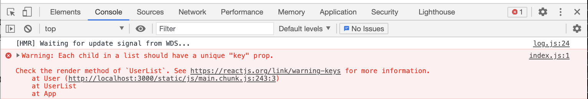

# 배열 렌더링하기 
- 이번에는 리액트에서 배열을 렌더링하는 방법을 알아보자. 

<br>

> 예시를 통해 이해하기    
- e.g.   
아래와 같은 배열이 있다고 가정해보자;   
```javascript
	const users = [
		{
			id: 1,
			username: 'velopert',
			email: 'public.velopert@gmail.com'
		},
		{
			id: 2,
			username: 'tester',
			email: 'tester@example.com'
		},
		{
			id: 3,
			username: 'liz',
			email: 'liz@example.com'
		}
	];
```
- 만약 위의 배열을 컴포넌트로 렌더링한다면 어떻게 해야할까? 
	- 일단, 가장 기본적이지만 비효율적인 방법인 "그대로 코드 작성하기"로 코드를 작성해보고, 그 다음에 효율적인 방법으로 코드를 작성해보자; 

>> 비효율적이지만 가장 기본적인 방법 
-	e.g.    

[UserList.js]

```javascript
import React from 'react'; 

function UserList() {
	const users = [
		{
			id: 1,
			username: 'velopert',
			email: 'public.velopert@gmail.com'
		},
		{
			id: 2,
			username: 'tester',
			email: 'tester@example.com'
		},
		{
			id: 3,
			username: 'liz',
			email: 'liz@example.com'
		}
	];

	// 방법 1) 비효율적인 방법!! 무식한 방법! 
	return(
		<div>
			<div>
				<b>{users[0].username}</b> <span>{users[0].email}</span> <br />
				<b>{users[1].username}</b> <span>{users[1].email}</span> <br />
				<b>{users[2].username}</b> <span>{users[2].email}</span>
			</div>
		</div>		
	)
}

export default UserList;
```
- 그리고 App.js에서 렌더링을 한다; 

[App.js]

```javascript
	import React from 'react';
	import UserList from './UserList';   // UserList 불러오고 ... 

	function App() {
		return <UserList />    // 렌더링 될 결과물/컴포넌트 
	}

	export default App;      // 내보내기 ... 
```
- 위와 같이 코드를 작성하면 아래와 같은 화면이 볼일 것이다;    
<div style="padding-left: 40px;">
		
</div>

- 결과는 정상적일지라도 해당 소스는 유사한 소스 코드가 세 번이나 반복되는 비효율적인 코드다. 

<br>

>> 비효율적이지만 가장 기본적인 방법 - 응용 
- 위의 코드를 좀 더 깔끔하고 효율적으로 정리하면...     

[UserList.js]

```javascript
	import React from 'react';

	// 새로운 컴포넌트 추가 ... 
	function User({ user }) {
		return (
			<div>
			 {/* props로 값 가져오기 */}
				<b>{ user.username }</b> <sapn>{ user.email }</sapn>
			</div>
		);
	}

	function UserList() {
		const users = [
			{
				id: 1,
				username: 'velopert',
				email: 'public.velopert@gmail.com'
			},
			{
				id: 2,
				username: 'tester',
				email: 'tester@example.com'
			},
			{
				id: 3,
				username: 'liz',
				email: 'liz@example.com'
			}
		];

		return (
			<div>
				<User user={users[0]} />
				<User user={users[1]} />
				<User user={users[2]} />
			</div>
		)

	export default UserList;
```
- 문제점!!!
	- 위와 같이 "아주 조금은 깔끔"해 질 수는 있으나 여전히 비효율적이다. 그리고 위의 방법은 배열이 고정적일 때는 상관 없지만 <u>동적인 배열을 렌더링 할 수 없다</u>.   
	- 만약 배열이 동적이라면 렌더링 할 때 자바스크립트 배열의 내장함수인 `map()`을 사용해야 한다.     
	<br>

👉 [map()에 대해 더 자세히 알고싶다면 클릭!](https://learnjs.vlpt.us/basics/09-array-functions.html#map)  
👉 간략하게 <u>`map()`함수는 배열안에 있는 각 원소를 변환하여 새로운 배열을 만들어준다</u>.    
👉 리액트에서 동적인 배열을 렌더링해야 할 때는 이 함수를 사용하여 일반 데이터 배열을 리액트 엘리먼트로 이루어진 배열로 변환해주면 된다.

<br>

>> map() 함수를 사용하는 방법 
- e.g.     

[UserList.js]

```javascript
	import React from 'react';

	// 새로운 컴포넌트 추가 ... 
	function User({ user }) {    
		return (
			<div>
			 {/* props로 값 가져오기 */}
				<b>{ user.username }</b> <sapn>({ user.email })</sapn>
			</div>
		);
	}

	function UserList() {
		const users = [
			{
				id: 1,
				username: 'velopert',
				email: 'public.velopert@gmail.com'
			},
			{
				id: 2,
				username: 'tester',
				email: 'tester@example.com'
			},
			{
				id: 3,
				username: 'liz',
				email: 'liz@example.com'
			}
		];

		return (
			<div>
				{ // 배열 users에다가 .map을 해준다 
					users.map( 
						// user라는 parameter를 가져와서, <User /> 컴포넌트로 구성된 새로운 배열을 생성... 
						user => (<
							User user={user} />
						)
					)
				}
			</div>
		);
	}
	export default UserList;
```
- 위와 같이 map() 함수를 사용하면 배열의 모든 원소가 렌더링 된다.     
- 하지만 이 방법도 문제가 있다! 콘솔창을 열면 아래와 같은 에러 메세지가 보일 것이다; 
<div style="padding-left: 45px;">
		
</div>

- 즉, 해석해보자면 **모든 child ~~(cf. 여기서 child란 배열 users 안에 있는 각 user들을 의미한다)~~ 각각의 (key라는) 고유값을 가져야 한다는 의미**다.   
지금의 경우에서는 각 user들이 갖고있는 고유값은 id값이다.    

[UserList.js]

```javascript
	import React from 'react';

	function User({ user }) {
		return (
			<div>
				<b>{user.username}</b> <span>({user.email})</span>
			</div>
		);
	}

	function UserList() {
		const users = [
			{
				id: 1,
				username: 'velopert',
				email: 'public.velopert@gmail.com'
			},
			{
				id: 2,
				username: 'tester',
				email: 'tester@example.com'
			},
			{
				id: 3,
				username: 'liz',
				email: 'liz@example.com'
			}
		];

		return (
			<div>
				{users.map(user => (
					// 여기서 key={user.id}라고 해주면 에러 메세지가 사라진다!!!
					<User user={user} key={user.id} />
				))}
			</div>
		);
	}

	export default UserList;
```
- 물론 항상 배열 안에 원소가 고유한 값을 갖고 있는 것은 아니다.    
이럴 경우 map() 함수를 사용 할 때 설정하는 콜백함수의 두번째 파라미터인 `index`를 고유한 `key`로 사용하면 된다;     
e.g.  

[UserList.js]

```javascript
	<div>
		{users.map(
			(user, index) => (
				<User user={user} key={index} />
			)
		)}
	</div>
```
- 하지만 웬만하면 index말고 고유한 key를 사용하는 것이 좋은 이유는 key를 사용하면 어떤 엘리먼트/데이터를 가르키는지가 명확해서 혹시나 데이터를 추가/제거/수정 할 일이 있다면 매우 효율적으로 일을 할 수 있지만, index는 그렇지 못하기 때문이다.    
그래서 key를 사용하는 것을 추천한다! 😉

<br>
<br>
---
<details>
	<summary>CLICK ME!</summary>

- cf. 
	- https://react.vlpt.us/basic/11-render-array.html
	- https://velopert.com/3636
	- https://developing-move.tistory.com/202
	- https://xiubindev.tistory.com/99

</details>
---

