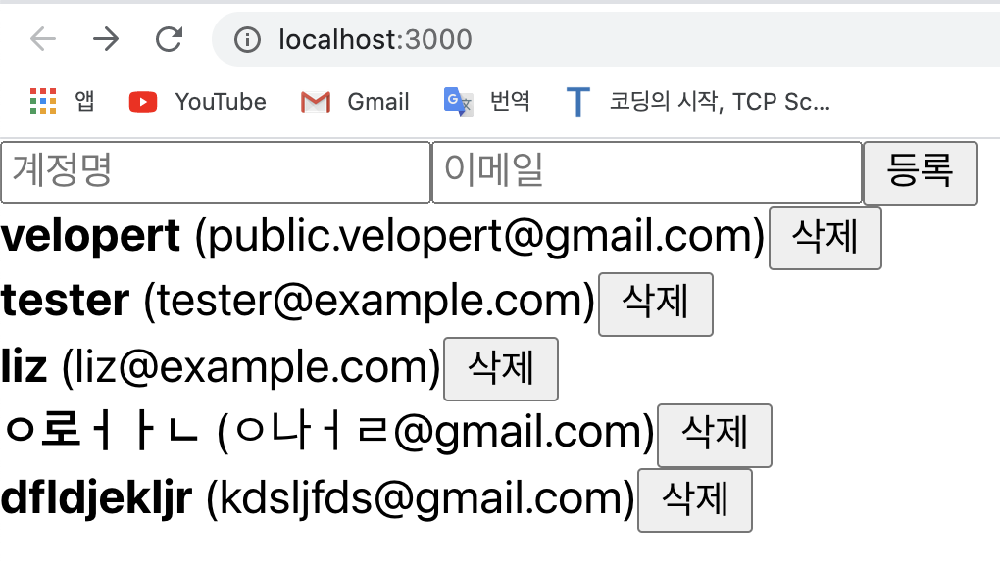

# 배열에 항목 제거하기
- 배열에 항목을 제거하는 방법을 연습하기 위해 우선 UserList.js에서 각 User 컴포넌트를 보여줄 때, 삭제 버튼을 렌더링하는 코드를 작성하자;     
e.g.

[UserList.js]

```javascript
import React from 'react';

function User({ user, onRemove }) {    // 삭제하는 기능을 위해 onRemove를 받아온다 
  return (
    <div>
      <b>{user.username}</b> <span>({user.email})</span>
			<button onClick={() => onRemove(user.id)}>삭제</button>
    </div>
  );
}

function UserList({ users, onRemove }) {
  return (
    <div>
      {users.map(user => (
        <User user={user} key={user.id} onRemove={onRemove} />
      ))}
    </div>
  );
}

export default UserList;
```
- 위와 같이 코드를 작성하면 아래와 같은 화면이 보일 것이다; 
<div style="padding-left: 40px;">
		
</div>

- 하지만 "삭제" 버튼을 눌러도 실제로 배열의 항목이 삭제되지는 않는데, 니는 아직 onRemove 함수를 구현하지 않았기 때문이다.    
이제, onRemove 함수를 구현해보자;   
- e.g.   
	- 배열에 항목을 추가할 때와 마찬가지로 배열에 있는 항목을 제거할 때는, "불변성"을 지켜가면서 업데이트를 해주어야 한다.
	- 불변성을 지키면서 특정 원소를 배열에서 제거하기 위해서는 `filter`라는 배열 내장 함수를 사용하는것이 가장 편하다.    
	<u>`filter` 함수는 배열에서 특정 조건이 만족하는 원소들만 추출하여 새로운 배열을 만들어준다</u>.    
	[참고 링크](https://developer.mozilla.org/ko/docs/Web/JavaScript/Reference/Global_Objects/Array/filter)

[App.js] 

```javascript
	import React, { useRef, useState } from 'react';   
	import UserList from './UserList';
	import CreateUser from './CreateUser';

	function App() {
		const [inputs, setInputs] = useState({
			username: '',
			email:''
		});
		const {username, email} = inputs;
		const onChange = e => {
			const {name, value} = e.target;
			setInputs({
				...inputs,
				[name]: value
			});
		};

		const [users, setUsers] = useState([    // useState() 사용 
			{
				id: 1,
				username: 'velopert',
				email: 'public.velopert@gmail.com'
			},
			{
				id: 2,
				username: 'tester',
				email: 'tester@example.com'
			},
			{
				id: 3,
				username: 'liz',
				email: 'liz@example.com'
			}
		]);

		const nextId = useRef(4);
		const onCreate = () => {
			// 방법 1:  spread 문법 사용 
			// 방법 2: concat 함수 사용 
			const user = {
				id: nextId.current,
				username,
				email
			};
			setUsers([...users, user]);   // spread 연산자 사용 
			// setUsers(users.concat(user));  // concat 함수 사용
			setInputs({
				username:'',
				email:''
			});

			nextId.current += 1;
		};

		// onRemove 함수 구현 
		const onRemove = id => {
			// filter 함수를 사용하여 user.id가 파라미터로 받은 id와 일치하지 않는 원소만 추출해서 새로운 배열을 만든다
			setUsers(users.filter(user => user.id !== id));
		}

		return (
			<>
				<CreateUser 
					username={username}
					email={email}
					onChange={onChange}
					onCreate={onCreate}
				/>
				<UserList users={users} onRemove={onRemove} />
			</>
		)
	}

	export default App;
```
📌 여기까지 코드를 작성했다면 이제 "삭제" 버튼을 누르면 정상적으로 users 배열의 항목이 제거되는 것을 확인 할 수 있다. 😉

<br>
<br>
---
<details>
	<summary>CLICK ME!</summary>

- cf. 
	- https://react.vlpt.us/basic/14-array-remove.html
	- https://xiubindev.tistory.com/99

</details>

---

