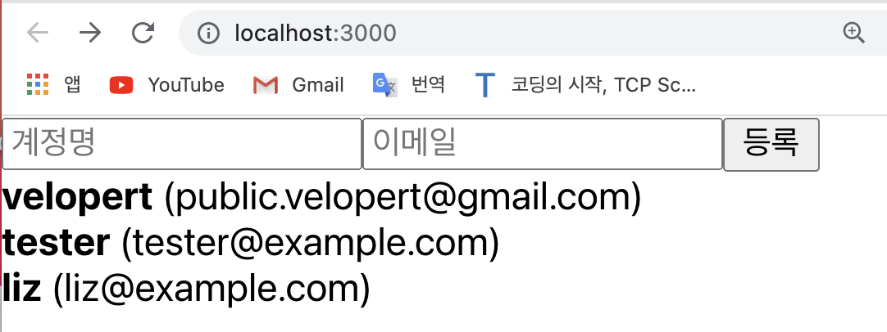

# 배열에 항목 추가하기
- 이번에는 배열에 새로운 항목을 추가하는 방법을 알아보자. 
- 우선, input 두개와 button 하나로 이루어진 CreateUser.js 라는 컴포넌트를 src 디렉터리에 만들어준다;     

[CreateUser.js]
```javascript
	import React from 'react';

	function CreateUser({ username, email, onChange, onCreate }) {  
		//  CreateUser에서는 총 4개의 props를 받아올 것이다; username, email, onChange, onCreate
		return (
			<div>
				<input
					name="username"
					placeholder="계정명"
					onChange={onChange}
					value={username}
				/>
				<input
					name="email"
					placeholder="이메일"
					onChange={onChange}
					value={email}
				/>
				<button onClick={onCreate}>등록</button>
			</div>
		);
	}

	export default CreateUser;
```
- 그리고 나서, App.js 파일에 가서 아래와 같이 코드를 작성한다; 
```javascript
	import React, { useRef } from 'react';
	import UserList from './UserList';
	import CreateUser from './CreateUser';

	function App() {
		const users = [
			{
				id: 1,
				username: 'velopert',
				email: 'public.velopert@gmail.com'
			},
			{
				id: 2,
				username: 'tester',
				email: 'tester@example.com'
			},
			{
				id: 3,
				username: 'liz',
				email: 'liz@example.com'
			}
		];

		const nextId = useRef(4);
		const onCreate = () => {

			nextId.current += 1;
		};

		return (
			// 두개 이상의 태그는 태그로 감싸져야 하니까 <></>로 감싸줄 것! 유의!
			<>   
				<CreateUser />
				{/* 저번에 작성한 UserList는 고대로 냅두고 CreateUser 컴포넌트만 UserList위에 추가한다*/}
				<UserList users={users} />;    
			</>
		)
	}

	export default App;
```
- 위와 같이 App.js와 CreateUser.js 파일을 작성한 뒤, 브라우저를 열면 아래와 같은 화면이 보여야 한다;     

<div style="padding-left: 40px;">
		
</div>

<br>

- 여기까지 성공했다면 이제 CreateUser 컴포넌트에게 필요한 props 를 App.js에서 준비해주자;
	- 복습!! 여러개의 input 상태를 관리할 때는 useState()를 사용하는데, 이때 useState()를 여러번 사용하는 것이 아니라, useState()를 객체 형태로 만들어서 한 번만 사용하는 것이라고 했었다. 아래와 같이... 
	- e.g.    
	[App.js]    
	```javascript
		import React, { useRef, useState } from 'react';   // useState를 사용할거니까 ...
		import UserList from './UserList';
		import CreateUser from './CreateUser';

		function App() {
			// useState로 여러개의 input 태그들을 상태 관리 해줄거기 때무에 객체로 생성...
			const [inputs, setInputs] = useState({
				username: '',
				email:''
			});
			const {username, email} = inputs;
			const onChange = e => {
				const {name, value} = e.target;
				setInputs({
					...inputs,
					[name]: value
				});
			}


			const users = [
				{
					id: 1,
					username: 'velopert',
					email: 'public.velopert@gmail.com'
				},
				{
					id: 2,
					username: 'tester',
					email: 'tester@example.com'
				},
				{
					id: 3,
					username: 'liz',
					email: 'liz@example.com'
				}
			];

			const nextId = useRef(4);
			const onCreate = () => {
				// 나중에 구현할 배열에 항목 추가하는 로직
				setInput({
					username:'',
					email:''
				});

				nextId.current += 1;
			};

			return (
				<>
					<CreateUser 
						username={username}
						email={email}
						onChange={onChange}
						onCreate={onCreate}
					/>
					<UserList users={users} />
				</>
			);
		}
		
		export default App;
	```
	- 여기까지 작성한 후, 브라우저에 가서 input에 값을 입력하고 등록 버튼을 눌렀을 때,  input 값들이 잘 초기화되는지 확인해본다. 여기까지 잘 작동한다면 이제 users 배열에 변화를 줘보자.    
	배열에 변화를 줄 때는 객체와 마찬가지로, "불변성"을 지켜줘야 한다. 즉, 만약에 사용해야 한다면 기존의 배열을 한 번 복사하고 나서 사용해야 한다. 꼭!    
- 불변성을 지키면서 배열에 새 항목을 추가하는 방법은 두 가지가 있다;    
`1. spread 연산자 사용`, `2. concat 함수를 사용`

<br>

> 1. spread 연산자를 사용해서 배열에 새 항목 추가하기
- e.g.   

[App.js]

```javascript
	import React, { useRef, useState } from 'react';   
	import UserList from './UserList';
	import CreateUser from './CreateUser';

	function App() {
		const [inputs, setInputs] = useState({
			username: '',
			email:''
		});
		const {username, email} = inputs;
		const onChange = e => {
			const {name, value} = e.target;
			setInputs({
				...inputs,
				[name]: value
			});
		};

		// useState() 사용
		const [users, setUsers] = useState([
			{
				id: 1,
				username: 'velopert',
				email: 'public.velopert@gmail.com'
			},
			{
				id: 2,
				username: 'tester',
				email: 'tester@example.com'
			},
			{
				id: 3,
				username: 'liz',
				email: 'liz@example.com'
			}
		]);

		const nextId = useRef(4);
		const onCreate = () => {
			const user = {
				id: nextId.current,
				username,
				email
			}
			setUsers([...users, user]);   // spread 문법 사용 

			setInputs({
				username:'',
				email:''
			});

			nextId.current += 1;
		};

		return (
			<>
				<CreateUser 
					username={username}
					email={email}
					onChange={onChange}
					onCreate={onCreate}
				/>
				<UserList users={users} />
			</>
		)
	}

	export default App;
```
<br>

> 2. concat 함수를 사용해서 배열에 새 항목 추가하기 
- `concat` 함수는 기존의 배열을 수정하지 않고, 새로운 원소가 추가된 새로운 배열을 만들어준다   
~~(cf. 배열의 불변성을 지킬 수 있다! 기존의 배열을 보존하니까~)~~ ;  
- e.g.   

[App.js]

```javascript
	import React, { useRef, useState } from 'react';   
	import UserList from './UserList';
	import CreateUser from './CreateUser';

	function App() {
		const [inputs, setInputs] = useState({
			username: '',
			email:''
		});
		const {username, email} = inputs;
		const onChange = e => {
			const {name, value} = e.target;
			setInputs({
				...inputs,
				[name]: value
			});
		};

		const [users, setUsers] = useState([   // useState() 사용 
			{
				id: 1,
				username: 'velopert',
				email: 'public.velopert@gmail.com'
			},
			{
				id: 2,
				username: 'tester',
				email: 'tester@example.com'
			},
			{
				id: 3,
				username: 'liz',
				email: 'liz@example.com'
			}
		]);

		const nextId = useRef(4);
		const onCreate = () => {
			const user = {
				id: nextId.current,
				username,
				email
			};
			setUsers(users.concat(user));   // concat 함수 사용 

			setInputs({
				username:'',
				email:''
			});

			nextId.current += 1;
		};

		return (
			<>
				<CreateUser 
					username={username}
					email={email}
					onChange={onChange}
					onCreate={onCreate}
				/>
				<UserList users={users} />
			</>
		)
	}

	export default App;
```

<br>

📌 위와 같이 배열에 새 항목을 추가할 때는 spread 연산자 또는 concat을 사용하면 된다. 😉

<br>
<br>

---
<details>
	<summary>CLICK ME!</summary>

- cf. 
	- https://react.vlpt.us/basic/13-array-insert.html
	- https://velopert.com/3636
	- https://developing-move.tistory.com/202
	- https://xiubindev.tistory.com/99
	
</details>

---


	