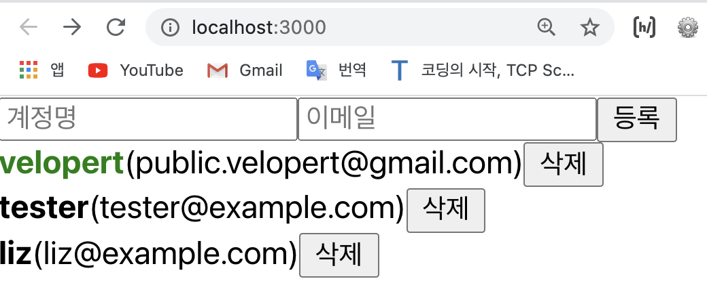
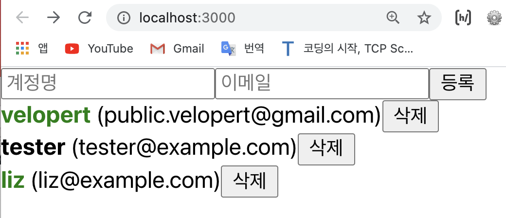

# 배열 항목 수정하기 
- 이번에는 배열 안에 들어있는 특정 항목을 수정하는 방법에 대해 알아보자.
- 오늘의 학습 목표:
	- **User 컴포넌트에 계정명을 클릭했을때 색상이 초록색으로 바뀌고, 다시 누르면 검정색으로 바뀌도록 구현해보자**.
- 우선, App 컴포넌트의 users 배열 안의 객체 안에 active 라는 속성을 추가한다;   
e.g.    

[App.js]   

```javascript
	import React, { useRef, useState } from 'react';   
	import UserList from './UserList';
	import CreateUser from './CreateUser';

	function App() {
		const [inputs, setInputs] = useState({
			username: '',
			email:''
		});
		const {username, email} = inputs;
		const onChange = e => {
			const {name, value} = e.target;
			setInputs({
				...inputs,
				[name]: value
			});
		};

		const [users, setUsers] = useState([    // useState() 사용 
			{
				id: 1,
				username: 'velopert',
				email: 'public.velopert@gmail.com',
				active: true
			},
			{
				id: 2,
				username: 'tester',
				email: 'tester@example.com',
				active: false
			},
			{
				id: 3,
				username: 'liz',
				email: 'liz@example.com',
				active: false
			}
		]);

		const nextId = useRef(4);
		const onCreate = () => {
			// 방법 1:  spread 문법 사용 
			// 방법 2: concat 함수 사용 
			const user = {
				id: nextId.current,
				username,
				email
			};
			setUsers([...users, user]);   // spread 연산자 사용 
			// setUsers(users.concat(user));  // concat 함수 사용
			setInputs({
				username:'',
				email:''
			});

			nextId.current += 1;
		};

		// onRemove 함수 구현 
		const onRemove = id => {
			// filter 함수를 사용해서 ...
			setUsers(users.filter(user => user.id !== id));
		};
		
		return (
			<>
				<CreateUser 
					username={username}
					email={email}
					onChange={onChange}
					onCreate={onCreate}
				/>
				<UserList users={users} onRemove={onRemove} />
			</>
		)
	}

	export default App;
```
- 그리고 UserList.js에 가서 props로 active를 받아온다;     

[UserList.js]

```javascript
	import React from 'react';

	function User({ user, onRemove, active }) {   // active를 props로 받아온다 
		return (
			<div>
				<b style={{
					color: user.active ? 'green' : 'black',
					cursor: 'pointer'
				}}>
					{user.username}
				</b> 
				&nbsp;   {/* 띄어쓰기 */}
				<span>({user.email})</span>
				<button onClick={() => onRemove(user.id)}>삭제</button>
			</div>
		);
	}

	function UserList({ users, onRemove }) {
		return (
			<div>
				{users.map(user => (
					<User user={user} key={user.id} onRemove={onRemove} />
				))}
			</div>
		);
	}

	export default UserList;
```
- 여기까지 완성하면 아래와 같은 화면이 보여야한다; 
<div style="padding-left: 40px;">
		
</div>

- 이제 App.js 파일에서 active의 값이 true/false이냐에 따라 색상을 변하게 해줄 `onToggle`이라는 함수를 구현해보자.  
	- Tip!    
	배열의 불변성을 유지하면서 배열을 업데이트 할 때에도 map 함수를 사용 하면 된다. 
	- 삼항연산자를 활용하여 파라미터로 받은 id 값을 비교해서 user.id와 id가 같다면 active 값을 반전시키고, 같다면 그냥 두는 식으로 구현을 하면 된다.

<br>

[App.js]

```javascript
	import React, { useRef, useState } from 'react';   
	import UserList from './UserList';
	import CreateUser from './CreateUser';

	function App() {
		const [inputs, setInputs] = useState({
			username: '',
			email:''
		});
		const {username, email} = inputs;
		const onChange = e => {
			const {name, value} = e.target;
			setInputs({
				...inputs,
				[name]: value
			});
		};

		const [users, setUsers] = useState([    // useState() 사용 
			{
				id: 1,
				username: 'velopert',
				email: 'public.velopert@gmail.com',
				active: true
			},
			{
				id: 2,
				username: 'tester',
				email: 'tester@example.com',
				active: false
			},
			{
				id: 3,
				username: 'liz',
				email: 'liz@example.com',
				active: false
			}
		]);

		const nextId = useRef(4);
		const onCreate = () => {
			// 방법 1:  spread 문법 사용 
			// 방법 2: concat 함수 사용 
			const user = {
				id: nextId.current,
				username,
				email
			};
			setUsers([...users, user]);   // spread 연산자 사용 
			// setUsers(users.concat(user));  // concat 함수 사용
			setInputs({
				username:'',
				email:''
			});

			nextId.current += 1;
		};

		// onRemove 함수 구현 
		const onRemove = id => {
			// filter 함수를 사용해서 ...
			setUsers(users.filter(user => user.id !== id));
		};
		
		// onToggle 함수 구현 
		const onToggle = id => {   // id 값을 파라미터로 가져온다
			setUsers(users.map(user => user.id === id   // user.id 가 파라미터로 받아온 id와 같다면 삼항연산자 -> 불변성을 위해 spread 연산자를 사용해서 만약 마지막에 오는 배열의 원소가 참(true)면 user.active를 false로 toggle하고 참이 아닌 거짓이라면 user을 그대로 사용하겠다고 적는다...  
				? {...users, active: !user.active}
				: user
			))
		}


		return (
			<>
				<CreateUser 
					username={username}
					email={email}
					onChange={onChange}
					onCreate={onCreate}
				/>
				<UserList users={users} onRemove={onRemove} onToggle={onToggle} />
				{/* onToggle을 UserList에 추가해준다 */}
			</>
		)
	}

	export default App;
```
- 이제, onToggle 함수를 UserList 컴포넌트에게 전달하면 된다;    
즉, UserList 컴포넌트에서 onToggle 함수를 받아와서 User에게 전달해주고, onRemove를 구현했었던 것처럼 onToggle에 id를 넣어서 호출하면 된다. 
e.g.   

[UserList.js]

```javascript
	import React from 'react';

	function User({ user, onRemove, onToggle }) {   // onToggle을 받아온다 
		return (
			<div>
				<b 
					style={{
						color : user.active ? 'green' : 'black',
						cursor: 'pointer'
					}}
					onClick={() => onToggle(user.id)}    // 해석: 클릭시 새로운 함수를 만들어서 id를 넣어서 호출 해준다
				>
					{user.username}
				</b> 
				<span>({user.email})</span>
				<button onClick={() => onRemove(user.id)}>삭제</button>
			</div>
		);
	}

	function UserList({ users, onRemove, onToggle }) {   // onToggle을 받아온다 
		return (
			<div>
				{users.map(user => (
					<User 
						user={user} 
						key={user.id} 
						onRemove={onRemove}
						onToggle={onToggle}     // onToggle을 넣어준다 
					/>
				))}
			</div>
		);
	}

	export default UserList;
```
- 위와 같이 코드를 작성했다면 클릭한 계정명(user.id)은 초록색이 되어야 하고 클릭하지 않아서 active 속성이 false 값인 계정명(user.id)은 검은색이여야 한다. 아래와 같이;

<div style="padding-left: 40px;">
		
</div>

<br>

## 정리  

👉 배열 항목 추가:   
- _spread 연산자 / concat 함수_    

👉 배열 항목 제거: 
- _filter 함수_    

👉 배열 항목 수정(/배열의 특정 값만 업데이트 할 때):   
- _map 함수_    

<br>
<br>

---
<details>
	<summary>CLICK ME!</summary>

- cf. 
	- https://react.vlpt.us/basic/15-array-modify.html
	- https://xiubindev.tistory.com/99
	- https://velog.io/@yunsungyang-omc/React-%EB%B0%B0%EC%97%B4-%ED%95%AD%EB%AA%A9-%EC%88%98%EC%A0%95%ED%95%98%EA%B8%B0
	- https://hyeok999.github.io/2020/01/18/react-velo-13/
	
</details>

---


	