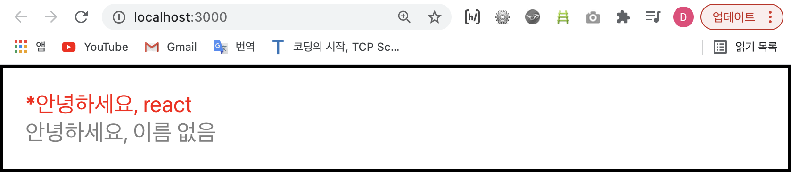

# 조건부 렌더링 
- 조건부 렌더링이란? 
	- 특정 조건이 참인지 거짓인지에 따라서 다른 결과를 보여주는 것을 의미한다. 
- e.g.   
예를 들어, App 컴포넌트에서 Hello 컴포넌트를 사용할 때 `isSpecial`이라는 props를 설정한다고 가정해보자;   

[App.js]

```javascript
	import React from 'react';
	import Hello from './Hello';
	import Wrapper from './Wrapper';


	function App() {
		return (
			<Wrapper>
				// 특정 조건인 isSpecial에 true(참)라는 값을 넣어준다... 
				// 이때, true는 자바스크립트 값이기 때문에 중괄호로 감싸준다! 
				<Hello name="react" color="red" isSpecial={true}>안녕하세요</Hello>
				<Hello color="gray">안녕하세요</Hello>
			</Wrapper>
		)
	}

	export default App;
```
- 그리고 Hello.js에 가서 **삼항조건연산자** 를 사용하여 isSpecial이 참이면 Hello 컴포넌트 안ㅍ에 별표를, 거짓이라면 null 값을 주는 조건을 만든다; 
e.g.   

[Hello.js]

```javascript
	import React from 'react';

	function Hello({color, name, isSpecial}) { // props로 받는 값들을 파라미터로... 
		return (
			<div style={{
				color: color
			}}>
				{isSpecial ? <b>*</b> : null}   
				안녕하세요, {name}
			</div>
		)
	}

	Hello.defaultProps = {   
		name: '이름 없음'
	};

	export default Hello;
```
- 위의 코드대로면 첫번째 Hello 컴포넌트에서 isSpecial의 값은 참이기 때문에 별표가 앞에 하나 붙을 것이다; 
<div style="padding-left: 45px;">
		
</div>

- cf. `falsy한 값` (e.g. {false}, {undefined}, {null}은 ...) 화면에 렌더링 되지 않는다. 다만 {0}은 예외!!!!


- tip! 위에서는 조건부 렌더링을 처리할 때 가장 기본적으로 사용할 수 있는 `삼항연산자`를 사용했는데, 보통 삼항연산자는 참과 거짓에 따라 보여줄 결과물이 달라져야할 때 사용된다. 하지만 지금 위의 예시 내용은 내용이 달라지는 것보다는 참이면 값을 보여주고 거짓이면 값을 안보여주는 것이기 때문에...   
이런 경우는 `&& 연산자`를 사용해주는 것이 좋다;    

[Hello.js]

```javascript
	import React from 'react';

	function Hello({color, name, isSpecial}) { 
		return (
			<div style={{
				color: color
			}}>
				{isSpecial && <b>*</b>}   
				안녕하세요, {name}
			</div>
		)
	}
	// 설명:  && 연산자를 넣어주면 만약 isSpecial의 값이 false 일때는 아무런 값이 나타나지 않게 되고 (&&는 연산자의 앞과 두의 조건이 모두 true여야 되니까...), 그리고 또 만약 isSpecial 값이 true일 때는 뒤 쪽의 <b>*</b>가 보여질 것이기 때문에 이 경우는 삼항연산자보다 &&연산자가 더 간편하다...

	Hello.defaultProps = {   
		name: '이름 없음'
	};

	export default Hello;
```

<br>
<br>

---
<details>
	<summary>CLICK ME!</summary>

- cf. 
	- https://react.vlpt.us/basic/06-conditional-rendering.html
	
</details>
---

