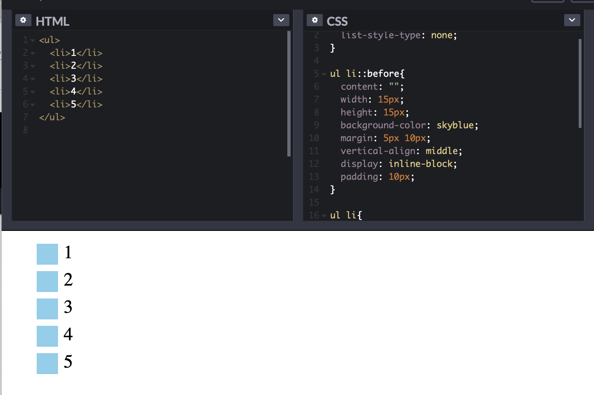
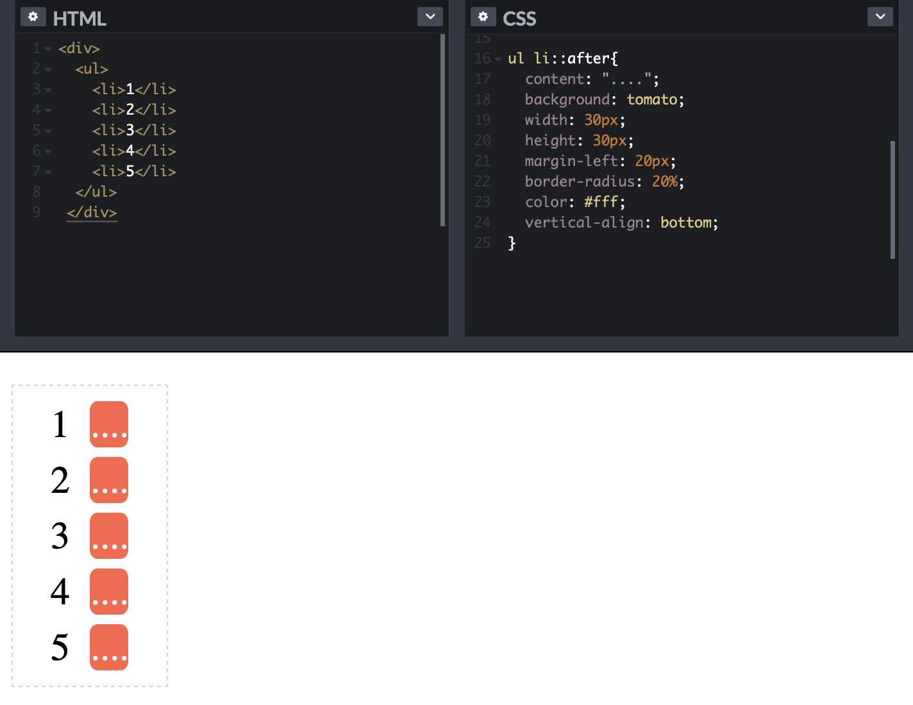
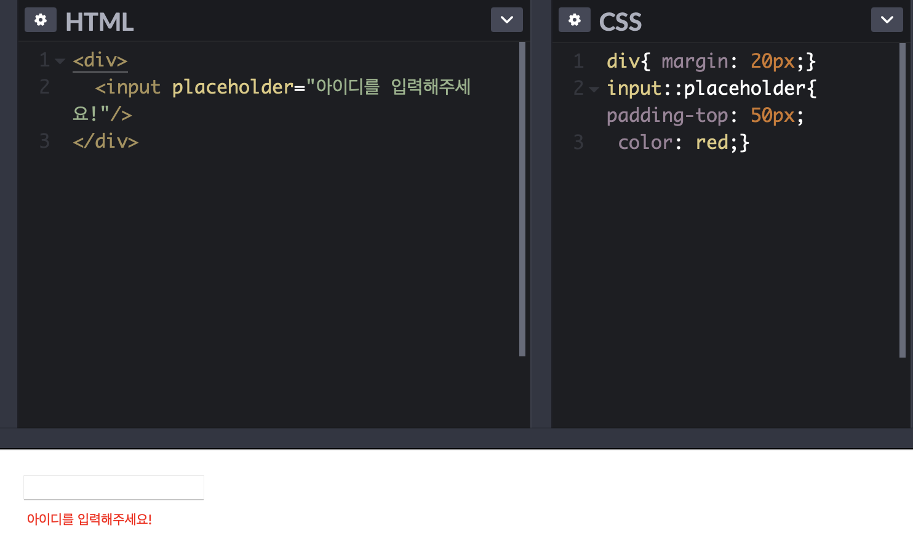

선택자 
=====

- 선택자란? 
- 가상 선택자란? 

    `Pseudo-Classes Selectors(가상 클래스)` VS `Pseudo Element(가상 요소 선택자)`

<br>

---
> Selector(선택자)

    CSS에서 선택자란 HTML과 CSS를 연결해주는 개념으로 사용된다. 
    선택자의 종류는 다양한데 오늘은 기본적으로 꼭 학습해야 하는 기본 선택자들을 정리해보는 시간을 갖고, 
    가상 클래스 선택자와 가상 요소 선택자에 대해서 알아보는 시간을 갖고자 한다. 
<br>

>> Basic Selectors(기본 선택자)

1. Universal Selectors(전체 선택자)
    - (HTML 내부의) `모든 요소`를 전체 선택
    - Asterisk로 표현

    ```css
    * {
        color: blue;   /* 모든 요소의 색을 파란색으로 만든다 */
    }
    ```

2. Type Selectors(태그 선택자/타입 선택자)
    - `태그`를 선택
    - HTML 요소(Element)를 선택자로 놓고 속성과 속성값을 지정한다 
    
    ```css
    div {
        backgroundcolor: pink;   /* HTML 문서 안에 있는 모든 div 요소의 색을 분홍색으로 만든다 */
        width: 100px;            /* HTML 문서 안에 있는 모든 div 요소의 width를 100px로 만든다 */
    }
    ```

3. Class Selectors(클래스 선택자)
    - HTML의 `class`를 선택
    - .클래스명{ 속성: 속성값; }으로 표현. 이때, 클래스 명 앞에 `.` 붙이는 것 유의!
    
    ```html
    <div class="div_1"> DIV - 1 </div>
    ```

    ```css
    .div_1{                       /* 선택자로 들어온 클래스에 border와 border-radius라는 CSS 속성들을 적용 시킨다 */
        border: 1px solid lightgray;  
        border-radius: 3px;
    }
    ```

4.  ID Selectors(아이디 선택자)
    - HTML의`id`를 선택 
    - #아이디명{ 속성: 속성값; }으로 표현. 이때, 아이디명 앞에 `#` 붙이는 것 유의!

    ```html
    
    ```

    ```css
    .first-image{                       /* 선택자로 들어온 아이디에 width와 height를 각각 100px, 200px로 지정한다 */
        width: 100px;
        height: 200px;
    }
    ```
<br>

<!-- >> 속성 선택자 ????  -->
---
---

> 가상 선택자 

    CSS의 가상 선택자에는 크게 가상 클래스 선택자와 가상 요소 선택자가 있다.
    HTML에 이미 존재하는 요소를 선택하면 `가상 클래스 선택자`이고, 
    HTML에 존재하지는 않지만 가상의 요소를 생성하여 선택하고자 할 때 사용하는 것은 `가상 요소 선택자`이다. 
    (cf. 가상 클래스가 가상 요소보다 구체성이 높다!)

<br>
<br>

>> 가상 클래스 (콜론이 하나!)

- `E:hover`  

    :point_right: 
    요소 위로 마우스(포인터)를 가져가서 마우스가 요소 위에 있을 동안에만 요소를 선택 

- `E:active`

    :point_right: 
    요소를 마우스로 클릭하는 동안에만 요소를 선택 

- `E:focus`

    :point_right: 
    요소가 포커스된 동안에만 요소를 선택

    :point_right: 
    여기서 포거스가 됐다는 것은 사용자가 요소를 클릭하거나 탭키를 사용하여 해당 부분이 선택되어 졌다는 것을 의미 

    :point_right: 
    포커스 가상 클래스 선택자는 대화형 콘텐츠 --input, img, tabindex와 같은-- 에서 사용 되는 셀렉터이다 

- 이 외에도 기타 다양한 가상 클래스 선택자들이 있다. 
    
    - cf. 

    [링크1]: https://bearjin90.tistory.com/4 "참고 링크1로 이동합니다!"
    [링크2]: https://homzzang.com/b/css-284 "참고 링크2로 이동합니다!"
    [링크1], [링크2] 참고!! 

<br>
<br>

>> 가상 요소 (콜론이 두개!)

가상 요소 선택자라는 것은 가상 클래스 선택자와는 다르게 CSS를 통해서 HTML에 가상의 요소를 생성해서 제공을 할 수 있다. 대표적인 가상 요소 선택자들을 알아보자. 

<br>

- `E::before:`

    :point_right: 
    특정한 요소의, 내부의, **앞**쪽에다가 가상으로 존재하지 않는 요소를 존재하는 것처럼 부여하여 문서에 내용(content)을 삽입하는 것을 가능케한다 

    :point_right: 
    가상 요소 선택자인 `:before`에 `content: "";` 라는 속성과 속성값을 넣어주는 것은 아주 중요하다. 왜냐면 이 content: ""; 라는 속성을 넣어주지 않으면 해당 가상 요소 선택자에 어떠한 CSS 속성을 적용시킨다 한들 결과가 나오지 않기 때문이다. 
    ""안에는 아무 값도 넣지 않아 null 값을 만드는 것도 가능하지만, 안에 내용(content)를 삽입하는 것도 가능하다. 
    
    
    <br>
    
    

    <br>
    <br>

- `E::after`  
    
    :point_right: 
    특정한 요소의, 내부의, **뒤**쪽에다가 가상으로 존재하지 않는 요소를 존재하는 것처럼 부여하여 문서의 특정 부분 선택 및 내용 삽입을 가능케한다
    

    <br>
    <br>
    
- `E::first-letter` 

    :point_right: 
    요소의 첫번째 글자를 감싸고 있는 요소가 없지만, 있는 것과 같이 가상의 요소를 만들어서 제어하는 것이 가능해진다 
    ```html
    <ul>
        <li>오늘 점심메뉴는?</li>
        <li>고기!!</li>
    </ul>
    ```

    ```css
    ul li::first-letter{font-size: 30px; color: red;}
    ```

    

    <br>
    <br>
    
- `E::placeholder` 

    :point_right: 
    input 필드에 힌트 텍스트에 스타일을 적용한다     
    ```html 
    <input placeholder="아이디를 입력해주세요!"/>
    ```
            
    ```css 
    input::placeholder{ padding-top: 50px; color: red;}
    ```

    

---
---

cf. 
- https://www.codingfactory.net/10792
- https://bearjin90.tistory.com/4
- http://blog.hivelab.co.kr/공유before와after-그들의-정체는/

